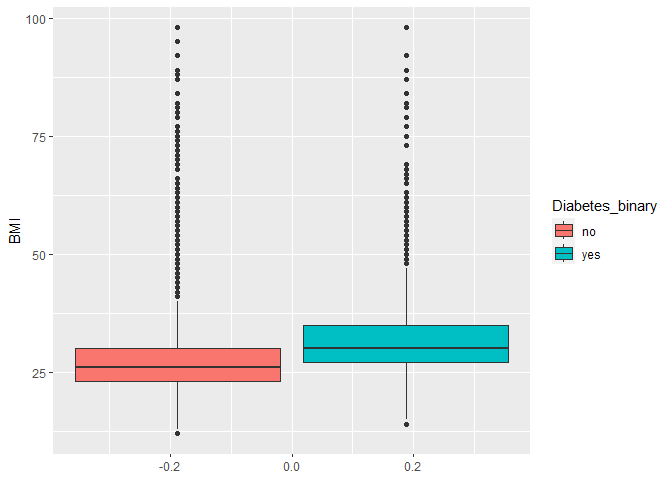
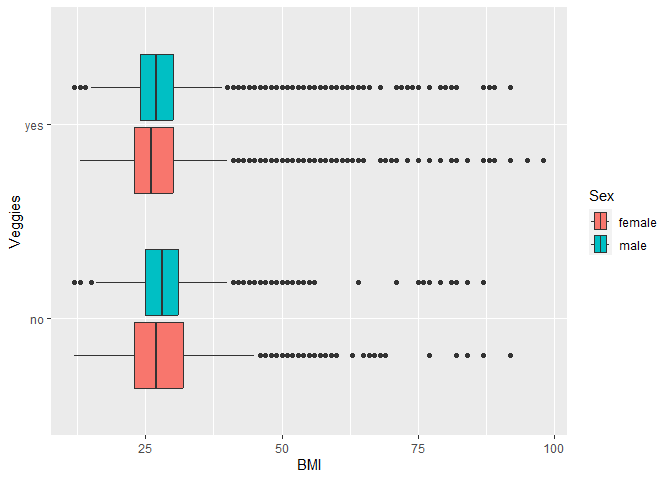
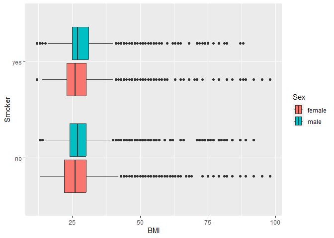
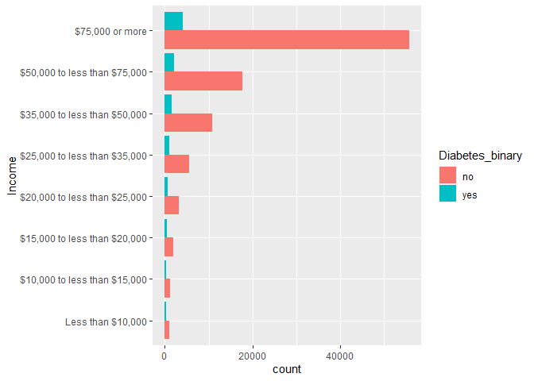
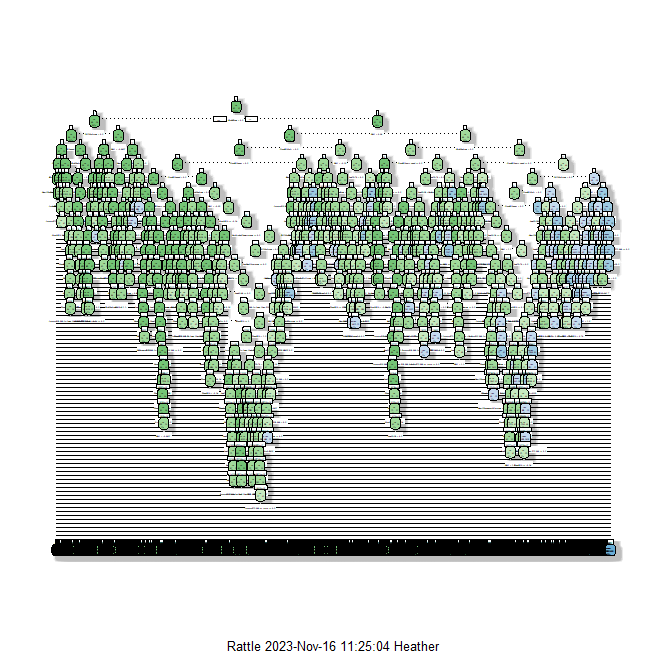
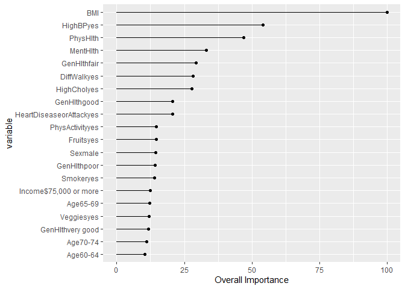

ST 558 Project 3 
Education Level: College 4 years or more (College graduate)

================

Heather Copley & Andy Johnson
2023-11-16

## Introduction

This report automates the construction of exploratory analyses and
prediction models using data from the 2015 [Behavioral Risk Factor
Surveillance System](https://www.cdc.gov/brfss/index.html) (BRFSS). The
BRFSS is a long-running telephone survey in the United States that
collects data on health-related issues, behaviors, and service
utilization. The primary outcome of interest in these analyses is if a
respondent reports being diabetic or prediabetic. Diabetes is an chronic
endocrine disorder in which the body is unable to properly regulate
blood glucose levels. [Approximately one in nine U.S. adults has
diabetes](https://diabetes.org/about-diabetes/statistics/about-diabetes),
and this prevalence has steadily increased over the last few decades.
[Prediabetes](https://www.mayoclinic.org/diseases-conditions/prediabetes/symptoms-causes/syc-20355278)
is a transitional state of chronically heightened blood glucose levels
that is just below the clinical threshold for diabetes. Early detection
and treatment of prediabetes can restore blood glucose to normal levels,
and the appropriate clinical management of diabetes can reduce long-term
negative health outcomes and healthcare costs due to the disease. For
these reasons, it is important to identify and understand the various
personal characteristics that are associated with having diabetes.

In this report, we use a subset of BRFSS data to explore a variety of
factors associated with having diabetes or prediabetes, and build
prediction models to estimate the probability of a survey respondent
having diabetes. This report is part of a larger series of reports, each
one focusing on a subset of BRFSS survey respondent defined by having a
common level of education. The analyses below include descriptive
statistical summaries, exploratory visualizations/graphs, and the
creation and evaluation of prediction models for diabetic status for
individuals with an education level of college 4 years or more (college
graduate).

The variables used in these analyses include individually-reported
characteristics such as:

- a history of chronic comorbidities (hypertension,
  hypercholesterolemia, heart disease, depression),
- a history of acute health events (heart attacks, stroke),
- other relevant physical characteristics (BMI, age, sex),
- behavorial factors that influence health (smoking, diet, physical
  activity), and
- socioeconomic factors (income, health insurance coverage, education
  levels).

## Exploratory Data Analysis

The codebook for the variables included in this analysis can be found
here:

[Behavioral Risk Factor Surveillance System
Codebook](chrome-extension://efaidnbmnnnibpcajpcglclefindmkaj/https://www.cdc.gov/brfss/annual_data/2015/pdf/codebook15_llcp.pdf)

We used these definitions to properly format and describe the data.

``` r
#read in data 
#filter to parameter education
#and format factors
diabetes_data <- read_csv('diabetes_binary_health_indicators_BRFSS2015.csv') %>%
    filter(Education == params$education) %>%
    mutate_at(vars(Diabetes_binary,
                   HighBP,
                   HighChol,
                   CholCheck,
                   Smoker,
                   Stroke,
                   HeartDiseaseorAttack,
                   PhysActivity,
                   Fruits,
                   Veggies,
                   HvyAlcoholConsump, 
                   AnyHealthcare,
                   NoDocbcCost,
                   DiffWalk
                  ),
              ~factor(., 
                      levels = c(0,1), 
                      labels = c("no", "yes"))) %>%
    mutate(GenHlth = factor(GenHlth, 
                            levels = c(1:5), 
                            labels = c("excellent", "very good", "good", "fair", "poor")),
           Sex = factor(Sex, 
                        levels = c(0,1), 
                            labels = c("female", "male")),
           Age = factor(Age,
                        levels = c(1:13),
                        labels = c("18-24",
                                   "25-29",
                                   "30-34",
                                   "35-39",
                                   "40-44",
                                   "45-49",
                                   "50-54",
                                   "55-59",
                                   "60-64",
                                   "65-69",
                                   "70-74",
                                   "75-79",
                                   "80-99")),
           Education = factor(Education,
                        levels = c(1:6),
                        labels = c("Never attended school or only kindergarten",
                                    "Grades 1 through 8 (Elementary)",
                                    "Grades 9 through 11 (Some high school)",
                                    "Grade 12 or GED (High school graduate)",
                                    "College 1 year to 3 years (Some college or technical school)",
                                    "College 4 years or more (College graduate)")),
          Income = factor(Income,
                          levels = c(1:8), 
                            labels = c("Less than $10,000",
                                        "$10,000 to less than $15,000",
                                        "$15,000 to less than $20,000",
                                        "$20,000 to less than $25,000",
                                        "$25,000 to less than $35,000",
                                        "$35,000 to less than $50,000",
                                        "$50,000 to less than $75,000",
                                        "$75,000 or more"))
    )

#create a vector of column descriptions/labels
descriptions <- c("Diabetes or prediabetes?"
            ,"High Blood Pressure?"
            ,"High Cholesterol?"
            ,"Cholesterol check in the past 5 years?"
            ,"Body Mass Index"
            ,"Have you smoked at least 100 cigarettes in your entire life? [Note: 5 packs = 100 cigarettes]"
            ,"(Ever told) you had a stroke?"
            ,"Coronary heart disease (CHD) or myocardial infarction (MI)?"
            ,"Physical activity in past 30 days - not including job?"
            ,"Consume Fruit 1 or more times per day?"
            ,"Consume Vegetables 1 or more times per day?"
            ,"Heavy Alcohol Consumption (adult men >=14 drinks per week and adult women>=7 drinks per week)"
            ,"Have any kind of health care coverage, including health insurance, prepaid plans such as HMO, etc.?"
            ,"Was there a time in the past 12 months when you needed to see a doctor but could not because of cost?" 
            ,"Would you say that in general your health is:" 
            ,"Now thinking about your mental health, which includes stress, depression, and problems with emotions, for how many days during the past 30 days was your mental health not good?"
            ,"Now thinking about your physical health, which includes physical illness and injury, for how many days during the past 30 days was your physical health not good?"
            ,"Do you have serious difficulty walking or climbing stairs?"
            ,"Sex"
            ,"Age Group"
            ,"What is the highest grade or year of school you completed?" 
            ,"Is your annual household income from all sources:") 


#add variable descriptions as labels
label(diabetes_data) <- descriptions

#subtitle <- diabetes_data$Education %>%
#    droplevels() %>%
#    unique() %>%
#    as.character() %>%
#    paste0('Education Level: ', .)
```

### Summary Statistics

Univariate summary statistics of each variable can be seen below:

``` r
#show univariate summary statistics
print(dfSummary(diabetes_data
                ,varnumbers = FALSE
                ,valid.col = FALSE
                ,graph.magnif = .8
                ),
      method = 'render',
      headings = FALSE,
      bootstrap.css = FALSE
      )
```

<div class="container st-container">
<table class="table table-striped table-bordered st-table st-table-striped st-table-bordered st-multiline ">
  <thead>
    <tr>
      <th align="center" class="st-protect-top-border"><strong>Variable</strong></th>
      <th align="center" class="st-protect-top-border"><strong>Label</strong></th>
      <th align="center" class="st-protect-top-border"><strong>Stats / Values</strong></th>
      <th align="center" class="st-protect-top-border"><strong>Freqs (% of Valid)</strong></th>
      <th align="center" class="st-protect-top-border"><strong>Graph</strong></th>
      <th align="center" class="st-protect-top-border"><strong>Missing</strong></th>
    </tr>
  </thead>
  <tbody>
    <tr>
      <td align="left">Diabetes_binary
[factor]</td>
      <td align="left">Diabetes or prediabetes?</td>
      <td align="left" style="padding:8;vertical-align:middle"><table style="border-collapse:collapse;border:none;margin:0"><tr style="background-color:transparent"><td style="padding:0;margin:0;border:0" align="left">1. no</td></tr><tr style="background-color:transparent"><td style="padding:0;margin:0;border:0" align="left">2. yes</td></tr></table></td>
      <td align="left" style="padding:0;vertical-align:middle"><table style="border-collapse:collapse;border:none;margin:0"><tr style="background-color:transparent"><td style="padding:0 5px 0 7px;margin:0;border:0" align="right">96925</td><td style="padding:0 2px 0 0;border:0;" align="left">(</td><td style="padding:0;border:0" align="right">90.3%</td><td style="padding:0 4px 0 2px;border:0" align="left">)</td></tr><tr style="background-color:transparent"><td style="padding:0 5px 0 7px;margin:0;border:0" align="right">10400</td><td style="padding:0 2px 0 0;border:0;" align="left">(</td><td style="padding:0;border:0" align="right">9.7%</td><td style="padding:0 4px 0 2px;border:0" align="left">)</td></tr></table></td>
      <td align="left" style="vertical-align:middle;padding:0;background-color:transparent;"></td>
      <td align="center">0
(0.0%)</td>
    </tr>
    <tr>
      <td align="left">HighBP
[factor]</td>
      <td align="left">High Blood Pressure?</td>
      <td align="left" style="padding:8;vertical-align:middle"><table style="border-collapse:collapse;border:none;margin:0"><tr style="background-color:transparent"><td style="padding:0;margin:0;border:0" align="left">1. no</td></tr><tr style="background-color:transparent"><td style="padding:0;margin:0;border:0" align="left">2. yes</td></tr></table></td>
      <td align="left" style="padding:0;vertical-align:middle"><table style="border-collapse:collapse;border:none;margin:0"><tr style="background-color:transparent"><td style="padding:0 5px 0 7px;margin:0;border:0" align="right">69087</td><td style="padding:0 2px 0 0;border:0;" align="left">(</td><td style="padding:0;border:0" align="right">64.4%</td><td style="padding:0 4px 0 2px;border:0" align="left">)</td></tr><tr style="background-color:transparent"><td style="padding:0 5px 0 7px;margin:0;border:0" align="right">38238</td><td style="padding:0 2px 0 0;border:0;" align="left">(</td><td style="padding:0;border:0" align="right">35.6%</td><td style="padding:0 4px 0 2px;border:0" align="left">)</td></tr></table></td>
      <td align="left" style="vertical-align:middle;padding:0;background-color:transparent;"></td>
      <td align="center">0
(0.0%)</td>
    </tr>
    <tr>
      <td align="left">HighChol
[factor]</td>
      <td align="left">High Cholesterol?</td>
      <td align="left" style="padding:8;vertical-align:middle"><table style="border-collapse:collapse;border:none;margin:0"><tr style="background-color:transparent"><td style="padding:0;margin:0;border:0" align="left">1. no</td></tr><tr style="background-color:transparent"><td style="padding:0;margin:0;border:0" align="left">2. yes</td></tr></table></td>
      <td align="left" style="padding:0;vertical-align:middle"><table style="border-collapse:collapse;border:none;margin:0"><tr style="background-color:transparent"><td style="padding:0 5px 0 7px;margin:0;border:0" align="right">65371</td><td style="padding:0 2px 0 0;border:0;" align="left">(</td><td style="padding:0;border:0" align="right">60.9%</td><td style="padding:0 4px 0 2px;border:0" align="left">)</td></tr><tr style="background-color:transparent"><td style="padding:0 5px 0 7px;margin:0;border:0" align="right">41954</td><td style="padding:0 2px 0 0;border:0;" align="left">(</td><td style="padding:0;border:0" align="right">39.1%</td><td style="padding:0 4px 0 2px;border:0" align="left">)</td></tr></table></td>
      <td align="left" style="vertical-align:middle;padding:0;background-color:transparent;"></td>
      <td align="center">0
(0.0%)</td>
    </tr>
    <tr>
      <td align="left">CholCheck
[factor]</td>
      <td align="left">Cholesterol check in the past 5 years?</td>
      <td align="left" style="padding:8;vertical-align:middle"><table style="border-collapse:collapse;border:none;margin:0"><tr style="background-color:transparent"><td style="padding:0;margin:0;border:0" align="left">1. no</td></tr><tr style="background-color:transparent"><td style="padding:0;margin:0;border:0" align="left">2. yes</td></tr></table></td>
      <td align="left" style="padding:0;vertical-align:middle"><table style="border-collapse:collapse;border:none;margin:0"><tr style="background-color:transparent"><td style="padding:0 5px 0 7px;margin:0;border:0" align="right">3810</td><td style="padding:0 2px 0 0;border:0;" align="left">(</td><td style="padding:0;border:0" align="right">3.5%</td><td style="padding:0 4px 0 2px;border:0" align="left">)</td></tr><tr style="background-color:transparent"><td style="padding:0 5px 0 7px;margin:0;border:0" align="right">103515</td><td style="padding:0 2px 0 0;border:0;" align="left">(</td><td style="padding:0;border:0" align="right">96.5%</td><td style="padding:0 4px 0 2px;border:0" align="left">)</td></tr></table></td>
      <td align="left" style="vertical-align:middle;padding:0;background-color:transparent;"></td>
      <td align="center">0
(0.0%)</td>
    </tr>
    <tr>
      <td align="left">BMI
[numeric]</td>
      <td align="left">Body Mass Index</td>
      <td align="left" style="padding:8;vertical-align:middle"><table style="border-collapse:collapse;border:none;margin:0"><tr style="background-color:transparent"><td style="padding:0;margin:0;border:0" align="left">Mean (sd) : 27.5 (6.2)</td></tr><tr style="background-color:transparent"><td style="padding:0;margin:0;border:0" align="left">min &le; med &le; max:</td></tr><tr style="background-color:transparent"><td style="padding:0;margin:0;border:0" align="left">12 &le; 27 &le; 98</td></tr><tr style="background-color:transparent"><td style="padding:0;margin:0;border:0" align="left">IQR (CV) : 6 (0.2)</td></tr></table></td>
      <td align="left" style="vertical-align:middle">77 distinct values</td>
      <td align="left" style="vertical-align:middle;padding:0;background-color:transparent;"></td>
      <td align="center">0
(0.0%)</td>
    </tr>
    <tr>
      <td align="left">Smoker
[factor]</td>
      <td align="left">Have you smoked at least 100 cigarettes
in your entire life? [Note: 5 packs =
100 cigarettes]</td>
      <td align="left" style="padding:8;vertical-align:middle"><table style="border-collapse:collapse;border:none;margin:0"><tr style="background-color:transparent"><td style="padding:0;margin:0;border:0" align="left">1. no</td></tr><tr style="background-color:transparent"><td style="padding:0;margin:0;border:0" align="left">2. yes</td></tr></table></td>
      <td align="left" style="padding:0;vertical-align:middle"><table style="border-collapse:collapse;border:none;margin:0"><tr style="background-color:transparent"><td style="padding:0 5px 0 7px;margin:0;border:0" align="right">70515</td><td style="padding:0 2px 0 0;border:0;" align="left">(</td><td style="padding:0;border:0" align="right">65.7%</td><td style="padding:0 4px 0 2px;border:0" align="left">)</td></tr><tr style="background-color:transparent"><td style="padding:0 5px 0 7px;margin:0;border:0" align="right">36810</td><td style="padding:0 2px 0 0;border:0;" align="left">(</td><td style="padding:0;border:0" align="right">34.3%</td><td style="padding:0 4px 0 2px;border:0" align="left">)</td></tr></table></td>
      <td align="left" style="vertical-align:middle;padding:0;background-color:transparent;"></td>
      <td align="center">0
(0.0%)</td>
    </tr>
    <tr>
      <td align="left">Stroke
[factor]</td>
      <td align="left">(Ever told) you had a stroke?</td>
      <td align="left" style="padding:8;vertical-align:middle"><table style="border-collapse:collapse;border:none;margin:0"><tr style="background-color:transparent"><td style="padding:0;margin:0;border:0" align="left">1. no</td></tr><tr style="background-color:transparent"><td style="padding:0;margin:0;border:0" align="left">2. yes</td></tr></table></td>
      <td align="left" style="padding:0;vertical-align:middle"><table style="border-collapse:collapse;border:none;margin:0"><tr style="background-color:transparent"><td style="padding:0 5px 0 7px;margin:0;border:0" align="right">104504</td><td style="padding:0 2px 0 0;border:0;" align="left">(</td><td style="padding:0;border:0" align="right">97.4%</td><td style="padding:0 4px 0 2px;border:0" align="left">)</td></tr><tr style="background-color:transparent"><td style="padding:0 5px 0 7px;margin:0;border:0" align="right">2821</td><td style="padding:0 2px 0 0;border:0;" align="left">(</td><td style="padding:0;border:0" align="right">2.6%</td><td style="padding:0 4px 0 2px;border:0" align="left">)</td></tr></table></td>
      <td align="left" style="vertical-align:middle;padding:0;background-color:transparent;"></td>
      <td align="center">0
(0.0%)</td>
    </tr>
    <tr>
      <td align="left">HeartDiseaseorAttack
[factor]</td>
      <td align="left">Coronary heart disease (CHD) or
myocardial infarction (MI)?</td>
      <td align="left" style="padding:8;vertical-align:middle"><table style="border-collapse:collapse;border:none;margin:0"><tr style="background-color:transparent"><td style="padding:0;margin:0;border:0" align="left">1. no</td></tr><tr style="background-color:transparent"><td style="padding:0;margin:0;border:0" align="left">2. yes</td></tr></table></td>
      <td align="left" style="padding:0;vertical-align:middle"><table style="border-collapse:collapse;border:none;margin:0"><tr style="background-color:transparent"><td style="padding:0 5px 0 7px;margin:0;border:0" align="right">100242</td><td style="padding:0 2px 0 0;border:0;" align="left">(</td><td style="padding:0;border:0" align="right">93.4%</td><td style="padding:0 4px 0 2px;border:0" align="left">)</td></tr><tr style="background-color:transparent"><td style="padding:0 5px 0 7px;margin:0;border:0" align="right">7083</td><td style="padding:0 2px 0 0;border:0;" align="left">(</td><td style="padding:0;border:0" align="right">6.6%</td><td style="padding:0 4px 0 2px;border:0" align="left">)</td></tr></table></td>
      <td align="left" style="vertical-align:middle;padding:0;background-color:transparent;"></td>
      <td align="center">0
(0.0%)</td>
    </tr>
    <tr>
      <td align="left">PhysActivity
[factor]</td>
      <td align="left">Physical activity in past 30 days - not
including job?</td>
      <td align="left" style="padding:8;vertical-align:middle"><table style="border-collapse:collapse;border:none;margin:0"><tr style="background-color:transparent"><td style="padding:0;margin:0;border:0" align="left">1. no</td></tr><tr style="background-color:transparent"><td style="padding:0;margin:0;border:0" align="left">2. yes</td></tr></table></td>
      <td align="left" style="padding:0;vertical-align:middle"><table style="border-collapse:collapse;border:none;margin:0"><tr style="background-color:transparent"><td style="padding:0 5px 0 7px;margin:0;border:0" align="right">16630</td><td style="padding:0 2px 0 0;border:0;" align="left">(</td><td style="padding:0;border:0" align="right">15.5%</td><td style="padding:0 4px 0 2px;border:0" align="left">)</td></tr><tr style="background-color:transparent"><td style="padding:0 5px 0 7px;margin:0;border:0" align="right">90695</td><td style="padding:0 2px 0 0;border:0;" align="left">(</td><td style="padding:0;border:0" align="right">84.5%</td><td style="padding:0 4px 0 2px;border:0" align="left">)</td></tr></table></td>
      <td align="left" style="vertical-align:middle;padding:0;background-color:transparent;"></td>
      <td align="center">0
(0.0%)</td>
    </tr>
    <tr>
      <td align="left">Fruits
[factor]</td>
      <td align="left">Consume Fruit 1 or more times per day?</td>
      <td align="left" style="padding:8;vertical-align:middle"><table style="border-collapse:collapse;border:none;margin:0"><tr style="background-color:transparent"><td style="padding:0;margin:0;border:0" align="left">1. no</td></tr><tr style="background-color:transparent"><td style="padding:0;margin:0;border:0" align="left">2. yes</td></tr></table></td>
      <td align="left" style="padding:0;vertical-align:middle"><table style="border-collapse:collapse;border:none;margin:0"><tr style="background-color:transparent"><td style="padding:0 5px 0 7px;margin:0;border:0" align="right">32868</td><td style="padding:0 2px 0 0;border:0;" align="left">(</td><td style="padding:0;border:0" align="right">30.6%</td><td style="padding:0 4px 0 2px;border:0" align="left">)</td></tr><tr style="background-color:transparent"><td style="padding:0 5px 0 7px;margin:0;border:0" align="right">74457</td><td style="padding:0 2px 0 0;border:0;" align="left">(</td><td style="padding:0;border:0" align="right">69.4%</td><td style="padding:0 4px 0 2px;border:0" align="left">)</td></tr></table></td>
      <td align="left" style="vertical-align:middle;padding:0;background-color:transparent;"></td>
      <td align="center">0
(0.0%)</td>
    </tr>
    <tr>
      <td align="left">Veggies
[factor]</td>
      <td align="left">Consume Vegetables 1 or more times per
day?</td>
      <td align="left" style="padding:8;vertical-align:middle"><table style="border-collapse:collapse;border:none;margin:0"><tr style="background-color:transparent"><td style="padding:0;margin:0;border:0" align="left">1. no</td></tr><tr style="background-color:transparent"><td style="padding:0;margin:0;border:0" align="left">2. yes</td></tr></table></td>
      <td align="left" style="padding:0;vertical-align:middle"><table style="border-collapse:collapse;border:none;margin:0"><tr style="background-color:transparent"><td style="padding:0 5px 0 7px;margin:0;border:0" align="right">13862</td><td style="padding:0 2px 0 0;border:0;" align="left">(</td><td style="padding:0;border:0" align="right">12.9%</td><td style="padding:0 4px 0 2px;border:0" align="left">)</td></tr><tr style="background-color:transparent"><td style="padding:0 5px 0 7px;margin:0;border:0" align="right">93463</td><td style="padding:0 2px 0 0;border:0;" align="left">(</td><td style="padding:0;border:0" align="right">87.1%</td><td style="padding:0 4px 0 2px;border:0" align="left">)</td></tr></table></td>
      <td align="left" style="vertical-align:middle;padding:0;background-color:transparent;"></td>
      <td align="center">0
(0.0%)</td>
    </tr>
    <tr>
      <td align="left">HvyAlcoholConsump
[factor]</td>
      <td align="left">Heavy Alcohol Consumption (adult men
>=14 drinks per week and adult women>=7
drinks per week)</td>
      <td align="left" style="padding:8;vertical-align:middle"><table style="border-collapse:collapse;border:none;margin:0"><tr style="background-color:transparent"><td style="padding:0;margin:0;border:0" align="left">1. no</td></tr><tr style="background-color:transparent"><td style="padding:0;margin:0;border:0" align="left">2. yes</td></tr></table></td>
      <td align="left" style="padding:0;vertical-align:middle"><table style="border-collapse:collapse;border:none;margin:0"><tr style="background-color:transparent"><td style="padding:0 5px 0 7px;margin:0;border:0" align="right">100830</td><td style="padding:0 2px 0 0;border:0;" align="left">(</td><td style="padding:0;border:0" align="right">93.9%</td><td style="padding:0 4px 0 2px;border:0" align="left">)</td></tr><tr style="background-color:transparent"><td style="padding:0 5px 0 7px;margin:0;border:0" align="right">6495</td><td style="padding:0 2px 0 0;border:0;" align="left">(</td><td style="padding:0;border:0" align="right">6.1%</td><td style="padding:0 4px 0 2px;border:0" align="left">)</td></tr></table></td>
      <td align="left" style="vertical-align:middle;padding:0;background-color:transparent;"></td>
      <td align="center">0
(0.0%)</td>
    </tr>
    <tr>
      <td align="left">AnyHealthcare
[factor]</td>
      <td align="left">Have any kind of health care coverage,
including health insurance, prepaid
plans such as HMO, etc.?</td>
      <td align="left" style="padding:8;vertical-align:middle"><table style="border-collapse:collapse;border:none;margin:0"><tr style="background-color:transparent"><td style="padding:0;margin:0;border:0" align="left">1. no</td></tr><tr style="background-color:transparent"><td style="padding:0;margin:0;border:0" align="left">2. yes</td></tr></table></td>
      <td align="left" style="padding:0;vertical-align:middle"><table style="border-collapse:collapse;border:none;margin:0"><tr style="background-color:transparent"><td style="padding:0 5px 0 7px;margin:0;border:0" align="right">2594</td><td style="padding:0 2px 0 0;border:0;" align="left">(</td><td style="padding:0;border:0" align="right">2.4%</td><td style="padding:0 4px 0 2px;border:0" align="left">)</td></tr><tr style="background-color:transparent"><td style="padding:0 5px 0 7px;margin:0;border:0" align="right">104731</td><td style="padding:0 2px 0 0;border:0;" align="left">(</td><td style="padding:0;border:0" align="right">97.6%</td><td style="padding:0 4px 0 2px;border:0" align="left">)</td></tr></table></td>
      <td align="left" style="vertical-align:middle;padding:0;background-color:transparent;"></td>
      <td align="center">0
(0.0%)</td>
    </tr>
    <tr>
      <td align="left">NoDocbcCost
[factor]</td>
      <td align="left">Was there a time in the past 12 months
when you needed to see a doctor but
could not because of cost?</td>
      <td align="left" style="padding:8;vertical-align:middle"><table style="border-collapse:collapse;border:none;margin:0"><tr style="background-color:transparent"><td style="padding:0;margin:0;border:0" align="left">1. no</td></tr><tr style="background-color:transparent"><td style="padding:0;margin:0;border:0" align="left">2. yes</td></tr></table></td>
      <td align="left" style="padding:0;vertical-align:middle"><table style="border-collapse:collapse;border:none;margin:0"><tr style="background-color:transparent"><td style="padding:0 5px 0 7px;margin:0;border:0" align="right">101533</td><td style="padding:0 2px 0 0;border:0;" align="left">(</td><td style="padding:0;border:0" align="right">94.6%</td><td style="padding:0 4px 0 2px;border:0" align="left">)</td></tr><tr style="background-color:transparent"><td style="padding:0 5px 0 7px;margin:0;border:0" align="right">5792</td><td style="padding:0 2px 0 0;border:0;" align="left">(</td><td style="padding:0;border:0" align="right">5.4%</td><td style="padding:0 4px 0 2px;border:0" align="left">)</td></tr></table></td>
      <td align="left" style="vertical-align:middle;padding:0;background-color:transparent;"></td>
      <td align="center">0
(0.0%)</td>
    </tr>
    <tr>
      <td align="left">GenHlth
[factor]</td>
      <td align="left">Would you say that in general your
health is:</td>
      <td align="left" style="padding:8;vertical-align:middle"><table style="border-collapse:collapse;border:none;margin:0"><tr style="background-color:transparent"><td style="padding:0;margin:0;border:0" align="left">1. excellent</td></tr><tr style="background-color:transparent"><td style="padding:0;margin:0;border:0" align="left">2. very good</td></tr><tr style="background-color:transparent"><td style="padding:0;margin:0;border:0" align="left">3. good</td></tr><tr style="background-color:transparent"><td style="padding:0;margin:0;border:0" align="left">4. fair</td></tr><tr style="background-color:transparent"><td style="padding:0;margin:0;border:0" align="left">5. poor</td></tr></table></td>
      <td align="left" style="padding:0;vertical-align:middle"><table style="border-collapse:collapse;border:none;margin:0"><tr style="background-color:transparent"><td style="padding:0 5px 0 7px;margin:0;border:0" align="right">26486</td><td style="padding:0 2px 0 0;border:0;" align="left">(</td><td style="padding:0;border:0" align="right">24.7%</td><td style="padding:0 4px 0 2px;border:0" align="left">)</td></tr><tr style="background-color:transparent"><td style="padding:0 5px 0 7px;margin:0;border:0" align="right">44106</td><td style="padding:0 2px 0 0;border:0;" align="left">(</td><td style="padding:0;border:0" align="right">41.1%</td><td style="padding:0 4px 0 2px;border:0" align="left">)</td></tr><tr style="background-color:transparent"><td style="padding:0 5px 0 7px;margin:0;border:0" align="right">27094</td><td style="padding:0 2px 0 0;border:0;" align="left">(</td><td style="padding:0;border:0" align="right">25.2%</td><td style="padding:0 4px 0 2px;border:0" align="left">)</td></tr><tr style="background-color:transparent"><td style="padding:0 5px 0 7px;margin:0;border:0" align="right">7420</td><td style="padding:0 2px 0 0;border:0;" align="left">(</td><td style="padding:0;border:0" align="right">6.9%</td><td style="padding:0 4px 0 2px;border:0" align="left">)</td></tr><tr style="background-color:transparent"><td style="padding:0 5px 0 7px;margin:0;border:0" align="right">2219</td><td style="padding:0 2px 0 0;border:0;" align="left">(</td><td style="padding:0;border:0" align="right">2.1%</td><td style="padding:0 4px 0 2px;border:0" align="left">)</td></tr></table></td>
      <td align="left" style="vertical-align:middle;padding:0;background-color:transparent;"></td>
      <td align="center">0
(0.0%)</td>
    </tr>
    <tr>
      <td align="left">MentHlth
[numeric]</td>
      <td align="left">Now thinking about your mental health,
which includes stress, depression, and
problems with emotions, for how many
days during the past 30 days was your
mental health not good?</td>
      <td align="left" style="padding:8;vertical-align:middle"><table style="border-collapse:collapse;border:none;margin:0"><tr style="background-color:transparent"><td style="padding:0;margin:0;border:0" align="left">Mean (sd) : 2.3 (6.1)</td></tr><tr style="background-color:transparent"><td style="padding:0;margin:0;border:0" align="left">min &le; med &le; max:</td></tr><tr style="background-color:transparent"><td style="padding:0;margin:0;border:0" align="left">0 &le; 0 &le; 30</td></tr><tr style="background-color:transparent"><td style="padding:0;margin:0;border:0" align="left">IQR (CV) : 1 (2.6)</td></tr></table></td>
      <td align="left" style="vertical-align:middle">31 distinct values</td>
      <td align="left" style="vertical-align:middle;padding:0;background-color:transparent;"></td>
      <td align="center">0
(0.0%)</td>
    </tr>
    <tr>
      <td align="left">PhysHlth
[numeric]</td>
      <td align="left">Now thinking about your physical
health, which includes physical illness
and injury, for how many days during
the past 30 days was your physical
health not good?</td>
      <td align="left" style="padding:8;vertical-align:middle"><table style="border-collapse:collapse;border:none;margin:0"><tr style="background-color:transparent"><td style="padding:0;margin:0;border:0" align="left">Mean (sd) : 2.9 (7)</td></tr><tr style="background-color:transparent"><td style="padding:0;margin:0;border:0" align="left">min &le; med &le; max:</td></tr><tr style="background-color:transparent"><td style="padding:0;margin:0;border:0" align="left">0 &le; 0 &le; 30</td></tr><tr style="background-color:transparent"><td style="padding:0;margin:0;border:0" align="left">IQR (CV) : 2 (2.5)</td></tr></table></td>
      <td align="left" style="vertical-align:middle">31 distinct values</td>
      <td align="left" style="vertical-align:middle;padding:0;background-color:transparent;"></td>
      <td align="center">0
(0.0%)</td>
    </tr>
    <tr>
      <td align="left">DiffWalk
[factor]</td>
      <td align="left">Do you have serious difficulty walking
or climbing stairs?</td>
      <td align="left" style="padding:8;vertical-align:middle"><table style="border-collapse:collapse;border:none;margin:0"><tr style="background-color:transparent"><td style="padding:0;margin:0;border:0" align="left">1. no</td></tr><tr style="background-color:transparent"><td style="padding:0;margin:0;border:0" align="left">2. yes</td></tr></table></td>
      <td align="left" style="padding:0;vertical-align:middle"><table style="border-collapse:collapse;border:none;margin:0"><tr style="background-color:transparent"><td style="padding:0 5px 0 7px;margin:0;border:0" align="right">97035</td><td style="padding:0 2px 0 0;border:0;" align="left">(</td><td style="padding:0;border:0" align="right">90.4%</td><td style="padding:0 4px 0 2px;border:0" align="left">)</td></tr><tr style="background-color:transparent"><td style="padding:0 5px 0 7px;margin:0;border:0" align="right">10290</td><td style="padding:0 2px 0 0;border:0;" align="left">(</td><td style="padding:0;border:0" align="right">9.6%</td><td style="padding:0 4px 0 2px;border:0" align="left">)</td></tr></table></td>
      <td align="left" style="vertical-align:middle;padding:0;background-color:transparent;"></td>
      <td align="center">0
(0.0%)</td>
    </tr>
    <tr>
      <td align="left">Sex
[factor]</td>
      <td align="left">Sex</td>
      <td align="left" style="padding:8;vertical-align:middle"><table style="border-collapse:collapse;border:none;margin:0"><tr style="background-color:transparent"><td style="padding:0;margin:0;border:0" align="left">1. female</td></tr><tr style="background-color:transparent"><td style="padding:0;margin:0;border:0" align="left">2. male</td></tr></table></td>
      <td align="left" style="padding:0;vertical-align:middle"><table style="border-collapse:collapse;border:none;margin:0"><tr style="background-color:transparent"><td style="padding:0 5px 0 7px;margin:0;border:0" align="right">57837</td><td style="padding:0 2px 0 0;border:0;" align="left">(</td><td style="padding:0;border:0" align="right">53.9%</td><td style="padding:0 4px 0 2px;border:0" align="left">)</td></tr><tr style="background-color:transparent"><td style="padding:0 5px 0 7px;margin:0;border:0" align="right">49488</td><td style="padding:0 2px 0 0;border:0;" align="left">(</td><td style="padding:0;border:0" align="right">46.1%</td><td style="padding:0 4px 0 2px;border:0" align="left">)</td></tr></table></td>
      <td align="left" style="vertical-align:middle;padding:0;background-color:transparent;"></td>
      <td align="center">0
(0.0%)</td>
    </tr>
    <tr>
      <td align="left">Age
[factor]</td>
      <td align="left">Age Group</td>
      <td align="left" style="padding:8;vertical-align:middle"><table style="border-collapse:collapse;border:none;margin:0"><tr style="background-color:transparent"><td style="padding:0;margin:0;border:0" align="left">1. 18-24</td></tr><tr style="background-color:transparent"><td style="padding:0;margin:0;border:0" align="left">2. 25-29</td></tr><tr style="background-color:transparent"><td style="padding:0;margin:0;border:0" align="left">3. 30-34</td></tr><tr style="background-color:transparent"><td style="padding:0;margin:0;border:0" align="left">4. 35-39</td></tr><tr style="background-color:transparent"><td style="padding:0;margin:0;border:0" align="left">5. 40-44</td></tr><tr style="background-color:transparent"><td style="padding:0;margin:0;border:0" align="left">6. 45-49</td></tr><tr style="background-color:transparent"><td style="padding:0;margin:0;border:0" align="left">7. 50-54</td></tr><tr style="background-color:transparent"><td style="padding:0;margin:0;border:0" align="left">8. 55-59</td></tr><tr style="background-color:transparent"><td style="padding:0;margin:0;border:0" align="left">9. 60-64</td></tr><tr style="background-color:transparent"><td style="padding:0;margin:0;border:0" align="left">10. 65-69</td></tr><tr style="background-color:transparent"><td style="padding:0;margin:0;border:0" align="left">[ 3 others ]</td></tr></table></td>
      <td align="left" style="padding:0;vertical-align:middle"><table style="border-collapse:collapse;border:none;margin:0"><tr style="background-color:transparent"><td style="padding:0 5px 0 7px;margin:0;border:0" align="right">1386</td><td style="padding:0 2px 0 0;border:0;" align="left">(</td><td style="padding:0;border:0" align="right">1.3%</td><td style="padding:0 4px 0 2px;border:0" align="left">)</td></tr><tr style="background-color:transparent"><td style="padding:0 5px 0 7px;margin:0;border:0" align="right">3806</td><td style="padding:0 2px 0 0;border:0;" align="left">(</td><td style="padding:0;border:0" align="right">3.5%</td><td style="padding:0 4px 0 2px;border:0" align="left">)</td></tr><tr style="background-color:transparent"><td style="padding:0 5px 0 7px;margin:0;border:0" align="right">5607</td><td style="padding:0 2px 0 0;border:0;" align="left">(</td><td style="padding:0;border:0" align="right">5.2%</td><td style="padding:0 4px 0 2px;border:0" align="left">)</td></tr><tr style="background-color:transparent"><td style="padding:0 5px 0 7px;margin:0;border:0" align="right">7042</td><td style="padding:0 2px 0 0;border:0;" align="left">(</td><td style="padding:0;border:0" align="right">6.6%</td><td style="padding:0 4px 0 2px;border:0" align="left">)</td></tr><tr style="background-color:transparent"><td style="padding:0 5px 0 7px;margin:0;border:0" align="right">8242</td><td style="padding:0 2px 0 0;border:0;" align="left">(</td><td style="padding:0;border:0" align="right">7.7%</td><td style="padding:0 4px 0 2px;border:0" align="left">)</td></tr><tr style="background-color:transparent"><td style="padding:0 5px 0 7px;margin:0;border:0" align="right">9515</td><td style="padding:0 2px 0 0;border:0;" align="left">(</td><td style="padding:0;border:0" align="right">8.9%</td><td style="padding:0 4px 0 2px;border:0" align="left">)</td></tr><tr style="background-color:transparent"><td style="padding:0 5px 0 7px;margin:0;border:0" align="right">10982</td><td style="padding:0 2px 0 0;border:0;" align="left">(</td><td style="padding:0;border:0" align="right">10.2%</td><td style="padding:0 4px 0 2px;border:0" align="left">)</td></tr><tr style="background-color:transparent"><td style="padding:0 5px 0 7px;margin:0;border:0" align="right">12291</td><td style="padding:0 2px 0 0;border:0;" align="left">(</td><td style="padding:0;border:0" align="right">11.5%</td><td style="padding:0 4px 0 2px;border:0" align="left">)</td></tr><tr style="background-color:transparent"><td style="padding:0 5px 0 7px;margin:0;border:0" align="right">14175</td><td style="padding:0 2px 0 0;border:0;" align="left">(</td><td style="padding:0;border:0" align="right">13.2%</td><td style="padding:0 4px 0 2px;border:0" align="left">)</td></tr><tr style="background-color:transparent"><td style="padding:0 5px 0 7px;margin:0;border:0" align="right">14013</td><td style="padding:0 2px 0 0;border:0;" align="left">(</td><td style="padding:0;border:0" align="right">13.1%</td><td style="padding:0 4px 0 2px;border:0" align="left">)</td></tr><tr style="background-color:transparent"><td style="padding:0 5px 0 7px;margin:0;border:0" align="right">20266</td><td style="padding:0 2px 0 0;border:0;" align="left">(</td><td style="padding:0;border:0" align="right">18.9%</td><td style="padding:0 4px 0 2px;border:0" align="left">)</td></tr></table></td>
      <td align="left" style="vertical-align:middle;padding:0;background-color:transparent;"></td>
      <td align="center">0
(0.0%)</td>
    </tr>
    <tr>
      <td align="left">Education
[factor]</td>
      <td align="left">What is the highest grade or year of
school you completed?</td>
      <td align="left" style="padding:8;vertical-align:middle"><table style="border-collapse:collapse;border:none;margin:0"><tr style="background-color:transparent"><td style="padding:0;margin:0;border:0" align="left">1. Never attended school or </td></tr><tr style="background-color:transparent"><td style="padding:0;margin:0;border:0" align="left">2. Grades 1 through 8 (Eleme</td></tr><tr style="background-color:transparent"><td style="padding:0;margin:0;border:0" align="left">3. Grades 9 through 11 (Some</td></tr><tr style="background-color:transparent"><td style="padding:0;margin:0;border:0" align="left">4. Grade 12 or GED (High sch</td></tr><tr style="background-color:transparent"><td style="padding:0;margin:0;border:0" align="left">5. College 1 year to 3 years</td></tr><tr style="background-color:transparent"><td style="padding:0;margin:0;border:0" align="left">6. College 4 years or more (</td></tr></table></td>
      <td align="left" style="padding:0;vertical-align:middle"><table style="border-collapse:collapse;border:none;margin:0"><tr style="background-color:transparent"><td style="padding:0 5px 0 7px;margin:0;border:0" align="right">0</td><td style="padding:0 2px 0 0;border:0;" align="left">(</td><td style="padding:0;border:0" align="right">0.0%</td><td style="padding:0 4px 0 2px;border:0" align="left">)</td></tr><tr style="background-color:transparent"><td style="padding:0 5px 0 7px;margin:0;border:0" align="right">0</td><td style="padding:0 2px 0 0;border:0;" align="left">(</td><td style="padding:0;border:0" align="right">0.0%</td><td style="padding:0 4px 0 2px;border:0" align="left">)</td></tr><tr style="background-color:transparent"><td style="padding:0 5px 0 7px;margin:0;border:0" align="right">0</td><td style="padding:0 2px 0 0;border:0;" align="left">(</td><td style="padding:0;border:0" align="right">0.0%</td><td style="padding:0 4px 0 2px;border:0" align="left">)</td></tr><tr style="background-color:transparent"><td style="padding:0 5px 0 7px;margin:0;border:0" align="right">0</td><td style="padding:0 2px 0 0;border:0;" align="left">(</td><td style="padding:0;border:0" align="right">0.0%</td><td style="padding:0 4px 0 2px;border:0" align="left">)</td></tr><tr style="background-color:transparent"><td style="padding:0 5px 0 7px;margin:0;border:0" align="right">0</td><td style="padding:0 2px 0 0;border:0;" align="left">(</td><td style="padding:0;border:0" align="right">0.0%</td><td style="padding:0 4px 0 2px;border:0" align="left">)</td></tr><tr style="background-color:transparent"><td style="padding:0 5px 0 7px;margin:0;border:0" align="right">107325</td><td style="padding:0 2px 0 0;border:0;" align="left">(</td><td style="padding:0;border:0" align="right">100.0%</td><td style="padding:0 4px 0 2px;border:0" align="left">)</td></tr></table></td>
      <td align="left" style="vertical-align:middle;padding:0;background-color:transparent;"></td>
      <td align="center">0
(0.0%)</td>
    </tr>
    <tr>
      <td align="left">Income
[factor]</td>
      <td align="left">Is your annual household income from
all sources:</td>
      <td align="left" style="padding:8;vertical-align:middle"><table style="border-collapse:collapse;border:none;margin:0"><tr style="background-color:transparent"><td style="padding:0;margin:0;border:0" align="left">1. Less than $10,000</td></tr><tr style="background-color:transparent"><td style="padding:0;margin:0;border:0" align="left">2. $10,000 to less than $15,</td></tr><tr style="background-color:transparent"><td style="padding:0;margin:0;border:0" align="left">3. $15,000 to less than $20,</td></tr><tr style="background-color:transparent"><td style="padding:0;margin:0;border:0" align="left">4. $20,000 to less than $25,</td></tr><tr style="background-color:transparent"><td style="padding:0;margin:0;border:0" align="left">5. $25,000 to less than $35,</td></tr><tr style="background-color:transparent"><td style="padding:0;margin:0;border:0" align="left">6. $35,000 to less than $50,</td></tr><tr style="background-color:transparent"><td style="padding:0;margin:0;border:0" align="left">7. $50,000 to less than $75,</td></tr><tr style="background-color:transparent"><td style="padding:0;margin:0;border:0" align="left">8. $75,000 or more</td></tr></table></td>
      <td align="left" style="padding:0;vertical-align:middle"><table style="border-collapse:collapse;border:none;margin:0"><tr style="background-color:transparent"><td style="padding:0 5px 0 7px;margin:0;border:0" align="right">1307</td><td style="padding:0 2px 0 0;border:0;" align="left">(</td><td style="padding:0;border:0" align="right">1.2%</td><td style="padding:0 4px 0 2px;border:0" align="left">)</td></tr><tr style="background-color:transparent"><td style="padding:0 5px 0 7px;margin:0;border:0" align="right">1545</td><td style="padding:0 2px 0 0;border:0;" align="left">(</td><td style="padding:0;border:0" align="right">1.4%</td><td style="padding:0 4px 0 2px;border:0" align="left">)</td></tr><tr style="background-color:transparent"><td style="padding:0 5px 0 7px;margin:0;border:0" align="right">2342</td><td style="padding:0 2px 0 0;border:0;" align="left">(</td><td style="padding:0;border:0" align="right">2.2%</td><td style="padding:0 4px 0 2px;border:0" align="left">)</td></tr><tr style="background-color:transparent"><td style="padding:0 5px 0 7px;margin:0;border:0" align="right">3720</td><td style="padding:0 2px 0 0;border:0;" align="left">(</td><td style="padding:0;border:0" align="right">3.5%</td><td style="padding:0 4px 0 2px;border:0" align="left">)</td></tr><tr style="background-color:transparent"><td style="padding:0 5px 0 7px;margin:0;border:0" align="right">6490</td><td style="padding:0 2px 0 0;border:0;" align="left">(</td><td style="padding:0;border:0" align="right">6.0%</td><td style="padding:0 4px 0 2px;border:0" align="left">)</td></tr><tr style="background-color:transparent"><td style="padding:0 5px 0 7px;margin:0;border:0" align="right">12370</td><td style="padding:0 2px 0 0;border:0;" align="left">(</td><td style="padding:0;border:0" align="right">11.5%</td><td style="padding:0 4px 0 2px;border:0" align="left">)</td></tr><tr style="background-color:transparent"><td style="padding:0 5px 0 7px;margin:0;border:0" align="right">19732</td><td style="padding:0 2px 0 0;border:0;" align="left">(</td><td style="padding:0;border:0" align="right">18.4%</td><td style="padding:0 4px 0 2px;border:0" align="left">)</td></tr><tr style="background-color:transparent"><td style="padding:0 5px 0 7px;margin:0;border:0" align="right">59819</td><td style="padding:0 2px 0 0;border:0;" align="left">(</td><td style="padding:0;border:0" align="right">55.7%</td><td style="padding:0 4px 0 2px;border:0" align="left">)</td></tr></table></td>
      <td align="left" style="vertical-align:middle;padding:0;background-color:transparent;"></td>
      <td align="center">0
(0.0%)</td>
    </tr>
  </tbody>
</table>
<p>Generated by <a href='https://github.com/dcomtois/summarytools'>summarytools</a> 1.0.1 (<a href='https://www.r-project.org/'>R</a> version 4.2.1)<br/>2023-11-16</p>
</div>

### Contingency Tables

#### High Blood Pressure

``` r
#create contingency table of High Blood Pressure and Diabetes
with(diabetes_data,
    ctable( x = HighBP, 
            y = Diabetes_binary,
            chisq = TRUE,
            headings = FALSE)) %>%
    print(method = 'render')
```

<div class="container st-container">
<table class="table table-bordered st-table st-table-bordered st-cross-table ">
<thead>
<tr>
<th></th>
<th colspan="8" align="center" class="st-protect-top-border">Diabetes_binary</th>
<th colspan="4"></th>
</tr>
<tr>
<td align="center">
<strong>HighBP</strong>
</td>
<th colspan="4" align="center">no</th>
<th colspan="4" align="center">yes</th>
<th colspan="4" align="center">Total</th>
</tr>
</thead>
<tbody>
<tr>
<td>
<strong align="center">no</strong>
</td>
<td align="right" style="padding:0 0 0 15px;border-right:0;text-align:right">66157</td>
<td align="left" style="padding:0 1px 0 4px;border-left:0;border-right:0;text-align:left">(</td>
<td align="left" style="padding:0;border-left:0;border-right:0;text-align:right">95.8%</td>
<td align="left" style="padding:0 15px 0 1px;border-left:0;text-align:right">)</td>
<td align="right" style="padding:0 0 0 15px;border-right:0;text-align:right">2930</td>
<td align="left" style="padding:0 1px 0 4px;border-left:0;border-right:0;text-align:left">(</td>
<td align="left" style="padding:0;border-left:0;border-right:0;text-align:right">4.2%</td>
<td align="left" style="padding:0 15px 0 1px;border-left:0;text-align:right">)</td>
<td align="right" style="padding:0 0 0 15px;border-right:0;text-align:right">69087</td>
<td align="left" style="padding:0 1px 0 4px;border-left:0;border-right:0;text-align:left">(</td>
<td align="left" style="padding:0;border-left:0;border-right:0;text-align:right">100.0%</td>
<td align="left" style="padding:0 15px 0 1px;border-left:0;text-align:right">)</td>
</tr>
<tr>
<td>
<strong align="center">yes</strong>
</td>
<td align="right" style="padding:0 0 0 15px;border-right:0;text-align:right">30768</td>
<td align="left" style="padding:0 1px 0 4px;border-left:0;border-right:0;text-align:left">(</td>
<td align="left" style="padding:0;border-left:0;border-right:0;text-align:right">80.5%</td>
<td align="left" style="padding:0 15px 0 1px;border-left:0;text-align:right">)</td>
<td align="right" style="padding:0 0 0 15px;border-right:0;text-align:right">7470</td>
<td align="left" style="padding:0 1px 0 4px;border-left:0;border-right:0;text-align:left">(</td>
<td align="left" style="padding:0;border-left:0;border-right:0;text-align:right">19.5%</td>
<td align="left" style="padding:0 15px 0 1px;border-left:0;text-align:right">)</td>
<td align="right" style="padding:0 0 0 15px;border-right:0;text-align:right">38238</td>
<td align="left" style="padding:0 1px 0 4px;border-left:0;border-right:0;text-align:left">(</td>
<td align="left" style="padding:0;border-left:0;border-right:0;text-align:right">100.0%</td>
<td align="left" style="padding:0 15px 0 1px;border-left:0;text-align:right">)</td>
</tr>
<tr>
<td>
<strong align="center">Total</strong>
</td>
<td align="right" style="padding:0 0 0 15px;border-right:0;text-align:right">96925</td>
<td align="left" style="padding:0 1px 0 4px;border-left:0;border-right:0;text-align:left">(</td>
<td align="left" style="padding:0;border-left:0;border-right:0;text-align:right">90.3%</td>
<td align="left" style="padding:0 15px 0 1px;border-left:0;text-align:right">)</td>
<td align="right" style="padding:0 0 0 15px;border-right:0;text-align:right">10400</td>
<td align="left" style="padding:0 1px 0 4px;border-left:0;border-right:0;text-align:left">(</td>
<td align="left" style="padding:0;border-left:0;border-right:0;text-align:right">9.7%</td>
<td align="left" style="padding:0 15px 0 1px;border-left:0;text-align:right">)</td>
<td align="right" style="padding:0 0 0 15px;border-right:0;text-align:right">107325</td>
<td align="left" style="padding:0 1px 0 4px;border-left:0;border-right:0;text-align:left">(</td>
<td align="left" style="padding:0;border-left:0;border-right:0;text-align:right">100.0%</td>
<td align="left" style="padding:0 15px 0 1px;border-left:0;text-align:right">)</td>
</tr>
</tbody>
<tfoot>
<tr>
<td colspan="100"><em><strong>&nbsp;&#935;<sup>2</sup></strong> = 6577.7760&nbsp;&nbsp;&nbsp;<strong>df</strong> = 1&nbsp;&nbsp;&nbsp;<strong>p</strong> = .0000</em><br/></td>
</tr>
</tfoot>
</table>
<p>Generated by <a href='https://github.com/dcomtois/summarytools'>summarytools</a> 1.0.1 (<a href='https://www.r-project.org/'>R</a> version 4.2.1)<br/>2023-11-16</p>
</div>

#### High Cholesterol

``` r
#create contingency table of High Cholesterol Pressure and Diabetes
with(diabetes_data,
    ctable( x = HighChol, 
            y = Diabetes_binary,
            chisq = TRUE,
            headings = FALSE)) %>%
    print(method = 'render')
```

<div class="container st-container">
<table class="table table-bordered st-table st-table-bordered st-cross-table ">
<thead>
<tr>
<th></th>
<th colspan="8" align="center" class="st-protect-top-border">Diabetes_binary</th>
<th colspan="4"></th>
</tr>
<tr>
<td align="center">
<strong>HighChol</strong>
</td>
<th colspan="4" align="center">no</th>
<th colspan="4" align="center">yes</th>
<th colspan="4" align="center">Total</th>
</tr>
</thead>
<tbody>
<tr>
<td>
<strong align="center">no</strong>
</td>
<td align="right" style="padding:0 0 0 15px;border-right:0;text-align:right">61767</td>
<td align="left" style="padding:0 1px 0 4px;border-left:0;border-right:0;text-align:left">(</td>
<td align="left" style="padding:0;border-left:0;border-right:0;text-align:right">94.5%</td>
<td align="left" style="padding:0 15px 0 1px;border-left:0;text-align:right">)</td>
<td align="right" style="padding:0 0 0 15px;border-right:0;text-align:right">3604</td>
<td align="left" style="padding:0 1px 0 4px;border-left:0;border-right:0;text-align:left">(</td>
<td align="left" style="padding:0;border-left:0;border-right:0;text-align:right">5.5%</td>
<td align="left" style="padding:0 15px 0 1px;border-left:0;text-align:right">)</td>
<td align="right" style="padding:0 0 0 15px;border-right:0;text-align:right">65371</td>
<td align="left" style="padding:0 1px 0 4px;border-left:0;border-right:0;text-align:left">(</td>
<td align="left" style="padding:0;border-left:0;border-right:0;text-align:right">100.0%</td>
<td align="left" style="padding:0 15px 0 1px;border-left:0;text-align:right">)</td>
</tr>
<tr>
<td>
<strong align="center">yes</strong>
</td>
<td align="right" style="padding:0 0 0 15px;border-right:0;text-align:right">35158</td>
<td align="left" style="padding:0 1px 0 4px;border-left:0;border-right:0;text-align:left">(</td>
<td align="left" style="padding:0;border-left:0;border-right:0;text-align:right">83.8%</td>
<td align="left" style="padding:0 15px 0 1px;border-left:0;text-align:right">)</td>
<td align="right" style="padding:0 0 0 15px;border-right:0;text-align:right">6796</td>
<td align="left" style="padding:0 1px 0 4px;border-left:0;border-right:0;text-align:left">(</td>
<td align="left" style="padding:0;border-left:0;border-right:0;text-align:right">16.2%</td>
<td align="left" style="padding:0 15px 0 1px;border-left:0;text-align:right">)</td>
<td align="right" style="padding:0 0 0 15px;border-right:0;text-align:right">41954</td>
<td align="left" style="padding:0 1px 0 4px;border-left:0;border-right:0;text-align:left">(</td>
<td align="left" style="padding:0;border-left:0;border-right:0;text-align:right">100.0%</td>
<td align="left" style="padding:0 15px 0 1px;border-left:0;text-align:right">)</td>
</tr>
<tr>
<td>
<strong align="center">Total</strong>
</td>
<td align="right" style="padding:0 0 0 15px;border-right:0;text-align:right">96925</td>
<td align="left" style="padding:0 1px 0 4px;border-left:0;border-right:0;text-align:left">(</td>
<td align="left" style="padding:0;border-left:0;border-right:0;text-align:right">90.3%</td>
<td align="left" style="padding:0 15px 0 1px;border-left:0;text-align:right">)</td>
<td align="right" style="padding:0 0 0 15px;border-right:0;text-align:right">10400</td>
<td align="left" style="padding:0 1px 0 4px;border-left:0;border-right:0;text-align:left">(</td>
<td align="left" style="padding:0;border-left:0;border-right:0;text-align:right">9.7%</td>
<td align="left" style="padding:0 15px 0 1px;border-left:0;text-align:right">)</td>
<td align="right" style="padding:0 0 0 15px;border-right:0;text-align:right">107325</td>
<td align="left" style="padding:0 1px 0 4px;border-left:0;border-right:0;text-align:left">(</td>
<td align="left" style="padding:0;border-left:0;border-right:0;text-align:right">100.0%</td>
<td align="left" style="padding:0 15px 0 1px;border-left:0;text-align:right">)</td>
</tr>
</tbody>
<tfoot>
<tr>
<td colspan="100"><em><strong>&nbsp;&#935;<sup>2</sup></strong> = 3332.9178&nbsp;&nbsp;&nbsp;<strong>df</strong> = 1&nbsp;&nbsp;&nbsp;<strong>p</strong> = .0000</em><br/></td>
</tr>
</tfoot>
</table>
<p>Generated by <a href='https://github.com/dcomtois/summarytools'>summarytools</a> 1.0.1 (<a href='https://www.r-project.org/'>R</a> version 4.2.1)<br/>2023-11-16</p>
</div>

#### Deferred care because of cost by Coverage Status

``` r
#create contingency table of Deferred care because of cost versus Coverage
with(diabetes_data,
    ctable( x = AnyHealthcare, 
            y = NoDocbcCost,
            chisq = TRUE,
            headings = FALSE)) %>%
    print(method = 'render')
```

<div class="container st-container">
<table class="table table-bordered st-table st-table-bordered st-cross-table ">
<thead>
<tr>
<th></th>
<th colspan="8" align="center" class="st-protect-top-border">NoDocbcCost</th>
<th colspan="4"></th>
</tr>
<tr>
<td align="center">
<strong>AnyHealthcare</strong>
</td>
<th colspan="4" align="center">no</th>
<th colspan="4" align="center">yes</th>
<th colspan="4" align="center">Total</th>
</tr>
</thead>
<tbody>
<tr>
<td>
<strong align="center">no</strong>
</td>
<td align="right" style="padding:0 0 0 15px;border-right:0;text-align:right">1768</td>
<td align="left" style="padding:0 1px 0 4px;border-left:0;border-right:0;text-align:left">(</td>
<td align="left" style="padding:0;border-left:0;border-right:0;text-align:right">68.2%</td>
<td align="left" style="padding:0 15px 0 1px;border-left:0;text-align:right">)</td>
<td align="right" style="padding:0 0 0 15px;border-right:0;text-align:right">826</td>
<td align="left" style="padding:0 1px 0 4px;border-left:0;border-right:0;text-align:left">(</td>
<td align="left" style="padding:0;border-left:0;border-right:0;text-align:right">31.8%</td>
<td align="left" style="padding:0 15px 0 1px;border-left:0;text-align:right">)</td>
<td align="right" style="padding:0 0 0 15px;border-right:0;text-align:right">2594</td>
<td align="left" style="padding:0 1px 0 4px;border-left:0;border-right:0;text-align:left">(</td>
<td align="left" style="padding:0;border-left:0;border-right:0;text-align:right">100.0%</td>
<td align="left" style="padding:0 15px 0 1px;border-left:0;text-align:right">)</td>
</tr>
<tr>
<td>
<strong align="center">yes</strong>
</td>
<td align="right" style="padding:0 0 0 15px;border-right:0;text-align:right">99765</td>
<td align="left" style="padding:0 1px 0 4px;border-left:0;border-right:0;text-align:left">(</td>
<td align="left" style="padding:0;border-left:0;border-right:0;text-align:right">95.3%</td>
<td align="left" style="padding:0 15px 0 1px;border-left:0;text-align:right">)</td>
<td align="right" style="padding:0 0 0 15px;border-right:0;text-align:right">4966</td>
<td align="left" style="padding:0 1px 0 4px;border-left:0;border-right:0;text-align:left">(</td>
<td align="left" style="padding:0;border-left:0;border-right:0;text-align:right">4.7%</td>
<td align="left" style="padding:0 15px 0 1px;border-left:0;text-align:right">)</td>
<td align="right" style="padding:0 0 0 15px;border-right:0;text-align:right">104731</td>
<td align="left" style="padding:0 1px 0 4px;border-left:0;border-right:0;text-align:left">(</td>
<td align="left" style="padding:0;border-left:0;border-right:0;text-align:right">100.0%</td>
<td align="left" style="padding:0 15px 0 1px;border-left:0;text-align:right">)</td>
</tr>
<tr>
<td>
<strong align="center">Total</strong>
</td>
<td align="right" style="padding:0 0 0 15px;border-right:0;text-align:right">101533</td>
<td align="left" style="padding:0 1px 0 4px;border-left:0;border-right:0;text-align:left">(</td>
<td align="left" style="padding:0;border-left:0;border-right:0;text-align:right">94.6%</td>
<td align="left" style="padding:0 15px 0 1px;border-left:0;text-align:right">)</td>
<td align="right" style="padding:0 0 0 15px;border-right:0;text-align:right">5792</td>
<td align="left" style="padding:0 1px 0 4px;border-left:0;border-right:0;text-align:left">(</td>
<td align="left" style="padding:0;border-left:0;border-right:0;text-align:right">5.4%</td>
<td align="left" style="padding:0 15px 0 1px;border-left:0;text-align:right">)</td>
<td align="right" style="padding:0 0 0 15px;border-right:0;text-align:right">107325</td>
<td align="left" style="padding:0 1px 0 4px;border-left:0;border-right:0;text-align:left">(</td>
<td align="left" style="padding:0;border-left:0;border-right:0;text-align:right">100.0%</td>
<td align="left" style="padding:0 15px 0 1px;border-left:0;text-align:right">)</td>
</tr>
</tbody>
<tfoot>
<tr>
<td colspan="100"><em><strong>&nbsp;&#935;<sup>2</sup></strong> = 3636.2107&nbsp;&nbsp;&nbsp;<strong>df</strong> = 1&nbsp;&nbsp;&nbsp;<strong>p</strong> = .0000</em><br/></td>
</tr>
</tfoot>
</table>
<p>Generated by <a href='https://github.com/dcomtois/summarytools'>summarytools</a> 1.0.1 (<a href='https://www.r-project.org/'>R</a> version 4.2.1)<br/>2023-11-16</p>
</div>

### Plots

#### BMI

``` r
#BMI boxplots

ggplot(data = diabetes_data, aes(y = BMI, fill = Diabetes_binary)) + 
    geom_boxplot()
```

<!-- -->

##### BMI by Vegetables in Diet, across Sex

``` r
ggplot(data = diabetes_data, aes(x=BMI, y=Veggies, fill=Sex )) + 
  geom_boxplot()
```

<!-- -->

##### BMI by Smoking Status, across Sex

``` r
ggplot(data = diabetes_data, aes(x=BMI, y=Smoker, fill=Sex )) + 
  geom_boxplot()
```

<!-- -->

#### Health Status (Past 30 Days)

``` r
#reformat the not healthy days variables into long 
health_days <- diabetes_data %>%
    select(Diabetes_binary, MentHlth, PhysHlth) %>%
    pivot_longer(cols = c(MentHlth, PhysHlth)) %>%
    mutate(name = if_else(name == 'MentHlth', 'Days of Not Good Mental Health (Past 30 days)', 'Days of Not Good Physical Health (Past 30 days)')) %>%
    mutate(Diabetes = if_else(Diabetes_binary == 'yes', 'Diabetes or Prediabetes', 'No Diabetes'))
    
#plot not good healthy days by diabetes
ggplot(data = health_days, aes(x = value, fill = Diabetes)) + 
    geom_histogram(bins =5, alpha = .5, position = "dodge", show.legend = FALSE) + 
    facet_wrap(.~name + Diabetes) 
```

<!-- -->

#### Income

``` r
ggplot(data = diabetes_data, aes(y = Income, fill = Diabetes_binary)) +
    geom_bar(position = 'dodge')
```

<!-- -->

## Modeling

### Data Partition

We split the data into training and testing sets with 70% in the
training set and 30% in the testing set.

``` r
#split data into 70/20 train/test
set.seed(42)
train_index <- createDataPartition(diabetes_data$Diabetes_binary, p = .7, list = FALSE) 

diabetes_train <- diabetes_data[train_index, ]
diabetes_test <- diabetes_data[-train_index, ]
```

### Data Preprocessing

We applied centering and scaling to our training and test data.

``` r
#set up center and scale from the training set
pre_process_values <- preProcess(diabetes_train, method = c("center", "scale"))
#apply center and scaling to both the training and test set
train_preprocessed <- predict(pre_process_values, diabetes_train)
test_preprocessed <- predict(pre_process_values, diabetes_test)
```

### Log Loss

In binary classification problems log loss is used to measure
performance by comparing the predicted values to the actual values. Log
loss increases as the predicted probability diverges further away from
the actual. Log loss is a value between 0 and 1 with a perfect model
having a log loss of 0.

We can calculate log loss as follows:

$$log loss = \frac{1}{N}\sum[y_i*log(p_i)+(1-y_i)*log(1-p_i)]$$

Where:

- $N$ = the number of predictions
- $y_i$ = the actual outcome of instance $i$
- $p_i$ = the probability that the model predicts for instance $i$

Logloss has some advantages over other measures of performance. It works
well with imbalanced classes in the outcome variable where measures like
accuracy can be misleading.

We set our train control metric to logloss

``` r
train_control <- trainControl(method = 'cv',
                              number = 5,
                              classProbs = TRUE,
                              summaryFunction = mnLogLoss)
```

### Logistic Regression

[Logistic
regression](https://simple.wikipedia.org/wiki/Logistic_regression) is a
generalized linear model appropriate to binary outcome data. The
predictor variables may be continuous or categorical. It models the
probability of success of the outcome class using the logistic function

$$P(success) = \frac{e^{\beta_0 + B_1x_1 + B_2x_2 +... + B_nx_n}}{1 + e^{\beta_0 + B_1x_1 + B_2x_2 +... + B_nx_n}}$$

In logistic regression the logit function links the probability to a
linear combination of the parameters:

$$logit(p) = log(\frac{p}{1-p})$$

It can be shown that:

$$log(\frac{p}{1-p}) = \beta_0 + \beta_1x_1 + \beta_2x_2 + ... + \beta_nx_n + \epsilon$$

Aside from the dependent variable being binary Logistic regression does
have a few other key assumptions:

- Independence of errors
- The predictor variables are linearly related to the log odds/logit
- Absence of Multicollinearity
- Absence of strongly influential outliers

For this project we fit three different logistic regression models

``` r
#note there are no tuning parameters available for this model
set.seed(42)
log_reg_1 <- train(Diabetes_binary ~ ., 
                   data = train_preprocessed, 
                   method = 'glm', family = 'binomial',
                   metric="logLoss",
                   trControl = train_control)

log_reg_2 <- train(Diabetes_binary ~ BMI + HighBP + HighChol + MentHlth,
                   data = train_preprocessed, 
                   method = 'glm', family = 'binomial',
                   metric="logLoss",
                   trControl = train_control)

log_reg_3 <- train(Diabetes_binary ~ HighBP + HeartDiseaseorAttack + AnyHealthcare,
                   data = train_preprocessed, 
                   method = 'glm', family = 'binomial',
                   metric="logLoss",
                   trControl = train_control)

#choose the best model: 
results <- tibble( 'model' = c('full model',  
                  'BMI + HighBP + HighChol + MentHlth', 
                  'HighBP + HeartDiseaseorAttack + AnyHealthcare' 
                  ),
        'Log Loss' = c(log_reg_1$results$logLoss,
                        log_reg_2$results$logLoss,
                        log_reg_3$results$logLoss
                       ))


knitr::kable(results, Caption = "Logistic Regression Model Log Loss")
```

| model                                         |  Log Loss |
|:----------------------------------------------|----------:|
| full model                                    | 0.2458827 |
| BMI + HighBP + HighChol + MentHlth            | 0.2732488 |
| HighBP + HeartDiseaseorAttack + AnyHealthcare | 0.2843348 |

We choose the model with the lowest log loss which is

### LASSO

The [LASSO (Least Absolute Shrinkage and Selection
Operator)](https://en.wikipedia.org/wiki/Lasso_(statistics)) is a
regression modeling technique that adds a penalty term to the loss/cost
function. The penalty term (seen below) is the sum of the absolute
values of the estimated beta coefficients (also called the L1-norm or
“Manhattan” distance), multiplied by a hyperparameter $\lambda$. This
penalty term is added to the appropriate loss function, and the model
estimate procedure attempts to minimize the entire quantity.

$$lasso: log loss + penalty = \frac{1}{N}\sum[y_i*log(p_i)+(1-y_i)*log(1-p_i)] + \lambda\sum||\beta||$$

The first quantity (the original loss function) is minimized by choosing
values for $\beta$ that are not equal to zero (assuming there is any
“signal” at all present in the input variables). However, choosing
non-zero values for $\beta$ will then increase the value of the penalty
term. So in minimizing the entire penalized loss function, the two parts
are at odds with each other: decreasing one part necessarily increases
the other, and vice versa. The net effect is that the values of $\beta$
chosen in this procedure are shrunken (biased to be closer to zero)
versus those found in the usual un-penalized approach. The $\lambda$
hyperparameter adjusts the relative impact of the penalty on the overall
loss function. You can think of $\lambda$ as the “exchange rate that
governs the amount of non-zero coefficients you can buy”.

The end result is that you intentionally introduce bias into the
coefficients in order to reduce model variance. Models training using
penalization are simpler and less likely to be overfit. An interesting
side-effect of using the absolute value function in the penalty term is
that the model estimates for very small coefficients often get shrunk
directly to zero. In this manner, the LASSO performs variable selection.

In summary, there are two reasons why you would want to use the LASSO
over standard logistic regression:

1.  If you have many input variables (perhaps with some collinearity
    issues), and you want an automated variable selection routine that
    performs better than stepwise/forward/backward selection, and
2.  You want a final model that is not over-fit so it can predict well
    on data it hasn’t yet seen (and you prefer to stay within a linear
    model paradigm).

``` r
#fit lasso
set.seed(42)
lasso <- train(Diabetes_binary ~ ., 
               data = train_preprocessed, 
               method = 'glmnet', family = 'binomial',
               metric="logLoss",
               trControl = train_control,
               tuneGrid = expand.grid(alpha = 1, lambda = seq(0,1,0.005)))

#get the best tune
lasso$results %>%
    filter(logLoss == min(logLoss)) %>%
    knitr::kable(row.names = FALSE, caption = "LASSO Best Fit")
```

| alpha | lambda |   logLoss | logLossSD |
|------:|-------:|----------:|----------:|
|     1 |      0 | 0.2459438 | 0.0017738 |

LASSO Best Fit

``` r
# plot(lasso$finalModel, "lambda")
# abline(v = log(lasso$bestTune$lambda), lty = 2)
# text(x=log(lasso$bestTune$lambda), y=0, labels="Lambda for\nmin CV-LogLoss", cex=0.75, adj=0.55, srt=90)
```

### Classification Tree

Classification tree models attempt to recursively partition the input
feature space into local areas that maximize the homogeneity of the
outcome instances contained within them. Or said more simply,
classification trees find combinations of input variable values that
tend to associate with one of the output variable’s classes. Predictions
made with classification tree models are very easy to express in simple
terms, as they are just intersections of logical conditions. For
example:

*if (class = senior) and (credit_hours \> 120) and
(parking_fines_outstanding = 0), then ready_to_graduate = yes.*

For this reason, classification trees are useful for prediction models
that must be directly inspected. They also innately handle interactions
between variables and non-linearities by simply having an interacting
effect appear in multiple “levels” of a branch of the tree.
Unfortunately, individual classification trees are considered to be weak
learners that are high-bias (typically underfitted). To remedy this, we
often create large ensembles of classification trees, each one “grown”
slightly different from each other through the use of resampling rows of
the training data (bagging) and limiting the selection set at each split
(random forests). Classification trees are also a poor choice if we
strongly believe the underlying mechanism that generated the data was a
linear combination of inputs (like a regression model).

``` r
set.seed(42)
# train a single classification tree
tree <- train(Diabetes_binary ~ ., 
                  data = train_preprocessed, 
                  method = "rpart",
                  metric="logLoss",
                  trControl = train_control,
                  tuneGrid = expand.grid(cp=seq(0,1,0.01)))

#get the best tune
tree$results %>%
    filter(logLoss == min(logLoss)) %>%
     filter(cp == tree$bestTune$cp) %>%
    knitr::kable(row.names = FALSE, caption = "Classification Tree Best Fit")
```

|  cp |   logLoss | logLossSD |
|----:|----------:|----------:|
|   0 | 0.3130825 | 0.0194261 |

Classification Tree Best Fit

``` r
#if there is more than a root node in the final model then create a tree plot:
if (length(tree$finalModel$splits) > 0) {
fancyRpartPlot(tree$finalModel)

} 
```

<!-- -->

### Random Forest

Random forest is an ensemble method which uses many trees (in our case
classification trees) to predict the outcome. These trees are each fit
to a different bootstrap sample of the original training set. Each
bootstrap sample is sampled with replacement and has the same number of
observations as the training set. Each tree fit has a random selection
of the variables chosen.

``` r
set.seed(42)
random_forest <- train(Diabetes_binary ~ .,
            data = train_preprocessed,
            method = "ranger",
            num.trees = 100,
            importance = 'impurity', 
            trControl = train_control,
            metric="logLoss",
            tuneGrid = expand.grid(mtry = 1:7, min.node.size = 1, splitrule = 'gini')
            )


#get the best tune
random_forest$results %>%
    filter(logLoss == min(logLoss)) %>%
    knitr::kable(row.names = FALSE, caption = "Random Forest Best Fit")
```

| mtry | min.node.size | splitrule |   logLoss | logLossSD |
|-----:|--------------:|:----------|----------:|----------:|
|    4 |             1 | gini      | 0.2494947 | 0.0021563 |

Random Forest Best Fit

``` r
#get the top n variables by importance where n = the best tune (best # of predictors chosen)
variable_importance <- varImp(random_forest)$importance %>% 
    arrange(-Overall) %>% 
    head(20) %>%
    rownames_to_column('variable') %>%
    mutate(variable = fct_reorder(variable, Overall))

#create lollipop plot of the top n variables by variable importance
ggplot(variable_importance, aes(y = variable, x = Overall)) + 
    geom_point() + 
    geom_segment(aes(y=variable, yend=variable, x=0, xend=Overall)) +
    xlab('Overall Importance')
```

<!-- -->

In our model we tuned the variable mtry which is the number of predictor
variables to include in the models. The best tune turned out to be 4.
The top 10 variables by importance are shown above

### Ridge Regression

Ridge regression can be thought of as a sibling to the LASSO: they vary
only by the function/norm used in the penalty function. As seen below,
the penalized loss function for ridge regression replaces the absolute
value in the penalty term with a squared exponent:

$$ridge: log loss + penalty = \frac{1}{N}\sum[y_i*log(p_i)+(1-y_i)*log(1-p_i)] + \lambda\sum\beta^2$$
equations Instead of summing the absolute values of the $\beta$
coefficients, we sum their squares. This still enforces a penalty that
grows along with the coefficients, but it does not force smaller
estimates to zero like the LASSO does. Because of this, ridge regression
does not perform variable selection.

The reason you might want ridge regression over standard logistic
regression and the LASSO is that you have many input variabes (perhaps
with collinearity issues), and you want good out-of-sample predictive
performance but don’t want variable selection. In cases where you might
have real-but-small effects for some inputs, the LASSO would shrink them
to 0, while ridge would just shrink them smaller (but not necessarily to
0).

``` r
set.seed(42)
ridge <- train(Diabetes_binary ~ ., 
               data = train_preprocessed, 
               method = 'glmnet', family = 'binomial',
               metric="logLoss",
               trControl = train_control,
               tuneGrid = expand.grid(alpha = 0, lambda = seq(0,1,0.005)))

#get the best tune
ridge$results %>%
    filter(logLoss == min(logLoss)) %>%
    filter(lambda == ridge$bestTune$lambda) %>%
    knitr::kable(row.names = FALSE, caption = "Ridge Regression Best Fit")
```

| alpha | lambda |   logLoss | logLossSD |
|------:|-------:|----------:|----------:|
|     0 |  0.005 | 0.2471138 | 0.0018136 |

Ridge Regression Best Fit

### Elastic Net

[Elastic net](https://en.wikipedia.org/wiki/Elastic_net_regularization)
combines the features of both Lasso and Ridge regression. It does so by
incorporating both of their penalty terms $L_1$ (Lasso) and $L_2$
(Ridge) into the loss function of the regression model. A weighted sum
of the two penalties is taken as the regularization term. The penalty
term is a linear combination of $L_1$ and $L_2$ controlled by a mixing
term $\alpha$ when $\alpha = 1$ the penalty is purely L_1 (Lasso) and
when $\alpha = 0$ the penalty is purely L_2 (Ridge).

Elastic net overcomes some of the limitations of Lasso:

- In the case of a large number of predictors with fewer observations
  (large p, small n) lasso will select n variables at most.
- In the case of highly corrolated variables Lasso tends to select one
  variable and ignore the others.

Elastic net overcomes these limitations by adding a quadratic to the
penalty $||\beta||^2$. When used alone this penalty is ridge regression.

The estimates of elastic net are modeled as:

$$\hat\beta = \underset{\beta}argmin(||y=X\beta||^2 +\lambda _{2}\|\beta \|^{2}+\lambda _{1}\|\beta \|_{1} )$$

``` r
lambda <- seq(0, 3, 0.1)
alpha <- seq(0, 1, 0.1)

grid <- expand.grid(alpha = alpha, lambda = lambda)


set.seed(42)
elastic_net <- train(Diabetes_binary ~ .,
                     data = train_preprocessed,
                     method = "glmnet",
                     metric="logLoss",
                     trControl = train_control,
                     tuneGrid = grid
)


#get the best tune
elastic_net$results %>%
    filter(logLoss == min(logLoss)) %>%
    knitr::kable(row.names = FALSE, caption = "Elastic Net Best Fit")
```

| alpha | lambda |   logLoss | logLossSD |
|------:|-------:|----------:|----------:|
|   0.1 |      0 | 0.2459342 | 0.0017857 |

Elastic Net Best Fit

## Final Model Selection

In final our final model selection we want to applied our models to the
test set.

``` r
# stack model objects into a list
models <- list(logistic_regression_1 = log_reg_1,
               logistic_regression_2 = log_reg_2,
               logistic_regression_3 = log_reg_3,
               tree = tree,
               random_forest = random_forest,
               ridge = ridge,
               lasso = lasso,
               elastic_net = elastic_net)

# create function to extract logloss on test dataset
get_logloss_on_test <- function(model){
  test_pred <- predict(model, newdata = test_preprocessed, type="prob")
  test_set <- data.frame(obs = test_preprocessed$Diabetes_binary, 
                         yes = test_pred[,2],
                         no = test_pred[,1])
  ll <- mnLogLoss(test_set, lev = levels(test_set$obs))
  
  return( ll )
}

# use function to get test set accuracy numbers
perf <- sapply(models, get_logloss_on_test)
perf
```

    ## logistic_regression_1.logLoss logistic_regression_2.logLoss logistic_regression_3.logLoss                  tree.logLoss         random_forest.logLoss 
    ##                     0.2458714                     0.2732541                     0.2844447                     0.2947709                     0.2475469 
    ##                 ridge.logLoss                 lasso.logLoss           elastic_net.logLoss 
    ##                     0.2471218                     0.2459186                     0.2459528

``` r
#get the best performing model which minimizes logloss
top_model <- names(which.min(perf)) %>%
    str_replace_all('.logLoss|_', ' ') %>%
    str_squish %>%
    str_to_title
```

The model with the lowest log loss based on the test set is the Logistic
Regression 1 model with a log loss of = 0.246.
