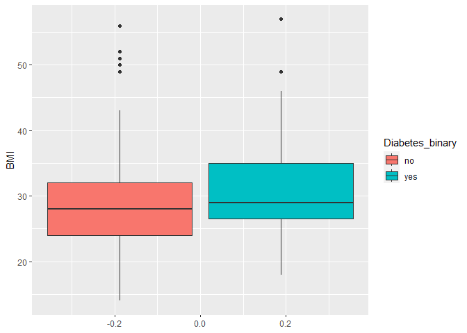
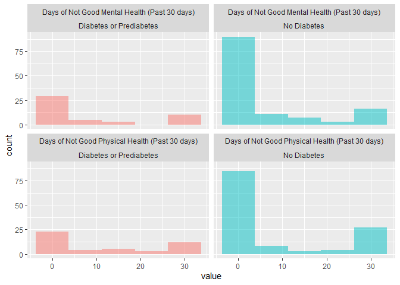
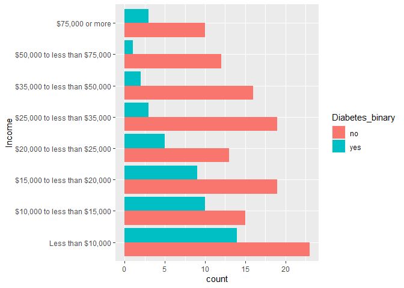

ST 558 Project 3 Education Level: Never attended school or only
kindergarten
================
Heather Copley & Andy Johnson
2023-11-08

## Introduction

## Exploratory Data Analysis

[Behavioral Risk Factor Surveillance System
Codebook](chrome-extension://efaidnbmnnnibpcajpcglclefindmkaj/https://www.cdc.gov/brfss/annual_data/2015/pdf/codebook15_llcp.pdf)

``` r
#read in data 
#filter to parameter education
#and format factors
diabetes_data <- read_csv('diabetes_binary_health_indicators_BRFSS2015.csv') %>%
    filter(Education == params$education) %>%
    mutate_at(vars(Diabetes_binary,
                   HighBP,
                   HighChol,
                   CholCheck,
                   Smoker,
                   Stroke,
                   HeartDiseaseorAttack,
                   PhysActivity,
                   Fruits,
                   Veggies,
                   HvyAlcoholConsump, 
                   AnyHealthcare,
                   NoDocbcCost,
                   DiffWalk
                  ),
              ~factor(., 
                      levels = c(0,1), 
                      labels = c("no", "yes"))) %>%
    mutate(GenHlth = factor(GenHlth, 
                            levels = c(1:5), 
                            labels = c("excellent", "very good", "good", "fair", "poor")),
           Sex = factor(Sex, 
                        levels = c(0,1), 
                            labels = c("female", "male")),
           Age = factor(Age,
                        levels = c(1:13),
                        labels = c("18-24",
                                   "25-29",
                                   "30-34",
                                   "35-39",
                                   "40-44",
                                   "45-49",
                                   "50-54",
                                   "55-59",
                                   "60-64",
                                   "65-69",
                                   "70-74",
                                   "75-79",
                                   "80-99")),
           Education = factor(Education,
                        levels = c(1:6),
                        labels = c("Never attended school or only kindergarten",
                                    "Grades 1 through 8 (Elementary)",
                                    "Grades 9 through 11 (Some high school)",
                                    "Grade 12 or GED (High school graduate)",
                                    "College 1 year to 3 years (Some college or technical school)",
                                    "College 4 years or more (College graduate)")),
          Income = factor(Income,
                          levels = c(1:8), 
                            labels = c("Less than $10,000",
                                        "$10,000 to less than $15,000",
                                        "$15,000 to less than $20,000",
                                        "$20,000 to less than $25,000",
                                        "$25,000 to less than $35,000",
                                        "$35,000 to less than $50,000",
                                        "$50,000 to less than $75,000",
                                        "$75,000 or more"))
    )

#create a vector of column descriptions/labels
descriptions <- c("Diabetes or prediabetes?"
            ,"High Blood Pressure?"
            ,"High Cholesterol?"
            ,"Cholesterol check in the past 5 years?"
            ,"Body Mass Index"
            ,"Have you smoked at least 100 cigarettes in your entire life? [Note: 5 packs = 100 cigarettes]"
            ,"(Ever told) you had a stroke?"
            ,"Coronary heart disease (CHD) or myocardial infarction (MI)?"
            ,"Physical activity in past 30 days - not including job?"
            ,"Consume Fruit 1 or more times per day?"
            ,"Consume Vegetables 1 or more times per day?"
            ,"Heavy Alcohol Consumption (adult men >=14 drinks per week and adult women>=7 drinks per week)"
            ,"Have any kind of health care coverage, including health insurance, prepaid plans such as HMO, etc.?"
            ,"Was there a time in the past 12 months when you needed to see a doctor but could not because of cost?" 
            ,"Would you say that in general your health is:" 
            ,"Now thinking about your mental health, which includes stress, depression, and problems with emotions, for how many days during the past 30 days was your mental health not good?"
            ,"Now thinking about your physical health, which includes physical illness and injury, for how many days during the past 30 days was your physical health not good?"
            ,"Do you have serious difficulty walking or climbing stairs?"
            ,"Sex"
            ,"Age Group"
            ,"What is the highest grade or year of school you completed?" 
            ,"Is your annual household income from all sources:") 


#add variable descriptions as labels
label(diabetes_data) <- descriptions

subtitle <- diabetes_data$Education %>%
    droplevels() %>%
    unique() %>%
    as.character() %>%
    paste0('Education Level: ', .)
```

### Summary Statistics

``` r
#show univariate summary statistics
print(dfSummary(diabetes_data
                ,varnumbers = FALSE
                ,valid.col = FALSE
                ,graph.magnif = .8
                ),
      method = 'render',
      headings = FALSE,
      bootstrap.css = FALSE
      )
```

<div class="container st-container">
<table class="table table-striped table-bordered st-table st-table-striped st-table-bordered st-multiline ">
  <thead>
    <tr>
      <th align="center" class="st-protect-top-border"><strong>Variable</strong></th>
      <th align="center" class="st-protect-top-border"><strong>Label</strong></th>
      <th align="center" class="st-protect-top-border"><strong>Stats / Values</strong></th>
      <th align="center" class="st-protect-top-border"><strong>Freqs (% of Valid)</strong></th>
      <th align="center" class="st-protect-top-border"><strong>Graph</strong></th>
      <th align="center" class="st-protect-top-border"><strong>Missing</strong></th>
    </tr>
  </thead>
  <tbody>
    <tr>
      <td align="left">Diabetes_binary
[factor]</td>
      <td align="left">Diabetes or prediabetes?</td>
      <td align="left" style="padding:8;vertical-align:middle"><table style="border-collapse:collapse;border:none;margin:0"><tr style="background-color:transparent"><td style="padding:0;margin:0;border:0" align="left">1. no</td></tr><tr style="background-color:transparent"><td style="padding:0;margin:0;border:0" align="left">2. yes</td></tr></table></td>
      <td align="left" style="padding:0;vertical-align:middle"><table style="border-collapse:collapse;border:none;margin:0"><tr style="background-color:transparent"><td style="padding:0 5px 0 7px;margin:0;border:0" align="right">127</td><td style="padding:0 2px 0 0;border:0;" align="left">(</td><td style="padding:0;border:0" align="right">73.0%</td><td style="padding:0 4px 0 2px;border:0" align="left">)</td></tr><tr style="background-color:transparent"><td style="padding:0 5px 0 7px;margin:0;border:0" align="right">47</td><td style="padding:0 2px 0 0;border:0;" align="left">(</td><td style="padding:0;border:0" align="right">27.0%</td><td style="padding:0 4px 0 2px;border:0" align="left">)</td></tr></table></td>
      <td align="left" style="vertical-align:middle;padding:0;background-color:transparent;"></td>
      <td align="center">0
(0.0%)</td>
    </tr>
    <tr>
      <td align="left">HighBP
[factor]</td>
      <td align="left">High Blood Pressure?</td>
      <td align="left" style="padding:8;vertical-align:middle"><table style="border-collapse:collapse;border:none;margin:0"><tr style="background-color:transparent"><td style="padding:0;margin:0;border:0" align="left">1. no</td></tr><tr style="background-color:transparent"><td style="padding:0;margin:0;border:0" align="left">2. yes</td></tr></table></td>
      <td align="left" style="padding:0;vertical-align:middle"><table style="border-collapse:collapse;border:none;margin:0"><tr style="background-color:transparent"><td style="padding:0 5px 0 7px;margin:0;border:0" align="right">86</td><td style="padding:0 2px 0 0;border:0;" align="left">(</td><td style="padding:0;border:0" align="right">49.4%</td><td style="padding:0 4px 0 2px;border:0" align="left">)</td></tr><tr style="background-color:transparent"><td style="padding:0 5px 0 7px;margin:0;border:0" align="right">88</td><td style="padding:0 2px 0 0;border:0;" align="left">(</td><td style="padding:0;border:0" align="right">50.6%</td><td style="padding:0 4px 0 2px;border:0" align="left">)</td></tr></table></td>
      <td align="left" style="vertical-align:middle;padding:0;background-color:transparent;"></td>
      <td align="center">0
(0.0%)</td>
    </tr>
    <tr>
      <td align="left">HighChol
[factor]</td>
      <td align="left">High Cholesterol?</td>
      <td align="left" style="padding:8;vertical-align:middle"><table style="border-collapse:collapse;border:none;margin:0"><tr style="background-color:transparent"><td style="padding:0;margin:0;border:0" align="left">1. no</td></tr><tr style="background-color:transparent"><td style="padding:0;margin:0;border:0" align="left">2. yes</td></tr></table></td>
      <td align="left" style="padding:0;vertical-align:middle"><table style="border-collapse:collapse;border:none;margin:0"><tr style="background-color:transparent"><td style="padding:0 5px 0 7px;margin:0;border:0" align="right">87</td><td style="padding:0 2px 0 0;border:0;" align="left">(</td><td style="padding:0;border:0" align="right">50.0%</td><td style="padding:0 4px 0 2px;border:0" align="left">)</td></tr><tr style="background-color:transparent"><td style="padding:0 5px 0 7px;margin:0;border:0" align="right">87</td><td style="padding:0 2px 0 0;border:0;" align="left">(</td><td style="padding:0;border:0" align="right">50.0%</td><td style="padding:0 4px 0 2px;border:0" align="left">)</td></tr></table></td>
      <td align="left" style="vertical-align:middle;padding:0;background-color:transparent;"></td>
      <td align="center">0
(0.0%)</td>
    </tr>
    <tr>
      <td align="left">CholCheck
[factor]</td>
      <td align="left">Cholesterol check in the past 5 years?</td>
      <td align="left" style="padding:8;vertical-align:middle"><table style="border-collapse:collapse;border:none;margin:0"><tr style="background-color:transparent"><td style="padding:0;margin:0;border:0" align="left">1. no</td></tr><tr style="background-color:transparent"><td style="padding:0;margin:0;border:0" align="left">2. yes</td></tr></table></td>
      <td align="left" style="padding:0;vertical-align:middle"><table style="border-collapse:collapse;border:none;margin:0"><tr style="background-color:transparent"><td style="padding:0 5px 0 7px;margin:0;border:0" align="right">7</td><td style="padding:0 2px 0 0;border:0;" align="left">(</td><td style="padding:0;border:0" align="right">4.0%</td><td style="padding:0 4px 0 2px;border:0" align="left">)</td></tr><tr style="background-color:transparent"><td style="padding:0 5px 0 7px;margin:0;border:0" align="right">167</td><td style="padding:0 2px 0 0;border:0;" align="left">(</td><td style="padding:0;border:0" align="right">96.0%</td><td style="padding:0 4px 0 2px;border:0" align="left">)</td></tr></table></td>
      <td align="left" style="vertical-align:middle;padding:0;background-color:transparent;"></td>
      <td align="center">0
(0.0%)</td>
    </tr>
    <tr>
      <td align="left">BMI
[numeric]</td>
      <td align="left">Body Mass Index</td>
      <td align="left" style="padding:8;vertical-align:middle"><table style="border-collapse:collapse;border:none;margin:0"><tr style="background-color:transparent"><td style="padding:0;margin:0;border:0" align="left">Mean (sd) : 29.8 (7.3)</td></tr><tr style="background-color:transparent"><td style="padding:0;margin:0;border:0" align="left">min &le; med &le; max:</td></tr><tr style="background-color:transparent"><td style="padding:0;margin:0;border:0" align="left">14 &le; 28 &le; 57</td></tr><tr style="background-color:transparent"><td style="padding:0;margin:0;border:0" align="left">IQR (CV) : 8 (0.2)</td></tr></table></td>
      <td align="left" style="vertical-align:middle">34 distinct values</td>
      <td align="left" style="vertical-align:middle;padding:0;background-color:transparent;"></td>
      <td align="center">0
(0.0%)</td>
    </tr>
    <tr>
      <td align="left">Smoker
[factor]</td>
      <td align="left">Have you smoked at least 100 cigarettes
in your entire life? [Note: 5 packs =
100 cigarettes]</td>
      <td align="left" style="padding:8;vertical-align:middle"><table style="border-collapse:collapse;border:none;margin:0"><tr style="background-color:transparent"><td style="padding:0;margin:0;border:0" align="left">1. no</td></tr><tr style="background-color:transparent"><td style="padding:0;margin:0;border:0" align="left">2. yes</td></tr></table></td>
      <td align="left" style="padding:0;vertical-align:middle"><table style="border-collapse:collapse;border:none;margin:0"><tr style="background-color:transparent"><td style="padding:0 5px 0 7px;margin:0;border:0" align="right">108</td><td style="padding:0 2px 0 0;border:0;" align="left">(</td><td style="padding:0;border:0" align="right">62.1%</td><td style="padding:0 4px 0 2px;border:0" align="left">)</td></tr><tr style="background-color:transparent"><td style="padding:0 5px 0 7px;margin:0;border:0" align="right">66</td><td style="padding:0 2px 0 0;border:0;" align="left">(</td><td style="padding:0;border:0" align="right">37.9%</td><td style="padding:0 4px 0 2px;border:0" align="left">)</td></tr></table></td>
      <td align="left" style="vertical-align:middle;padding:0;background-color:transparent;"></td>
      <td align="center">0
(0.0%)</td>
    </tr>
    <tr>
      <td align="left">Stroke
[factor]</td>
      <td align="left">(Ever told) you had a stroke?</td>
      <td align="left" style="padding:8;vertical-align:middle"><table style="border-collapse:collapse;border:none;margin:0"><tr style="background-color:transparent"><td style="padding:0;margin:0;border:0" align="left">1. no</td></tr><tr style="background-color:transparent"><td style="padding:0;margin:0;border:0" align="left">2. yes</td></tr></table></td>
      <td align="left" style="padding:0;vertical-align:middle"><table style="border-collapse:collapse;border:none;margin:0"><tr style="background-color:transparent"><td style="padding:0 5px 0 7px;margin:0;border:0" align="right">160</td><td style="padding:0 2px 0 0;border:0;" align="left">(</td><td style="padding:0;border:0" align="right">92.0%</td><td style="padding:0 4px 0 2px;border:0" align="left">)</td></tr><tr style="background-color:transparent"><td style="padding:0 5px 0 7px;margin:0;border:0" align="right">14</td><td style="padding:0 2px 0 0;border:0;" align="left">(</td><td style="padding:0;border:0" align="right">8.0%</td><td style="padding:0 4px 0 2px;border:0" align="left">)</td></tr></table></td>
      <td align="left" style="vertical-align:middle;padding:0;background-color:transparent;"></td>
      <td align="center">0
(0.0%)</td>
    </tr>
    <tr>
      <td align="left">HeartDiseaseorAttack
[factor]</td>
      <td align="left">Coronary heart disease (CHD) or
myocardial infarction (MI)?</td>
      <td align="left" style="padding:8;vertical-align:middle"><table style="border-collapse:collapse;border:none;margin:0"><tr style="background-color:transparent"><td style="padding:0;margin:0;border:0" align="left">1. no</td></tr><tr style="background-color:transparent"><td style="padding:0;margin:0;border:0" align="left">2. yes</td></tr></table></td>
      <td align="left" style="padding:0;vertical-align:middle"><table style="border-collapse:collapse;border:none;margin:0"><tr style="background-color:transparent"><td style="padding:0 5px 0 7px;margin:0;border:0" align="right">145</td><td style="padding:0 2px 0 0;border:0;" align="left">(</td><td style="padding:0;border:0" align="right">83.3%</td><td style="padding:0 4px 0 2px;border:0" align="left">)</td></tr><tr style="background-color:transparent"><td style="padding:0 5px 0 7px;margin:0;border:0" align="right">29</td><td style="padding:0 2px 0 0;border:0;" align="left">(</td><td style="padding:0;border:0" align="right">16.7%</td><td style="padding:0 4px 0 2px;border:0" align="left">)</td></tr></table></td>
      <td align="left" style="vertical-align:middle;padding:0;background-color:transparent;"></td>
      <td align="center">0
(0.0%)</td>
    </tr>
    <tr>
      <td align="left">PhysActivity
[factor]</td>
      <td align="left">Physical activity in past 30 days - not
including job?</td>
      <td align="left" style="padding:8;vertical-align:middle"><table style="border-collapse:collapse;border:none;margin:0"><tr style="background-color:transparent"><td style="padding:0;margin:0;border:0" align="left">1. no</td></tr><tr style="background-color:transparent"><td style="padding:0;margin:0;border:0" align="left">2. yes</td></tr></table></td>
      <td align="left" style="padding:0;vertical-align:middle"><table style="border-collapse:collapse;border:none;margin:0"><tr style="background-color:transparent"><td style="padding:0 5px 0 7px;margin:0;border:0" align="right">79</td><td style="padding:0 2px 0 0;border:0;" align="left">(</td><td style="padding:0;border:0" align="right">45.4%</td><td style="padding:0 4px 0 2px;border:0" align="left">)</td></tr><tr style="background-color:transparent"><td style="padding:0 5px 0 7px;margin:0;border:0" align="right">95</td><td style="padding:0 2px 0 0;border:0;" align="left">(</td><td style="padding:0;border:0" align="right">54.6%</td><td style="padding:0 4px 0 2px;border:0" align="left">)</td></tr></table></td>
      <td align="left" style="vertical-align:middle;padding:0;background-color:transparent;"></td>
      <td align="center">0
(0.0%)</td>
    </tr>
    <tr>
      <td align="left">Fruits
[factor]</td>
      <td align="left">Consume Fruit 1 or more times per day?</td>
      <td align="left" style="padding:8;vertical-align:middle"><table style="border-collapse:collapse;border:none;margin:0"><tr style="background-color:transparent"><td style="padding:0;margin:0;border:0" align="left">1. no</td></tr><tr style="background-color:transparent"><td style="padding:0;margin:0;border:0" align="left">2. yes</td></tr></table></td>
      <td align="left" style="padding:0;vertical-align:middle"><table style="border-collapse:collapse;border:none;margin:0"><tr style="background-color:transparent"><td style="padding:0 5px 0 7px;margin:0;border:0" align="right">64</td><td style="padding:0 2px 0 0;border:0;" align="left">(</td><td style="padding:0;border:0" align="right">36.8%</td><td style="padding:0 4px 0 2px;border:0" align="left">)</td></tr><tr style="background-color:transparent"><td style="padding:0 5px 0 7px;margin:0;border:0" align="right">110</td><td style="padding:0 2px 0 0;border:0;" align="left">(</td><td style="padding:0;border:0" align="right">63.2%</td><td style="padding:0 4px 0 2px;border:0" align="left">)</td></tr></table></td>
      <td align="left" style="vertical-align:middle;padding:0;background-color:transparent;"></td>
      <td align="center">0
(0.0%)</td>
    </tr>
    <tr>
      <td align="left">Veggies
[factor]</td>
      <td align="left">Consume Vegetables 1 or more times per
day?</td>
      <td align="left" style="padding:8;vertical-align:middle"><table style="border-collapse:collapse;border:none;margin:0"><tr style="background-color:transparent"><td style="padding:0;margin:0;border:0" align="left">1. no</td></tr><tr style="background-color:transparent"><td style="padding:0;margin:0;border:0" align="left">2. yes</td></tr></table></td>
      <td align="left" style="padding:0;vertical-align:middle"><table style="border-collapse:collapse;border:none;margin:0"><tr style="background-color:transparent"><td style="padding:0 5px 0 7px;margin:0;border:0" align="right">47</td><td style="padding:0 2px 0 0;border:0;" align="left">(</td><td style="padding:0;border:0" align="right">27.0%</td><td style="padding:0 4px 0 2px;border:0" align="left">)</td></tr><tr style="background-color:transparent"><td style="padding:0 5px 0 7px;margin:0;border:0" align="right">127</td><td style="padding:0 2px 0 0;border:0;" align="left">(</td><td style="padding:0;border:0" align="right">73.0%</td><td style="padding:0 4px 0 2px;border:0" align="left">)</td></tr></table></td>
      <td align="left" style="vertical-align:middle;padding:0;background-color:transparent;"></td>
      <td align="center">0
(0.0%)</td>
    </tr>
    <tr>
      <td align="left">HvyAlcoholConsump
[factor]</td>
      <td align="left">Heavy Alcohol Consumption (adult men
>=14 drinks per week and adult women>=7
drinks per week)</td>
      <td align="left" style="padding:8;vertical-align:middle"><table style="border-collapse:collapse;border:none;margin:0"><tr style="background-color:transparent"><td style="padding:0;margin:0;border:0" align="left">1. no</td></tr><tr style="background-color:transparent"><td style="padding:0;margin:0;border:0" align="left">2. yes</td></tr></table></td>
      <td align="left" style="padding:0;vertical-align:middle"><table style="border-collapse:collapse;border:none;margin:0"><tr style="background-color:transparent"><td style="padding:0 5px 0 7px;margin:0;border:0" align="right">167</td><td style="padding:0 2px 0 0;border:0;" align="left">(</td><td style="padding:0;border:0" align="right">96.0%</td><td style="padding:0 4px 0 2px;border:0" align="left">)</td></tr><tr style="background-color:transparent"><td style="padding:0 5px 0 7px;margin:0;border:0" align="right">7</td><td style="padding:0 2px 0 0;border:0;" align="left">(</td><td style="padding:0;border:0" align="right">4.0%</td><td style="padding:0 4px 0 2px;border:0" align="left">)</td></tr></table></td>
      <td align="left" style="vertical-align:middle;padding:0;background-color:transparent;"></td>
      <td align="center">0
(0.0%)</td>
    </tr>
    <tr>
      <td align="left">AnyHealthcare
[factor]</td>
      <td align="left">Have any kind of health care coverage,
including health insurance, prepaid
plans such as HMO, etc.?</td>
      <td align="left" style="padding:8;vertical-align:middle"><table style="border-collapse:collapse;border:none;margin:0"><tr style="background-color:transparent"><td style="padding:0;margin:0;border:0" align="left">1. no</td></tr><tr style="background-color:transparent"><td style="padding:0;margin:0;border:0" align="left">2. yes</td></tr></table></td>
      <td align="left" style="padding:0;vertical-align:middle"><table style="border-collapse:collapse;border:none;margin:0"><tr style="background-color:transparent"><td style="padding:0 5px 0 7px;margin:0;border:0" align="right">37</td><td style="padding:0 2px 0 0;border:0;" align="left">(</td><td style="padding:0;border:0" align="right">21.3%</td><td style="padding:0 4px 0 2px;border:0" align="left">)</td></tr><tr style="background-color:transparent"><td style="padding:0 5px 0 7px;margin:0;border:0" align="right">137</td><td style="padding:0 2px 0 0;border:0;" align="left">(</td><td style="padding:0;border:0" align="right">78.7%</td><td style="padding:0 4px 0 2px;border:0" align="left">)</td></tr></table></td>
      <td align="left" style="vertical-align:middle;padding:0;background-color:transparent;"></td>
      <td align="center">0
(0.0%)</td>
    </tr>
    <tr>
      <td align="left">NoDocbcCost
[factor]</td>
      <td align="left">Was there a time in the past 12 months
when you needed to see a doctor but
could not because of cost?</td>
      <td align="left" style="padding:8;vertical-align:middle"><table style="border-collapse:collapse;border:none;margin:0"><tr style="background-color:transparent"><td style="padding:0;margin:0;border:0" align="left">1. no</td></tr><tr style="background-color:transparent"><td style="padding:0;margin:0;border:0" align="left">2. yes</td></tr></table></td>
      <td align="left" style="padding:0;vertical-align:middle"><table style="border-collapse:collapse;border:none;margin:0"><tr style="background-color:transparent"><td style="padding:0 5px 0 7px;margin:0;border:0" align="right">133</td><td style="padding:0 2px 0 0;border:0;" align="left">(</td><td style="padding:0;border:0" align="right">76.4%</td><td style="padding:0 4px 0 2px;border:0" align="left">)</td></tr><tr style="background-color:transparent"><td style="padding:0 5px 0 7px;margin:0;border:0" align="right">41</td><td style="padding:0 2px 0 0;border:0;" align="left">(</td><td style="padding:0;border:0" align="right">23.6%</td><td style="padding:0 4px 0 2px;border:0" align="left">)</td></tr></table></td>
      <td align="left" style="vertical-align:middle;padding:0;background-color:transparent;"></td>
      <td align="center">0
(0.0%)</td>
    </tr>
    <tr>
      <td align="left">GenHlth
[factor]</td>
      <td align="left">Would you say that in general your
health is:</td>
      <td align="left" style="padding:8;vertical-align:middle"><table style="border-collapse:collapse;border:none;margin:0"><tr style="background-color:transparent"><td style="padding:0;margin:0;border:0" align="left">1. excellent</td></tr><tr style="background-color:transparent"><td style="padding:0;margin:0;border:0" align="left">2. very good</td></tr><tr style="background-color:transparent"><td style="padding:0;margin:0;border:0" align="left">3. good</td></tr><tr style="background-color:transparent"><td style="padding:0;margin:0;border:0" align="left">4. fair</td></tr><tr style="background-color:transparent"><td style="padding:0;margin:0;border:0" align="left">5. poor</td></tr></table></td>
      <td align="left" style="padding:0;vertical-align:middle"><table style="border-collapse:collapse;border:none;margin:0"><tr style="background-color:transparent"><td style="padding:0 5px 0 7px;margin:0;border:0" align="right">9</td><td style="padding:0 2px 0 0;border:0;" align="left">(</td><td style="padding:0;border:0" align="right">5.2%</td><td style="padding:0 4px 0 2px;border:0" align="left">)</td></tr><tr style="background-color:transparent"><td style="padding:0 5px 0 7px;margin:0;border:0" align="right">26</td><td style="padding:0 2px 0 0;border:0;" align="left">(</td><td style="padding:0;border:0" align="right">14.9%</td><td style="padding:0 4px 0 2px;border:0" align="left">)</td></tr><tr style="background-color:transparent"><td style="padding:0 5px 0 7px;margin:0;border:0" align="right">49</td><td style="padding:0 2px 0 0;border:0;" align="left">(</td><td style="padding:0;border:0" align="right">28.2%</td><td style="padding:0 4px 0 2px;border:0" align="left">)</td></tr><tr style="background-color:transparent"><td style="padding:0 5px 0 7px;margin:0;border:0" align="right">56</td><td style="padding:0 2px 0 0;border:0;" align="left">(</td><td style="padding:0;border:0" align="right">32.2%</td><td style="padding:0 4px 0 2px;border:0" align="left">)</td></tr><tr style="background-color:transparent"><td style="padding:0 5px 0 7px;margin:0;border:0" align="right">34</td><td style="padding:0 2px 0 0;border:0;" align="left">(</td><td style="padding:0;border:0" align="right">19.5%</td><td style="padding:0 4px 0 2px;border:0" align="left">)</td></tr></table></td>
      <td align="left" style="vertical-align:middle;padding:0;background-color:transparent;"></td>
      <td align="center">0
(0.0%)</td>
    </tr>
    <tr>
      <td align="left">MentHlth
[numeric]</td>
      <td align="left">Now thinking about your mental health,
which includes stress, depression, and
problems with emotions, for how many
days during the past 30 days was your
mental health not good?</td>
      <td align="left" style="padding:8;vertical-align:middle"><table style="border-collapse:collapse;border:none;margin:0"><tr style="background-color:transparent"><td style="padding:0;margin:0;border:0" align="left">Mean (sd) : 6.6 (10.8)</td></tr><tr style="background-color:transparent"><td style="padding:0;margin:0;border:0" align="left">min &le; med &le; max:</td></tr><tr style="background-color:transparent"><td style="padding:0;margin:0;border:0" align="left">0 &le; 0 &le; 30</td></tr><tr style="background-color:transparent"><td style="padding:0;margin:0;border:0" align="left">IQR (CV) : 10 (1.6)</td></tr></table></td>
      <td align="left" style="vertical-align:middle">14 distinct values</td>
      <td align="left" style="vertical-align:middle;padding:0;background-color:transparent;"></td>
      <td align="center">0
(0.0%)</td>
    </tr>
    <tr>
      <td align="left">PhysHlth
[numeric]</td>
      <td align="left">Now thinking about your physical
health, which includes physical illness
and injury, for how many days during
the past 30 days was your physical
health not good?</td>
      <td align="left" style="padding:8;vertical-align:middle"><table style="border-collapse:collapse;border:none;margin:0"><tr style="background-color:transparent"><td style="padding:0;margin:0;border:0" align="left">Mean (sd) : 8.9 (12.4)</td></tr><tr style="background-color:transparent"><td style="padding:0;margin:0;border:0" align="left">min &le; med &le; max:</td></tr><tr style="background-color:transparent"><td style="padding:0;margin:0;border:0" align="left">0 &le; 0 &le; 30</td></tr><tr style="background-color:transparent"><td style="padding:0;margin:0;border:0" align="left">IQR (CV) : 20 (1.4)</td></tr></table></td>
      <td align="left" style="vertical-align:middle">16 distinct values</td>
      <td align="left" style="vertical-align:middle;padding:0;background-color:transparent;"></td>
      <td align="center">0
(0.0%)</td>
    </tr>
    <tr>
      <td align="left">DiffWalk
[factor]</td>
      <td align="left">Do you have serious difficulty walking
or climbing stairs?</td>
      <td align="left" style="padding:8;vertical-align:middle"><table style="border-collapse:collapse;border:none;margin:0"><tr style="background-color:transparent"><td style="padding:0;margin:0;border:0" align="left">1. no</td></tr><tr style="background-color:transparent"><td style="padding:0;margin:0;border:0" align="left">2. yes</td></tr></table></td>
      <td align="left" style="padding:0;vertical-align:middle"><table style="border-collapse:collapse;border:none;margin:0"><tr style="background-color:transparent"><td style="padding:0 5px 0 7px;margin:0;border:0" align="right">114</td><td style="padding:0 2px 0 0;border:0;" align="left">(</td><td style="padding:0;border:0" align="right">65.5%</td><td style="padding:0 4px 0 2px;border:0" align="left">)</td></tr><tr style="background-color:transparent"><td style="padding:0 5px 0 7px;margin:0;border:0" align="right">60</td><td style="padding:0 2px 0 0;border:0;" align="left">(</td><td style="padding:0;border:0" align="right">34.5%</td><td style="padding:0 4px 0 2px;border:0" align="left">)</td></tr></table></td>
      <td align="left" style="vertical-align:middle;padding:0;background-color:transparent;"></td>
      <td align="center">0
(0.0%)</td>
    </tr>
    <tr>
      <td align="left">Sex
[factor]</td>
      <td align="left">Sex</td>
      <td align="left" style="padding:8;vertical-align:middle"><table style="border-collapse:collapse;border:none;margin:0"><tr style="background-color:transparent"><td style="padding:0;margin:0;border:0" align="left">1. female</td></tr><tr style="background-color:transparent"><td style="padding:0;margin:0;border:0" align="left">2. male</td></tr></table></td>
      <td align="left" style="padding:0;vertical-align:middle"><table style="border-collapse:collapse;border:none;margin:0"><tr style="background-color:transparent"><td style="padding:0 5px 0 7px;margin:0;border:0" align="right">102</td><td style="padding:0 2px 0 0;border:0;" align="left">(</td><td style="padding:0;border:0" align="right">58.6%</td><td style="padding:0 4px 0 2px;border:0" align="left">)</td></tr><tr style="background-color:transparent"><td style="padding:0 5px 0 7px;margin:0;border:0" align="right">72</td><td style="padding:0 2px 0 0;border:0;" align="left">(</td><td style="padding:0;border:0" align="right">41.4%</td><td style="padding:0 4px 0 2px;border:0" align="left">)</td></tr></table></td>
      <td align="left" style="vertical-align:middle;padding:0;background-color:transparent;"></td>
      <td align="center">0
(0.0%)</td>
    </tr>
    <tr>
      <td align="left">Age
[factor]</td>
      <td align="left">Age Group</td>
      <td align="left" style="padding:8;vertical-align:middle"><table style="border-collapse:collapse;border:none;margin:0"><tr style="background-color:transparent"><td style="padding:0;margin:0;border:0" align="left">1. 18-24</td></tr><tr style="background-color:transparent"><td style="padding:0;margin:0;border:0" align="left">2. 25-29</td></tr><tr style="background-color:transparent"><td style="padding:0;margin:0;border:0" align="left">3. 30-34</td></tr><tr style="background-color:transparent"><td style="padding:0;margin:0;border:0" align="left">4. 35-39</td></tr><tr style="background-color:transparent"><td style="padding:0;margin:0;border:0" align="left">5. 40-44</td></tr><tr style="background-color:transparent"><td style="padding:0;margin:0;border:0" align="left">6. 45-49</td></tr><tr style="background-color:transparent"><td style="padding:0;margin:0;border:0" align="left">7. 50-54</td></tr><tr style="background-color:transparent"><td style="padding:0;margin:0;border:0" align="left">8. 55-59</td></tr><tr style="background-color:transparent"><td style="padding:0;margin:0;border:0" align="left">9. 60-64</td></tr><tr style="background-color:transparent"><td style="padding:0;margin:0;border:0" align="left">10. 65-69</td></tr><tr style="background-color:transparent"><td style="padding:0;margin:0;border:0" align="left">[ 3 others ]</td></tr></table></td>
      <td align="left" style="padding:0;vertical-align:middle"><table style="border-collapse:collapse;border:none;margin:0"><tr style="background-color:transparent"><td style="padding:0 5px 0 7px;margin:0;border:0" align="right">4</td><td style="padding:0 2px 0 0;border:0;" align="left">(</td><td style="padding:0;border:0" align="right">2.3%</td><td style="padding:0 4px 0 2px;border:0" align="left">)</td></tr><tr style="background-color:transparent"><td style="padding:0 5px 0 7px;margin:0;border:0" align="right">1</td><td style="padding:0 2px 0 0;border:0;" align="left">(</td><td style="padding:0;border:0" align="right">0.6%</td><td style="padding:0 4px 0 2px;border:0" align="left">)</td></tr><tr style="background-color:transparent"><td style="padding:0 5px 0 7px;margin:0;border:0" align="right">7</td><td style="padding:0 2px 0 0;border:0;" align="left">(</td><td style="padding:0;border:0" align="right">4.0%</td><td style="padding:0 4px 0 2px;border:0" align="left">)</td></tr><tr style="background-color:transparent"><td style="padding:0 5px 0 7px;margin:0;border:0" align="right">7</td><td style="padding:0 2px 0 0;border:0;" align="left">(</td><td style="padding:0;border:0" align="right">4.0%</td><td style="padding:0 4px 0 2px;border:0" align="left">)</td></tr><tr style="background-color:transparent"><td style="padding:0 5px 0 7px;margin:0;border:0" align="right">10</td><td style="padding:0 2px 0 0;border:0;" align="left">(</td><td style="padding:0;border:0" align="right">5.7%</td><td style="padding:0 4px 0 2px;border:0" align="left">)</td></tr><tr style="background-color:transparent"><td style="padding:0 5px 0 7px;margin:0;border:0" align="right">12</td><td style="padding:0 2px 0 0;border:0;" align="left">(</td><td style="padding:0;border:0" align="right">6.9%</td><td style="padding:0 4px 0 2px;border:0" align="left">)</td></tr><tr style="background-color:transparent"><td style="padding:0 5px 0 7px;margin:0;border:0" align="right">22</td><td style="padding:0 2px 0 0;border:0;" align="left">(</td><td style="padding:0;border:0" align="right">12.6%</td><td style="padding:0 4px 0 2px;border:0" align="left">)</td></tr><tr style="background-color:transparent"><td style="padding:0 5px 0 7px;margin:0;border:0" align="right">20</td><td style="padding:0 2px 0 0;border:0;" align="left">(</td><td style="padding:0;border:0" align="right">11.5%</td><td style="padding:0 4px 0 2px;border:0" align="left">)</td></tr><tr style="background-color:transparent"><td style="padding:0 5px 0 7px;margin:0;border:0" align="right">26</td><td style="padding:0 2px 0 0;border:0;" align="left">(</td><td style="padding:0;border:0" align="right">14.9%</td><td style="padding:0 4px 0 2px;border:0" align="left">)</td></tr><tr style="background-color:transparent"><td style="padding:0 5px 0 7px;margin:0;border:0" align="right">17</td><td style="padding:0 2px 0 0;border:0;" align="left">(</td><td style="padding:0;border:0" align="right">9.8%</td><td style="padding:0 4px 0 2px;border:0" align="left">)</td></tr><tr style="background-color:transparent"><td style="padding:0 5px 0 7px;margin:0;border:0" align="right">48</td><td style="padding:0 2px 0 0;border:0;" align="left">(</td><td style="padding:0;border:0" align="right">27.6%</td><td style="padding:0 4px 0 2px;border:0" align="left">)</td></tr></table></td>
      <td align="left" style="vertical-align:middle;padding:0;background-color:transparent;"></td>
      <td align="center">0
(0.0%)</td>
    </tr>
    <tr>
      <td align="left">Education
[factor]</td>
      <td align="left">What is the highest grade or year of
school you completed?</td>
      <td align="left" style="padding:8;vertical-align:middle"><table style="border-collapse:collapse;border:none;margin:0"><tr style="background-color:transparent"><td style="padding:0;margin:0;border:0" align="left">1. Never attended school or </td></tr><tr style="background-color:transparent"><td style="padding:0;margin:0;border:0" align="left">2. Grades 1 through 8 (Eleme</td></tr><tr style="background-color:transparent"><td style="padding:0;margin:0;border:0" align="left">3. Grades 9 through 11 (Some</td></tr><tr style="background-color:transparent"><td style="padding:0;margin:0;border:0" align="left">4. Grade 12 or GED (High sch</td></tr><tr style="background-color:transparent"><td style="padding:0;margin:0;border:0" align="left">5. College 1 year to 3 years</td></tr><tr style="background-color:transparent"><td style="padding:0;margin:0;border:0" align="left">6. College 4 years or more (</td></tr></table></td>
      <td align="left" style="padding:0;vertical-align:middle"><table style="border-collapse:collapse;border:none;margin:0"><tr style="background-color:transparent"><td style="padding:0 5px 0 7px;margin:0;border:0" align="right">174</td><td style="padding:0 2px 0 0;border:0;" align="left">(</td><td style="padding:0;border:0" align="right">100.0%</td><td style="padding:0 4px 0 2px;border:0" align="left">)</td></tr><tr style="background-color:transparent"><td style="padding:0 5px 0 7px;margin:0;border:0" align="right">0</td><td style="padding:0 2px 0 0;border:0;" align="left">(</td><td style="padding:0;border:0" align="right">0.0%</td><td style="padding:0 4px 0 2px;border:0" align="left">)</td></tr><tr style="background-color:transparent"><td style="padding:0 5px 0 7px;margin:0;border:0" align="right">0</td><td style="padding:0 2px 0 0;border:0;" align="left">(</td><td style="padding:0;border:0" align="right">0.0%</td><td style="padding:0 4px 0 2px;border:0" align="left">)</td></tr><tr style="background-color:transparent"><td style="padding:0 5px 0 7px;margin:0;border:0" align="right">0</td><td style="padding:0 2px 0 0;border:0;" align="left">(</td><td style="padding:0;border:0" align="right">0.0%</td><td style="padding:0 4px 0 2px;border:0" align="left">)</td></tr><tr style="background-color:transparent"><td style="padding:0 5px 0 7px;margin:0;border:0" align="right">0</td><td style="padding:0 2px 0 0;border:0;" align="left">(</td><td style="padding:0;border:0" align="right">0.0%</td><td style="padding:0 4px 0 2px;border:0" align="left">)</td></tr><tr style="background-color:transparent"><td style="padding:0 5px 0 7px;margin:0;border:0" align="right">0</td><td style="padding:0 2px 0 0;border:0;" align="left">(</td><td style="padding:0;border:0" align="right">0.0%</td><td style="padding:0 4px 0 2px;border:0" align="left">)</td></tr></table></td>
      <td align="left" style="vertical-align:middle;padding:0;background-color:transparent;"></td>
      <td align="center">0
(0.0%)</td>
    </tr>
    <tr>
      <td align="left">Income
[factor]</td>
      <td align="left">Is your annual household income from
all sources:</td>
      <td align="left" style="padding:8;vertical-align:middle"><table style="border-collapse:collapse;border:none;margin:0"><tr style="background-color:transparent"><td style="padding:0;margin:0;border:0" align="left">1. Less than $10,000</td></tr><tr style="background-color:transparent"><td style="padding:0;margin:0;border:0" align="left">2. $10,000 to less than $15,</td></tr><tr style="background-color:transparent"><td style="padding:0;margin:0;border:0" align="left">3. $15,000 to less than $20,</td></tr><tr style="background-color:transparent"><td style="padding:0;margin:0;border:0" align="left">4. $20,000 to less than $25,</td></tr><tr style="background-color:transparent"><td style="padding:0;margin:0;border:0" align="left">5. $25,000 to less than $35,</td></tr><tr style="background-color:transparent"><td style="padding:0;margin:0;border:0" align="left">6. $35,000 to less than $50,</td></tr><tr style="background-color:transparent"><td style="padding:0;margin:0;border:0" align="left">7. $50,000 to less than $75,</td></tr><tr style="background-color:transparent"><td style="padding:0;margin:0;border:0" align="left">8. $75,000 or more</td></tr></table></td>
      <td align="left" style="padding:0;vertical-align:middle"><table style="border-collapse:collapse;border:none;margin:0"><tr style="background-color:transparent"><td style="padding:0 5px 0 7px;margin:0;border:0" align="right">37</td><td style="padding:0 2px 0 0;border:0;" align="left">(</td><td style="padding:0;border:0" align="right">21.3%</td><td style="padding:0 4px 0 2px;border:0" align="left">)</td></tr><tr style="background-color:transparent"><td style="padding:0 5px 0 7px;margin:0;border:0" align="right">25</td><td style="padding:0 2px 0 0;border:0;" align="left">(</td><td style="padding:0;border:0" align="right">14.4%</td><td style="padding:0 4px 0 2px;border:0" align="left">)</td></tr><tr style="background-color:transparent"><td style="padding:0 5px 0 7px;margin:0;border:0" align="right">28</td><td style="padding:0 2px 0 0;border:0;" align="left">(</td><td style="padding:0;border:0" align="right">16.1%</td><td style="padding:0 4px 0 2px;border:0" align="left">)</td></tr><tr style="background-color:transparent"><td style="padding:0 5px 0 7px;margin:0;border:0" align="right">18</td><td style="padding:0 2px 0 0;border:0;" align="left">(</td><td style="padding:0;border:0" align="right">10.3%</td><td style="padding:0 4px 0 2px;border:0" align="left">)</td></tr><tr style="background-color:transparent"><td style="padding:0 5px 0 7px;margin:0;border:0" align="right">22</td><td style="padding:0 2px 0 0;border:0;" align="left">(</td><td style="padding:0;border:0" align="right">12.6%</td><td style="padding:0 4px 0 2px;border:0" align="left">)</td></tr><tr style="background-color:transparent"><td style="padding:0 5px 0 7px;margin:0;border:0" align="right">18</td><td style="padding:0 2px 0 0;border:0;" align="left">(</td><td style="padding:0;border:0" align="right">10.3%</td><td style="padding:0 4px 0 2px;border:0" align="left">)</td></tr><tr style="background-color:transparent"><td style="padding:0 5px 0 7px;margin:0;border:0" align="right">13</td><td style="padding:0 2px 0 0;border:0;" align="left">(</td><td style="padding:0;border:0" align="right">7.5%</td><td style="padding:0 4px 0 2px;border:0" align="left">)</td></tr><tr style="background-color:transparent"><td style="padding:0 5px 0 7px;margin:0;border:0" align="right">13</td><td style="padding:0 2px 0 0;border:0;" align="left">(</td><td style="padding:0;border:0" align="right">7.5%</td><td style="padding:0 4px 0 2px;border:0" align="left">)</td></tr></table></td>
      <td align="left" style="vertical-align:middle;padding:0;background-color:transparent;"></td>
      <td align="center">0
(0.0%)</td>
    </tr>
  </tbody>
</table>
<p>Generated by <a href='https://github.com/dcomtois/summarytools'>summarytools</a> 1.0.1 (<a href='https://www.r-project.org/'>R</a> version 4.2.1)<br/>2023-11-08</p>
</div>

### Contingency Tables

#### High Blood Pressure

``` r
#create contingency table of High Blood Pressure and Diabetes
with(diabetes_data,
    ctable( x = HighBP, 
            y = Diabetes_binary,
            chisq = TRUE)) %>%
    print(method = 'render')
```

<div class="container st-container">
<h3>Cross-Tabulation, Row Proportions</h3>
<h4>HighBP * Diabetes_binary</h4>
<strong>Data Frame</strong>: diabetes_data
<br/>
<table class="table table-bordered st-table st-table-bordered st-cross-table ">
<thead>
<tr>
<th></th>
<th colspan="8" align="center" class="st-protect-top-border">Diabetes_binary</th>
<th colspan="4"></th>
</tr>
<tr>
<td align="center">
<strong>HighBP</strong>
</td>
<th colspan="4" align="center">no</th>
<th colspan="4" align="center">yes</th>
<th colspan="4" align="center">Total</th>
</tr>
</thead>
<tbody>
<tr>
<td>
<strong align="center">no</strong>
</td>
<td align="right" style="padding:0 0 0 15px;border-right:0;text-align:right">74</td>
<td align="left" style="padding:0 1px 0 4px;border-left:0;border-right:0;text-align:left">(</td>
<td align="left" style="padding:0;border-left:0;border-right:0;text-align:right">86.0%</td>
<td align="left" style="padding:0 15px 0 1px;border-left:0;text-align:right">)</td>
<td align="right" style="padding:0 0 0 15px;border-right:0;text-align:right">12</td>
<td align="left" style="padding:0 1px 0 4px;border-left:0;border-right:0;text-align:left">(</td>
<td align="left" style="padding:0;border-left:0;border-right:0;text-align:right">14.0%</td>
<td align="left" style="padding:0 15px 0 1px;border-left:0;text-align:right">)</td>
<td align="right" style="padding:0 0 0 15px;border-right:0;text-align:right">86</td>
<td align="left" style="padding:0 1px 0 4px;border-left:0;border-right:0;text-align:left">(</td>
<td align="left" style="padding:0;border-left:0;border-right:0;text-align:right">100.0%</td>
<td align="left" style="padding:0 15px 0 1px;border-left:0;text-align:right">)</td>
</tr>
<tr>
<td>
<strong align="center">yes</strong>
</td>
<td align="right" style="padding:0 0 0 15px;border-right:0;text-align:right">53</td>
<td align="left" style="padding:0 1px 0 4px;border-left:0;border-right:0;text-align:left">(</td>
<td align="left" style="padding:0;border-left:0;border-right:0;text-align:right">60.2%</td>
<td align="left" style="padding:0 15px 0 1px;border-left:0;text-align:right">)</td>
<td align="right" style="padding:0 0 0 15px;border-right:0;text-align:right">35</td>
<td align="left" style="padding:0 1px 0 4px;border-left:0;border-right:0;text-align:left">(</td>
<td align="left" style="padding:0;border-left:0;border-right:0;text-align:right">39.8%</td>
<td align="left" style="padding:0 15px 0 1px;border-left:0;text-align:right">)</td>
<td align="right" style="padding:0 0 0 15px;border-right:0;text-align:right">88</td>
<td align="left" style="padding:0 1px 0 4px;border-left:0;border-right:0;text-align:left">(</td>
<td align="left" style="padding:0;border-left:0;border-right:0;text-align:right">100.0%</td>
<td align="left" style="padding:0 15px 0 1px;border-left:0;text-align:right">)</td>
</tr>
<tr>
<td>
<strong align="center">Total</strong>
</td>
<td align="right" style="padding:0 0 0 15px;border-right:0;text-align:right">127</td>
<td align="left" style="padding:0 1px 0 4px;border-left:0;border-right:0;text-align:left">(</td>
<td align="left" style="padding:0;border-left:0;border-right:0;text-align:right">73.0%</td>
<td align="left" style="padding:0 15px 0 1px;border-left:0;text-align:right">)</td>
<td align="right" style="padding:0 0 0 15px;border-right:0;text-align:right">47</td>
<td align="left" style="padding:0 1px 0 4px;border-left:0;border-right:0;text-align:left">(</td>
<td align="left" style="padding:0;border-left:0;border-right:0;text-align:right">27.0%</td>
<td align="left" style="padding:0 15px 0 1px;border-left:0;text-align:right">)</td>
<td align="right" style="padding:0 0 0 15px;border-right:0;text-align:right">174</td>
<td align="left" style="padding:0 1px 0 4px;border-left:0;border-right:0;text-align:left">(</td>
<td align="left" style="padding:0;border-left:0;border-right:0;text-align:right">100.0%</td>
<td align="left" style="padding:0 15px 0 1px;border-left:0;text-align:right">)</td>
</tr>
</tbody>
<tfoot>
<tr>
<td colspan="100"><em><strong>&nbsp;&#935;<sup>2</sup></strong> = 13.4263&nbsp;&nbsp;&nbsp;<strong>df</strong> = 1&nbsp;&nbsp;&nbsp;<strong>p</strong> = .0002</em><br/></td>
</tr>
</tfoot>
</table>
<p>Generated by <a href='https://github.com/dcomtois/summarytools'>summarytools</a> 1.0.1 (<a href='https://www.r-project.org/'>R</a> version 4.2.1)<br/>2023-11-08</p>
</div>

#### High Cholesterol

``` r
#create contingency table of High Cholesterol Pressure and Diabetes
with(diabetes_data,
    ctable( x = HighChol, 
            y = Diabetes_binary,
            chisq = TRUE)) %>%
    print(method = 'render')
```

<div class="container st-container">
<h3>Cross-Tabulation, Row Proportions</h3>
<h4>HighChol * Diabetes_binary</h4>
<strong>Data Frame</strong>: diabetes_data
<br/>
<table class="table table-bordered st-table st-table-bordered st-cross-table ">
<thead>
<tr>
<th></th>
<th colspan="8" align="center" class="st-protect-top-border">Diabetes_binary</th>
<th colspan="4"></th>
</tr>
<tr>
<td align="center">
<strong>HighChol</strong>
</td>
<th colspan="4" align="center">no</th>
<th colspan="4" align="center">yes</th>
<th colspan="4" align="center">Total</th>
</tr>
</thead>
<tbody>
<tr>
<td>
<strong align="center">no</strong>
</td>
<td align="right" style="padding:0 0 0 15px;border-right:0;text-align:right">70</td>
<td align="left" style="padding:0 1px 0 4px;border-left:0;border-right:0;text-align:left">(</td>
<td align="left" style="padding:0;border-left:0;border-right:0;text-align:right">80.5%</td>
<td align="left" style="padding:0 15px 0 1px;border-left:0;text-align:right">)</td>
<td align="right" style="padding:0 0 0 15px;border-right:0;text-align:right">17</td>
<td align="left" style="padding:0 1px 0 4px;border-left:0;border-right:0;text-align:left">(</td>
<td align="left" style="padding:0;border-left:0;border-right:0;text-align:right">19.5%</td>
<td align="left" style="padding:0 15px 0 1px;border-left:0;text-align:right">)</td>
<td align="right" style="padding:0 0 0 15px;border-right:0;text-align:right">87</td>
<td align="left" style="padding:0 1px 0 4px;border-left:0;border-right:0;text-align:left">(</td>
<td align="left" style="padding:0;border-left:0;border-right:0;text-align:right">100.0%</td>
<td align="left" style="padding:0 15px 0 1px;border-left:0;text-align:right">)</td>
</tr>
<tr>
<td>
<strong align="center">yes</strong>
</td>
<td align="right" style="padding:0 0 0 15px;border-right:0;text-align:right">57</td>
<td align="left" style="padding:0 1px 0 4px;border-left:0;border-right:0;text-align:left">(</td>
<td align="left" style="padding:0;border-left:0;border-right:0;text-align:right">65.5%</td>
<td align="left" style="padding:0 15px 0 1px;border-left:0;text-align:right">)</td>
<td align="right" style="padding:0 0 0 15px;border-right:0;text-align:right">30</td>
<td align="left" style="padding:0 1px 0 4px;border-left:0;border-right:0;text-align:left">(</td>
<td align="left" style="padding:0;border-left:0;border-right:0;text-align:right">34.5%</td>
<td align="left" style="padding:0 15px 0 1px;border-left:0;text-align:right">)</td>
<td align="right" style="padding:0 0 0 15px;border-right:0;text-align:right">87</td>
<td align="left" style="padding:0 1px 0 4px;border-left:0;border-right:0;text-align:left">(</td>
<td align="left" style="padding:0;border-left:0;border-right:0;text-align:right">100.0%</td>
<td align="left" style="padding:0 15px 0 1px;border-left:0;text-align:right">)</td>
</tr>
<tr>
<td>
<strong align="center">Total</strong>
</td>
<td align="right" style="padding:0 0 0 15px;border-right:0;text-align:right">127</td>
<td align="left" style="padding:0 1px 0 4px;border-left:0;border-right:0;text-align:left">(</td>
<td align="left" style="padding:0;border-left:0;border-right:0;text-align:right">73.0%</td>
<td align="left" style="padding:0 15px 0 1px;border-left:0;text-align:right">)</td>
<td align="right" style="padding:0 0 0 15px;border-right:0;text-align:right">47</td>
<td align="left" style="padding:0 1px 0 4px;border-left:0;border-right:0;text-align:left">(</td>
<td align="left" style="padding:0;border-left:0;border-right:0;text-align:right">27.0%</td>
<td align="left" style="padding:0 15px 0 1px;border-left:0;text-align:right">)</td>
<td align="right" style="padding:0 0 0 15px;border-right:0;text-align:right">174</td>
<td align="left" style="padding:0 1px 0 4px;border-left:0;border-right:0;text-align:left">(</td>
<td align="left" style="padding:0;border-left:0;border-right:0;text-align:right">100.0%</td>
<td align="left" style="padding:0 15px 0 1px;border-left:0;text-align:right">)</td>
</tr>
</tbody>
<tfoot>
<tr>
<td colspan="100"><em><strong>&nbsp;&#935;<sup>2</sup></strong> = 4.1977&nbsp;&nbsp;&nbsp;<strong>df</strong> = 1&nbsp;&nbsp;&nbsp;<strong>p</strong> = .0405</em><br/></td>
</tr>
</tfoot>
</table>
<p>Generated by <a href='https://github.com/dcomtois/summarytools'>summarytools</a> 1.0.1 (<a href='https://www.r-project.org/'>R</a> version 4.2.1)<br/>2023-11-08</p>
</div>

### Plots

#### BMI

``` r
#BMI boxplots

ggplot(data = diabetes_data, aes(y = BMI, fill = Diabetes_binary)) + 
    geom_boxplot()
```

<!-- -->

#### Health Status (Past 30 Days)

``` r
#reformat the not healthy days variables into long 
health_days <- diabetes_data %>%
    select(Diabetes_binary, MentHlth, PhysHlth) %>%
    pivot_longer(cols = c(MentHlth, PhysHlth)) %>%
    mutate(name = if_else(name == 'MentHlth', 'Days of Not Good Mental Health (Past 30 days)', 'Days of Not Good Physical Health (Past 30 days)')) %>%
    mutate(Diabetes = if_else(Diabetes_binary == 'yes', 'Diabetes or Prediabetes', 'No Diabetes'))
    
#plot not good healthy days by diabetes
ggplot(data = health_days, aes(x = value, fill = Diabetes)) + 
    geom_histogram(bins =5, alpha = .5, position = "dodge", show.legend = FALSE) + 
    facet_wrap(.~name + Diabetes) 
```

<!-- -->

#### Income

``` r
ggplot(data = diabetes_data, aes(y = Income, fill = Diabetes_binary)) +
    geom_bar(position = 'dodge')
```

<!-- -->

## Modeling

### Data Partition

We split the data into training and testing sets with 70% in the
training set and 30% in the testing set.

``` r
#split data into 70/20 train/test
set.seed(42)
train_index <- createDataPartition(diabetes_data$Diabetes_binary, p = .7, list = FALSE) 

diabetes_train <- diabetes_data[train_index, ]
diabetes_test <- diabetes_data[-train_index, ]
```

### Data Preprocessing

We applied centering and scaling to our training and test data.

``` r
#set up center and scale from the training set
pre_process_values <- preProcess(diabetes_train, method = c("center", "scale"))
#apply center and scaling to both the training and test set
train_preprocessed <- predict(pre_process_values, diabetes_train)
test_preprocessed <- predict(pre_process_values, diabetes_test)
```

### Log Loss \[Heather\]

In binary classification problems log loss is used to measure
performance by comparing the predicted values to the actual values. Log
loss increases as the predicted probability diverges further away from
the actual. Log loss is a value between 0 and 1 with a perfect model
having a log loss of 0.

We can calculate log loss as follows:

$$log loss = \frac{1}{N}\sum[y_i*log(p_i)+(1-y_i)*log(1-p_i)]$$ Where:

- $N$ = the number of predictions
- $y_i$ = the actual outcome of instance $i$
- $p_i$ = the probability that the model predicts for instance $i$

Logloss has some advantages over other measures of performance. It works
well with imbalanced classes in the outcome variable where measures like
accuracy can be misleading.

We set our train control metric to logloss

``` r
train_control <- trainControl(method = 'cv',
                              number = 5,
                              classProbs = TRUE,
                              summaryFunction = mnLogLoss)
```

### Logistic Regression \[Heather\]

``` r
#note there are no tuning parameters available for this model
set.seed(42)
log_reg_1 <- train(Diabetes_binary ~ ., 
                   data = train_preprocessed, 
                   method = 'glm', family = 'binomial',
                   trControl = train_control)

log_reg_2 <- train(Diabetes_binary ~ BMI + HighBP + HighChol + MentHlth,
                   data = train_preprocessed, 
                   method = 'glm', family = 'binomial',
                   trControl = train_control)

log_reg_3 <- train(Diabetes_binary ~ HighBP + HeartDiseaseorAttack + AnyHealthcare,
                   data = train_preprocessed, 
                   method = 'glm', family = 'binomial',
                   trControl = train_control)

log_reg_1$results
```

    ##   parameter  logLoss logLossSD
    ## 1      none 8.864598  6.991427

``` r
log_reg_2$results
```

    ##   parameter   logLoss  logLossSD
    ## 1      none 0.5634293 0.06136904

``` r
log_reg_3$results
```

    ##   parameter   logLoss logLossSD
    ## 1      none 0.5320176 0.1459159

### LASSO \[Andy\]

### Classification Tree \[Andy\]

### Random Forest \[Heather\]

``` r
set.seed(42)
random_forest_1 <- train(Diabetes_binary ~ .,
            data = train_preprocessed,
            method = "rf",
            trControl = train_control,
            tuneGrid = data.frame(mtry = 1:15)
            )

random_forest_2 <- train(Diabetes_binary ~ BMI + HighBP + HighChol + MentHlth,
      data = train_preprocessed,
            method = "rf",
            trControl = train_control,
            tuneGrid = data.frame(mtry = 1:15)
            )
      
random_forest_3 <- train(Diabetes_binary ~ BMI + HighBP + HighChol + MentHlth,
      data = train_preprocessed,
            method = "rf",
            trControl = train_control,
            tuneGrid = data.frame(mtry = 1:15)
            )

random_forest_1$results
```

    ##    mtry   logLoss  logLossSD
    ## 1     1 0.6459188 0.03789888
    ## 2     2 0.5350350 0.02403932
    ## 3     3 0.5252446 0.02232340
    ## 4     4 0.5246449 0.02436323
    ## 5     5 0.5282917 0.03234499
    ## 6     6 0.5375821 0.03230289
    ## 7     7 0.5382896 0.02286970
    ## 8     8 0.5403389 0.03020613
    ## 9     9 0.5413729 0.03106254
    ## 10   10 0.5421878 0.03442707
    ## 11   11 0.5534805 0.02725836
    ## 12   12 0.5474646 0.03824254
    ## 13   13 0.5551834 0.03446809
    ## 14   14 0.5551131 0.03296853
    ## 15   15 0.5516107 0.03403390

``` r
random_forest_2$results
```

    ##    mtry   logLoss logLossSD
    ## 1     1 0.6809811 0.1495993
    ## 2     2 0.9066555 0.6236628
    ## 3     3 0.7336225 0.1893916
    ## 4     4 0.7222337 0.1416164
    ## 5     5 0.7452059 0.1722852
    ## 6     6 0.9662111 0.5817443
    ## 7     7 0.7258212 0.1518069
    ## 8     8 0.7316814 0.1517563
    ## 9     9 0.9975582 0.6954224
    ## 10   10 0.7410163 0.1657523
    ## 11   11 0.7456862 0.1694727
    ## 12   12 0.7246146 0.1644192
    ## 13   13 0.7414403 0.1743737
    ## 14   14 0.7215482 0.1557686
    ## 15   15 0.7287430 0.1556767

``` r
random_forest_3$results
```

    ##    mtry   logLoss logLossSD
    ## 1     1 0.6485283 0.1321663
    ## 2     2 0.6515950 0.1249634
    ## 3     3 0.6945029 0.1620751
    ## 4     4 0.7165138 0.1685434
    ## 5     5 0.7087818 0.1666848
    ## 6     6 0.7073373 0.1707090
    ## 7     7 0.7019997 0.1641078
    ## 8     8 0.7116402 0.1792446
    ## 9     9 0.7243865 0.1746883
    ## 10   10 0.7227645 0.1807657
    ## 11   11 0.7222050 0.1651106
    ## 12   12 0.7184205 0.1803156
    ## 13   13 0.7224278 0.1753799
    ## 14   14 0.7133768 0.1681486
    ## 15   15 0.7147099 0.1647789

### Ridge Regression \[Andy\]

### Elastic Net \[Heather\]

``` r
lambda <- seq(0, 3, 0.1)
alpha <- seq(0, 1, 0.1)

grid <- expand.grid(alpha = alpha, lambda = lambda)


set.seed(42)
elastic_net_1 <- train(Diabetes_binary ~ .,
            data = train_preprocessed,
            method = "glmnet",
            trControl = train_control,
            tuneGrid = grid
            )

elastic_net_2 <- train(Diabetes_binary ~ BMI + HighBP + HighChol + MentHlth,
      data = train_preprocessed,
            method = "glmnet",
            trControl = train_control,
            tuneGrid = grid
            )
      
elastic_net_3 <- train(Diabetes_binary ~ BMI + HighBP + HighChol + MentHlth,
      data = train_preprocessed,
            method = "glmnet",
            trControl = train_control,
            tuneGrid = grid
            )

elastic_net_1$results
```

    ##     alpha lambda   logLoss  logLossSD
    ## 1     0.0    0.0 0.5527470 0.07175376
    ## 2     0.0    0.1 0.4824367 0.03573222
    ## 3     0.0    0.2 0.4787431 0.02405485
    ## 4     0.0    0.3 0.4823408 0.01946398
    ## 5     0.0    0.4 0.4870565 0.01735652
    ## 6     0.0    0.5 0.4917909 0.01628815
    ## 7     0.0    0.6 0.4962796 0.01567965
    ## 8     0.0    0.7 0.5004568 0.01530188
    ## 9     0.0    0.8 0.5042992 0.01508387
    ## 10    0.0    0.9 0.5078602 0.01494404
    ## 11    0.0    1.0 0.5111215 0.01484223
    ## 12    0.0    1.1 0.5141362 0.01478710
    ## 13    0.0    1.2 0.5169281 0.01476955
    ## 14    0.0    1.3 0.5195174 0.01477253
    ## 15    0.0    1.4 0.5219011 0.01477568
    ## 16    0.0    1.5 0.5241333 0.01478973
    ## 17    0.0    1.6 0.5262284 0.01482709
    ## 18    0.0    1.7 0.5281746 0.01487885
    ## 19    0.0    1.8 0.5299906 0.01490898
    ## 20    0.0    1.9 0.5317220 0.01498352
    ## 21    0.0    2.0 0.5333106 0.01501601
    ## 22    0.0    2.1 0.5348407 0.01508353
    ## 23    0.0    2.2 0.5362547 0.01512901
    ## 24    0.0    2.3 0.5376208 0.01520083
    ## 25    0.0    2.4 0.5388825 0.01524073
    ## 26    0.0    2.5 0.5401122 0.01532394
    ## 27    0.0    2.6 0.5412407 0.01535451
    ## 28    0.0    2.7 0.5423360 0.01542850
    ## 29    0.0    2.8 0.5433757 0.01547464
    ## 30    0.0    2.9 0.5443523 0.01552706
    ## 31    0.0    3.0 0.5453124 0.01560407
    ## 32    0.1    0.0 1.7868423 0.94266461
    ## 33    0.1    0.1 0.4943961 0.02627787
    ## 34    0.1    0.2 0.4971107 0.01486958
    ## 35    0.1    0.3 0.5058557 0.01349430
    ## 36    0.1    0.4 0.5151857 0.01210760
    ## 37    0.1    0.5 0.5244223 0.01151768
    ## 38    0.1    0.6 0.5333146 0.01200492
    ## 39    0.1    0.7 0.5408116 0.01325347
    ## 40    0.1    0.8 0.5477204 0.01426254
    ## 41    0.1    0.9 0.5542774 0.01530058
    ## 42    0.1    1.0 0.5606048 0.01625432
    ## 43    0.1    1.1 0.5661727 0.01692209
    ## 44    0.1    1.2 0.5708645 0.01748200
    ## 45    0.1    1.3 0.5744224 0.01795433
    ## 46    0.1    1.4 0.5770686 0.01818500
    ## 47    0.1    1.5 0.5790657 0.01852153
    ## 48    0.1    1.6 0.5806491 0.01890385
    ## 49    0.1    1.7 0.5817330 0.01914577
    ## 50    0.1    1.8 0.5824914 0.01921307
    ## 51    0.1    1.9 0.5831700 0.01925403
    ## 52    0.1    2.0 0.5837276 0.01927681
    ## 53    0.1    2.1 0.5839221 0.01901993
    ## 54    0.1    2.2 0.5839836 0.01893814
    ## 55    0.1    2.3 0.5840019 0.01891383
    ## 56    0.1    2.4 0.5840019 0.01891383
    ## 57    0.1    2.5 0.5840019 0.01891383
    ## 58    0.1    2.6 0.5840019 0.01891383
    ## 59    0.1    2.7 0.5840019 0.01891383
    ## 60    0.1    2.8 0.5840019 0.01891383
    ## 61    0.1    2.9 0.5840019 0.01891383
    ## 62    0.1    3.0 0.5840019 0.01891383
    ## 63    0.2    0.0 2.3879451 1.44365201
    ## 64    0.2    0.1 0.5025987 0.02168919
    ## 65    0.2    0.2 0.5070432 0.01235707
    ## 66    0.2    0.3 0.5201823 0.01140981
    ## 67    0.2    0.4 0.5336883 0.01339784
    ## 68    0.2    0.5 0.5491538 0.01498760
    ## 69    0.2    0.6 0.5624536 0.01661071
    ## 70    0.2    0.7 0.5715556 0.01734592
    ## 71    0.2    0.8 0.5776055 0.01897160
    ## 72    0.2    0.9 0.5810470 0.01951271
    ## 73    0.2    1.0 0.5834593 0.01963219
    ## 74    0.2    1.1 0.5839652 0.01896250
    ## 75    0.2    1.2 0.5840019 0.01891383
    ## 76    0.2    1.3 0.5840019 0.01891383
    ## 77    0.2    1.4 0.5840019 0.01891383
    ## 78    0.2    1.5 0.5840019 0.01891383
    ## 79    0.2    1.6 0.5840019 0.01891383
    ## 80    0.2    1.7 0.5840019 0.01891383
    ## 81    0.2    1.8 0.5840019 0.01891383
    ## 82    0.2    1.9 0.5840019 0.01891383
    ## 83    0.2    2.0 0.5840019 0.01891383
    ## 84    0.2    2.1 0.5840019 0.01891383
    ## 85    0.2    2.2 0.5840019 0.01891383
    ## 86    0.2    2.3 0.5840019 0.01891383
    ## 87    0.2    2.4 0.5840019 0.01891383
    ## 88    0.2    2.5 0.5840019 0.01891383
    ## 89    0.2    2.6 0.5840019 0.01891383
    ## 90    0.2    2.7 0.5840019 0.01891383
    ## 91    0.2    2.8 0.5840019 0.01891383
    ## 92    0.2    2.9 0.5840019 0.01891383
    ## 93    0.2    3.0 0.5840019 0.01891383
    ## 94    0.3    0.0 2.9251104 1.87945932
    ## 95    0.3    0.1 0.5051771 0.01753169
    ## 96    0.3    0.2 0.5154975 0.01172192
    ## 97    0.3    0.3 0.5348019 0.01407229
    ## 98    0.3    0.4 0.5565085 0.01604317
    ## 99    0.3    0.5 0.5711104 0.01773247
    ## 100   0.3    0.6 0.5796710 0.01980783
    ## 101   0.3    0.7 0.5837650 0.01923177
    ## 102   0.3    0.8 0.5840019 0.01891383
    ## 103   0.3    0.9 0.5840019 0.01891383
    ## 104   0.3    1.0 0.5840019 0.01891383
    ## 105   0.3    1.1 0.5840019 0.01891383
    ## 106   0.3    1.2 0.5840019 0.01891383
    ## 107   0.3    1.3 0.5840019 0.01891383
    ## 108   0.3    1.4 0.5840019 0.01891383
    ## 109   0.3    1.5 0.5840019 0.01891383
    ## 110   0.3    1.6 0.5840019 0.01891383
    ## 111   0.3    1.7 0.5840019 0.01891383
    ## 112   0.3    1.8 0.5840019 0.01891383
    ## 113   0.3    1.9 0.5840019 0.01891383
    ## 114   0.3    2.0 0.5840019 0.01891383
    ## 115   0.3    2.1 0.5840019 0.01891383
    ## 116   0.3    2.2 0.5840019 0.01891383
    ## 117   0.3    2.3 0.5840019 0.01891383
    ## 118   0.3    2.4 0.5840019 0.01891383
    ## 119   0.3    2.5 0.5840019 0.01891383
    ## 120   0.3    2.6 0.5840019 0.01891383
    ## 121   0.3    2.7 0.5840019 0.01891383
    ## 122   0.3    2.8 0.5840019 0.01891383
    ## 123   0.3    2.9 0.5840019 0.01891383
    ## 124   0.3    3.0 0.5840019 0.01891383
    ## 125   0.4    0.0 3.2694934 2.13835293
    ## 126   0.4    0.1 0.5066885 0.01350894
    ## 127   0.4    0.2 0.5240132 0.01414477
    ## 128   0.4    0.3 0.5520688 0.01560337
    ## 129   0.4    0.4 0.5723709 0.01927204
    ## 130   0.4    0.5 0.5829438 0.02031642
    ## 131   0.4    0.6 0.5840019 0.01891383
    ## 132   0.4    0.7 0.5840019 0.01891383
    ## 133   0.4    0.8 0.5840019 0.01891383
    ## 134   0.4    0.9 0.5840019 0.01891383
    ## 135   0.4    1.0 0.5840019 0.01891383
    ## 136   0.4    1.1 0.5840019 0.01891383
    ## 137   0.4    1.2 0.5840019 0.01891383
    ## 138   0.4    1.3 0.5840019 0.01891383
    ## 139   0.4    1.4 0.5840019 0.01891383
    ## 140   0.4    1.5 0.5840019 0.01891383
    ## 141   0.4    1.6 0.5840019 0.01891383
    ## 142   0.4    1.7 0.5840019 0.01891383
    ## 143   0.4    1.8 0.5840019 0.01891383
    ## 144   0.4    1.9 0.5840019 0.01891383
    ## 145   0.4    2.0 0.5840019 0.01891383
    ## 146   0.4    2.1 0.5840019 0.01891383
    ## 147   0.4    2.2 0.5840019 0.01891383
    ## 148   0.4    2.3 0.5840019 0.01891383
    ## 149   0.4    2.4 0.5840019 0.01891383
    ## 150   0.4    2.5 0.5840019 0.01891383
    ## 151   0.4    2.6 0.5840019 0.01891383
    ## 152   0.4    2.7 0.5840019 0.01891383
    ## 153   0.4    2.8 0.5840019 0.01891383
    ## 154   0.4    2.9 0.5840019 0.01891383
    ## 155   0.4    3.0 0.5840019 0.01891383
    ## 156   0.5    0.0 3.6264682 2.40191243
    ## 157   0.5    0.1 0.5102175 0.01095161
    ## 158   0.5    0.2 0.5355909 0.01523321
    ## 159   0.5    0.3 0.5649277 0.01733217
    ## 160   0.5    0.4 0.5826975 0.02064384
    ## 161   0.5    0.5 0.5840019 0.01891383
    ## 162   0.5    0.6 0.5840019 0.01891383
    ## 163   0.5    0.7 0.5840019 0.01891383
    ## 164   0.5    0.8 0.5840019 0.01891383
    ## 165   0.5    0.9 0.5840019 0.01891383
    ## 166   0.5    1.0 0.5840019 0.01891383
    ## 167   0.5    1.1 0.5840019 0.01891383
    ## 168   0.5    1.2 0.5840019 0.01891383
    ## 169   0.5    1.3 0.5840019 0.01891383
    ## 170   0.5    1.4 0.5840019 0.01891383
    ## 171   0.5    1.5 0.5840019 0.01891383
    ## 172   0.5    1.6 0.5840019 0.01891383
    ## 173   0.5    1.7 0.5840019 0.01891383
    ## 174   0.5    1.8 0.5840019 0.01891383
    ## 175   0.5    1.9 0.5840019 0.01891383
    ## 176   0.5    2.0 0.5840019 0.01891383
    ## 177   0.5    2.1 0.5840019 0.01891383
    ## 178   0.5    2.2 0.5840019 0.01891383
    ## 179   0.5    2.3 0.5840019 0.01891383
    ## 180   0.5    2.4 0.5840019 0.01891383
    ## 181   0.5    2.5 0.5840019 0.01891383
    ## 182   0.5    2.6 0.5840019 0.01891383
    ## 183   0.5    2.7 0.5840019 0.01891383
    ## 184   0.5    2.8 0.5840019 0.01891383
    ## 185   0.5    2.9 0.5840019 0.01891383
    ## 186   0.5    3.0 0.5840019 0.01891383
    ## 187   0.6    0.0 4.0127363 2.68645995
    ## 188   0.6    0.1 0.5135363 0.01286631
    ## 189   0.6    0.2 0.5456917 0.01514309
    ## 190   0.6    0.3 0.5759514 0.02063889
    ## 191   0.6    0.4 0.5840019 0.01891383
    ## 192   0.6    0.5 0.5840019 0.01891383
    ## 193   0.6    0.6 0.5840019 0.01891383
    ## 194   0.6    0.7 0.5840019 0.01891383
    ## 195   0.6    0.8 0.5840019 0.01891383
    ## 196   0.6    0.9 0.5840019 0.01891383
    ## 197   0.6    1.0 0.5840019 0.01891383
    ## 198   0.6    1.1 0.5840019 0.01891383
    ## 199   0.6    1.2 0.5840019 0.01891383
    ## 200   0.6    1.3 0.5840019 0.01891383
    ## 201   0.6    1.4 0.5840019 0.01891383
    ## 202   0.6    1.5 0.5840019 0.01891383
    ## 203   0.6    1.6 0.5840019 0.01891383
    ## 204   0.6    1.7 0.5840019 0.01891383
    ## 205   0.6    1.8 0.5840019 0.01891383
    ## 206   0.6    1.9 0.5840019 0.01891383
    ## 207   0.6    2.0 0.5840019 0.01891383
    ## 208   0.6    2.1 0.5840019 0.01891383
    ## 209   0.6    2.2 0.5840019 0.01891383
    ## 210   0.6    2.3 0.5840019 0.01891383
    ## 211   0.6    2.4 0.5840019 0.01891383
    ## 212   0.6    2.5 0.5840019 0.01891383
    ## 213   0.6    2.6 0.5840019 0.01891383
    ## 214   0.6    2.7 0.5840019 0.01891383
    ## 215   0.6    2.8 0.5840019 0.01891383
    ## 216   0.6    2.9 0.5840019 0.01891383
    ## 217   0.6    3.0 0.5840019 0.01891383
    ## 218   0.7    0.0 4.3981583 2.99302436
    ## 219   0.7    0.1 0.5171728 0.01462473
    ## 220   0.7    0.2 0.5543618 0.01533085
    ## 221   0.7    0.3 0.5834664 0.01964563
    ## 222   0.7    0.4 0.5840019 0.01891383
    ## 223   0.7    0.5 0.5840019 0.01891383
    ## 224   0.7    0.6 0.5840019 0.01891383
    ## 225   0.7    0.7 0.5840019 0.01891383
    ## 226   0.7    0.8 0.5840019 0.01891383
    ## 227   0.7    0.9 0.5840019 0.01891383
    ## 228   0.7    1.0 0.5840019 0.01891383
    ## 229   0.7    1.1 0.5840019 0.01891383
    ## 230   0.7    1.2 0.5840019 0.01891383
    ## 231   0.7    1.3 0.5840019 0.01891383
    ## 232   0.7    1.4 0.5840019 0.01891383
    ## 233   0.7    1.5 0.5840019 0.01891383
    ## 234   0.7    1.6 0.5840019 0.01891383
    ## 235   0.7    1.7 0.5840019 0.01891383
    ## 236   0.7    1.8 0.5840019 0.01891383
    ## 237   0.7    1.9 0.5840019 0.01891383
    ## 238   0.7    2.0 0.5840019 0.01891383
    ## 239   0.7    2.1 0.5840019 0.01891383
    ## 240   0.7    2.2 0.5840019 0.01891383
    ## 241   0.7    2.3 0.5840019 0.01891383
    ## 242   0.7    2.4 0.5840019 0.01891383
    ## 243   0.7    2.5 0.5840019 0.01891383
    ## 244   0.7    2.6 0.5840019 0.01891383
    ## 245   0.7    2.7 0.5840019 0.01891383
    ## 246   0.7    2.8 0.5840019 0.01891383
    ## 247   0.7    2.9 0.5840019 0.01891383
    ## 248   0.7    3.0 0.5840019 0.01891383
    ## 249   0.8    0.0 4.9063655 3.41395701
    ## 250   0.8    0.1 0.5206382 0.01587275
    ## 251   0.8    0.2 0.5646382 0.02018481
    ## 252   0.8    0.3 0.5840019 0.01891383
    ## 253   0.8    0.4 0.5840019 0.01891383
    ## 254   0.8    0.5 0.5840019 0.01891383
    ## 255   0.8    0.6 0.5840019 0.01891383
    ## 256   0.8    0.7 0.5840019 0.01891383
    ## 257   0.8    0.8 0.5840019 0.01891383
    ## 258   0.8    0.9 0.5840019 0.01891383
    ## 259   0.8    1.0 0.5840019 0.01891383
    ## 260   0.8    1.1 0.5840019 0.01891383
    ## 261   0.8    1.2 0.5840019 0.01891383
    ## 262   0.8    1.3 0.5840019 0.01891383
    ## 263   0.8    1.4 0.5840019 0.01891383
    ## 264   0.8    1.5 0.5840019 0.01891383
    ## 265   0.8    1.6 0.5840019 0.01891383
    ## 266   0.8    1.7 0.5840019 0.01891383
    ## 267   0.8    1.8 0.5840019 0.01891383
    ## 268   0.8    1.9 0.5840019 0.01891383
    ## 269   0.8    2.0 0.5840019 0.01891383
    ## 270   0.8    2.1 0.5840019 0.01891383
    ## 271   0.8    2.2 0.5840019 0.01891383
    ## 272   0.8    2.3 0.5840019 0.01891383
    ## 273   0.8    2.4 0.5840019 0.01891383
    ## 274   0.8    2.5 0.5840019 0.01891383
    ## 275   0.8    2.6 0.5840019 0.01891383
    ## 276   0.8    2.7 0.5840019 0.01891383
    ## 277   0.8    2.8 0.5840019 0.01891383
    ## 278   0.8    2.9 0.5840019 0.01891383
    ## 279   0.8    3.0 0.5840019 0.01891383
    ## 280   0.9    0.0 5.5226445 3.97563793
    ## 281   0.9    0.1 0.5251737 0.01684777
    ## 282   0.9    0.2 0.5728060 0.02137008
    ## 283   0.9    0.3 0.5840019 0.01891383
    ## 284   0.9    0.4 0.5840019 0.01891383
    ## 285   0.9    0.5 0.5840019 0.01891383
    ## 286   0.9    0.6 0.5840019 0.01891383
    ## 287   0.9    0.7 0.5840019 0.01891383
    ## 288   0.9    0.8 0.5840019 0.01891383
    ## 289   0.9    0.9 0.5840019 0.01891383
    ## 290   0.9    1.0 0.5840019 0.01891383
    ## 291   0.9    1.1 0.5840019 0.01891383
    ## 292   0.9    1.2 0.5840019 0.01891383
    ## 293   0.9    1.3 0.5840019 0.01891383
    ## 294   0.9    1.4 0.5840019 0.01891383
    ## 295   0.9    1.5 0.5840019 0.01891383
    ## 296   0.9    1.6 0.5840019 0.01891383
    ## 297   0.9    1.7 0.5840019 0.01891383
    ## 298   0.9    1.8 0.5840019 0.01891383
    ## 299   0.9    1.9 0.5840019 0.01891383
    ## 300   0.9    2.0 0.5840019 0.01891383
    ## 301   0.9    2.1 0.5840019 0.01891383
    ## 302   0.9    2.2 0.5840019 0.01891383
    ## 303   0.9    2.3 0.5840019 0.01891383
    ## 304   0.9    2.4 0.5840019 0.01891383
    ## 305   0.9    2.5 0.5840019 0.01891383
    ## 306   0.9    2.6 0.5840019 0.01891383
    ## 307   0.9    2.7 0.5840019 0.01891383
    ## 308   0.9    2.8 0.5840019 0.01891383
    ## 309   0.9    2.9 0.5840019 0.01891383
    ## 310   0.9    3.0 0.5840019 0.01891383
    ## 311   1.0    0.0 6.3860126 4.87865553
    ## 312   1.0    0.1 0.5294736 0.01691254
    ## 313   1.0    0.2 0.5815887 0.02212120
    ## 314   1.0    0.3 0.5840019 0.01891383
    ## 315   1.0    0.4 0.5840019 0.01891383
    ## 316   1.0    0.5 0.5840019 0.01891383
    ## 317   1.0    0.6 0.5840019 0.01891383
    ## 318   1.0    0.7 0.5840019 0.01891383
    ## 319   1.0    0.8 0.5840019 0.01891383
    ## 320   1.0    0.9 0.5840019 0.01891383
    ## 321   1.0    1.0 0.5840019 0.01891383
    ## 322   1.0    1.1 0.5840019 0.01891383
    ## 323   1.0    1.2 0.5840019 0.01891383
    ## 324   1.0    1.3 0.5840019 0.01891383
    ## 325   1.0    1.4 0.5840019 0.01891383
    ## 326   1.0    1.5 0.5840019 0.01891383
    ## 327   1.0    1.6 0.5840019 0.01891383
    ## 328   1.0    1.7 0.5840019 0.01891383
    ## 329   1.0    1.8 0.5840019 0.01891383
    ## 330   1.0    1.9 0.5840019 0.01891383
    ## 331   1.0    2.0 0.5840019 0.01891383
    ## 332   1.0    2.1 0.5840019 0.01891383
    ## 333   1.0    2.2 0.5840019 0.01891383
    ## 334   1.0    2.3 0.5840019 0.01891383
    ## 335   1.0    2.4 0.5840019 0.01891383
    ## 336   1.0    2.5 0.5840019 0.01891383
    ## 337   1.0    2.6 0.5840019 0.01891383
    ## 338   1.0    2.7 0.5840019 0.01891383
    ## 339   1.0    2.8 0.5840019 0.01891383
    ## 340   1.0    2.9 0.5840019 0.01891383
    ## 341   1.0    3.0 0.5840019 0.01891383

``` r
elastic_net_2$results
```

    ##     alpha lambda   logLoss  logLossSD
    ## 1     0.0    0.0 0.5678835 0.08266758
    ## 2     0.0    0.1 0.5587173 0.06383406
    ## 3     0.0    0.2 0.5577372 0.05264429
    ## 4     0.0    0.3 0.5589127 0.04591599
    ## 5     0.0    0.4 0.5605398 0.04139093
    ## 6     0.0    0.5 0.5621781 0.03813572
    ## 7     0.0    0.6 0.5637000 0.03569035
    ## 8     0.0    0.7 0.5650754 0.03379380
    ## 9     0.0    0.8 0.5663033 0.03226746
    ## 10    0.0    0.9 0.5673993 0.03103082
    ## 11    0.0    1.0 0.5683816 0.02999538
    ## 12    0.0    1.1 0.5692605 0.02912011
    ## 13    0.0    1.2 0.5700499 0.02837206
    ## 14    0.0    1.3 0.5707614 0.02772290
    ## 15    0.0    1.4 0.5714093 0.02715154
    ## 16    0.0    1.5 0.5719987 0.02665208
    ## 17    0.0    1.6 0.5725368 0.02621841
    ## 18    0.0    1.7 0.5730265 0.02582044
    ## 19    0.0    1.8 0.5734819 0.02546226
    ## 20    0.0    1.9 0.5738976 0.02514965
    ## 21    0.0    2.0 0.5742850 0.02485116
    ## 22    0.0    2.1 0.5746432 0.02459462
    ## 23    0.0    2.2 0.5749765 0.02434413
    ## 24    0.0    2.3 0.5752866 0.02412959
    ## 25    0.0    2.4 0.5755769 0.02391704
    ## 26    0.0    2.5 0.5758470 0.02373351
    ## 27    0.0    2.6 0.5761046 0.02355199
    ## 28    0.0    2.7 0.5763414 0.02339072
    ## 29    0.0    2.8 0.5765688 0.02324135
    ## 30    0.0    2.9 0.5767811 0.02309303
    ## 31    0.0    3.0 0.5769804 0.02296466
    ## 32    0.1    0.0 0.5715306 0.08733548
    ## 33    0.1    0.1 0.5575516 0.05950258
    ## 34    0.1    0.2 0.5599172 0.04365840
    ## 35    0.1    0.3 0.5638041 0.03466738
    ## 36    0.1    0.4 0.5674552 0.02903683
    ## 37    0.1    0.5 0.5703653 0.02562259
    ## 38    0.1    0.6 0.5729333 0.02333641
    ## 39    0.1    0.7 0.5752735 0.02177030
    ## 40    0.1    0.8 0.5774562 0.02080095
    ## 41    0.1    0.9 0.5794185 0.02018322
    ## 42    0.1    1.0 0.5809361 0.01963764
    ## 43    0.1    1.1 0.5822188 0.01917010
    ## 44    0.1    1.2 0.5831493 0.01877516
    ## 45    0.1    1.3 0.5835616 0.01863428
    ## 46    0.1    1.4 0.5837910 0.01870587
    ## 47    0.1    1.5 0.5839457 0.01884509
    ## 48    0.1    1.6 0.5840019 0.01891383
    ## 49    0.1    1.7 0.5840019 0.01891383
    ## 50    0.1    1.8 0.5840019 0.01891383
    ## 51    0.1    1.9 0.5840019 0.01891383
    ## 52    0.1    2.0 0.5840019 0.01891383
    ## 53    0.1    2.1 0.5840019 0.01891383
    ## 54    0.1    2.2 0.5840019 0.01891383
    ## 55    0.1    2.3 0.5840019 0.01891383
    ## 56    0.1    2.4 0.5840019 0.01891383
    ## 57    0.1    2.5 0.5840019 0.01891383
    ## 58    0.1    2.6 0.5840019 0.01891383
    ## 59    0.1    2.7 0.5840019 0.01891383
    ## 60    0.1    2.8 0.5840019 0.01891383
    ## 61    0.1    2.9 0.5840019 0.01891383
    ## 62    0.1    3.0 0.5840019 0.01891383
    ## 63    0.2    0.0 0.5713923 0.08728704
    ## 64    0.2    0.1 0.5581843 0.05352954
    ## 65    0.2    0.2 0.5620470 0.03579805
    ## 66    0.2    0.3 0.5672594 0.02701501
    ## 67    0.2    0.4 0.5732920 0.02268653
    ## 68    0.2    0.5 0.5786096 0.02039025
    ## 69    0.2    0.6 0.5824500 0.01872731
    ## 70    0.2    0.7 0.5836043 0.01852533
    ## 71    0.2    0.8 0.5840019 0.01891383
    ## 72    0.2    0.9 0.5840019 0.01891383
    ## 73    0.2    1.0 0.5840019 0.01891383
    ## 74    0.2    1.1 0.5840019 0.01891383
    ## 75    0.2    1.2 0.5840019 0.01891383
    ## 76    0.2    1.3 0.5840019 0.01891383
    ## 77    0.2    1.4 0.5840019 0.01891383
    ## 78    0.2    1.5 0.5840019 0.01891383
    ## 79    0.2    1.6 0.5840019 0.01891383
    ## 80    0.2    1.7 0.5840019 0.01891383
    ## 81    0.2    1.8 0.5840019 0.01891383
    ## 82    0.2    1.9 0.5840019 0.01891383
    ## 83    0.2    2.0 0.5840019 0.01891383
    ## 84    0.2    2.1 0.5840019 0.01891383
    ## 85    0.2    2.2 0.5840019 0.01891383
    ## 86    0.2    2.3 0.5840019 0.01891383
    ## 87    0.2    2.4 0.5840019 0.01891383
    ## 88    0.2    2.5 0.5840019 0.01891383
    ## 89    0.2    2.6 0.5840019 0.01891383
    ## 90    0.2    2.7 0.5840019 0.01891383
    ## 91    0.2    2.8 0.5840019 0.01891383
    ## 92    0.2    2.9 0.5840019 0.01891383
    ## 93    0.2    3.0 0.5840019 0.01891383
    ## 94    0.3    0.0 0.5713285 0.08738241
    ## 95    0.3    0.1 0.5584813 0.04811634
    ## 96    0.3    0.2 0.5638787 0.02990409
    ## 97    0.3    0.3 0.5738094 0.02269238
    ## 98    0.3    0.4 0.5818704 0.01874121
    ## 99    0.3    0.5 0.5838478 0.01872602
    ## 100   0.3    0.6 0.5840019 0.01891383
    ## 101   0.3    0.7 0.5840019 0.01891383
    ## 102   0.3    0.8 0.5840019 0.01891383
    ## 103   0.3    0.9 0.5840019 0.01891383
    ## 104   0.3    1.0 0.5840019 0.01891383
    ## 105   0.3    1.1 0.5840019 0.01891383
    ## 106   0.3    1.2 0.5840019 0.01891383
    ## 107   0.3    1.3 0.5840019 0.01891383
    ## 108   0.3    1.4 0.5840019 0.01891383
    ## 109   0.3    1.5 0.5840019 0.01891383
    ## 110   0.3    1.6 0.5840019 0.01891383
    ## 111   0.3    1.7 0.5840019 0.01891383
    ## 112   0.3    1.8 0.5840019 0.01891383
    ## 113   0.3    1.9 0.5840019 0.01891383
    ## 114   0.3    2.0 0.5840019 0.01891383
    ## 115   0.3    2.1 0.5840019 0.01891383
    ## 116   0.3    2.2 0.5840019 0.01891383
    ## 117   0.3    2.3 0.5840019 0.01891383
    ## 118   0.3    2.4 0.5840019 0.01891383
    ## 119   0.3    2.5 0.5840019 0.01891383
    ## 120   0.3    2.6 0.5840019 0.01891383
    ## 121   0.3    2.7 0.5840019 0.01891383
    ## 122   0.3    2.8 0.5840019 0.01891383
    ## 123   0.3    2.9 0.5840019 0.01891383
    ## 124   0.3    3.0 0.5840019 0.01891383
    ## 125   0.4    0.0 0.5712306 0.08729805
    ## 126   0.4    0.1 0.5580882 0.04379460
    ## 127   0.4    0.2 0.5684549 0.02607435
    ## 128   0.4    0.3 0.5813856 0.01879708
    ## 129   0.4    0.4 0.5840019 0.01891383
    ## 130   0.4    0.5 0.5840019 0.01891383
    ## 131   0.4    0.6 0.5840019 0.01891383
    ## 132   0.4    0.7 0.5840019 0.01891383
    ## 133   0.4    0.8 0.5840019 0.01891383
    ## 134   0.4    0.9 0.5840019 0.01891383
    ## 135   0.4    1.0 0.5840019 0.01891383
    ## 136   0.4    1.1 0.5840019 0.01891383
    ## 137   0.4    1.2 0.5840019 0.01891383
    ## 138   0.4    1.3 0.5840019 0.01891383
    ## 139   0.4    1.4 0.5840019 0.01891383
    ## 140   0.4    1.5 0.5840019 0.01891383
    ## 141   0.4    1.6 0.5840019 0.01891383
    ## 142   0.4    1.7 0.5840019 0.01891383
    ## 143   0.4    1.8 0.5840019 0.01891383
    ## 144   0.4    1.9 0.5840019 0.01891383
    ## 145   0.4    2.0 0.5840019 0.01891383
    ## 146   0.4    2.1 0.5840019 0.01891383
    ## 147   0.4    2.2 0.5840019 0.01891383
    ## 148   0.4    2.3 0.5840019 0.01891383
    ## 149   0.4    2.4 0.5840019 0.01891383
    ## 150   0.4    2.5 0.5840019 0.01891383
    ## 151   0.4    2.6 0.5840019 0.01891383
    ## 152   0.4    2.7 0.5840019 0.01891383
    ## 153   0.4    2.8 0.5840019 0.01891383
    ## 154   0.4    2.9 0.5840019 0.01891383
    ## 155   0.4    3.0 0.5840019 0.01891383
    ## 156   0.5    0.0 0.5712393 0.08738759
    ## 157   0.5    0.1 0.5582023 0.03965510
    ## 158   0.5    0.2 0.5741931 0.02251841
    ## 159   0.5    0.3 0.5837654 0.01862670
    ## 160   0.5    0.4 0.5840019 0.01891383
    ## 161   0.5    0.5 0.5840019 0.01891383
    ## 162   0.5    0.6 0.5840019 0.01891383
    ## 163   0.5    0.7 0.5840019 0.01891383
    ## 164   0.5    0.8 0.5840019 0.01891383
    ## 165   0.5    0.9 0.5840019 0.01891383
    ## 166   0.5    1.0 0.5840019 0.01891383
    ## 167   0.5    1.1 0.5840019 0.01891383
    ## 168   0.5    1.2 0.5840019 0.01891383
    ## 169   0.5    1.3 0.5840019 0.01891383
    ## 170   0.5    1.4 0.5840019 0.01891383
    ## 171   0.5    1.5 0.5840019 0.01891383
    ## 172   0.5    1.6 0.5840019 0.01891383
    ## 173   0.5    1.7 0.5840019 0.01891383
    ## 174   0.5    1.8 0.5840019 0.01891383
    ## 175   0.5    1.9 0.5840019 0.01891383
    ## 176   0.5    2.0 0.5840019 0.01891383
    ## 177   0.5    2.1 0.5840019 0.01891383
    ## 178   0.5    2.2 0.5840019 0.01891383
    ## 179   0.5    2.3 0.5840019 0.01891383
    ## 180   0.5    2.4 0.5840019 0.01891383
    ## 181   0.5    2.5 0.5840019 0.01891383
    ## 182   0.5    2.6 0.5840019 0.01891383
    ## 183   0.5    2.7 0.5840019 0.01891383
    ## 184   0.5    2.8 0.5840019 0.01891383
    ## 185   0.5    2.9 0.5840019 0.01891383
    ## 186   0.5    3.0 0.5840019 0.01891383
    ## 187   0.6    0.0 0.5711362 0.08724626
    ## 188   0.6    0.1 0.5591546 0.03585634
    ## 189   0.6    0.2 0.5806295 0.01898462
    ## 190   0.6    0.3 0.5840019 0.01891383
    ## 191   0.6    0.4 0.5840019 0.01891383
    ## 192   0.6    0.5 0.5840019 0.01891383
    ## 193   0.6    0.6 0.5840019 0.01891383
    ## 194   0.6    0.7 0.5840019 0.01891383
    ## 195   0.6    0.8 0.5840019 0.01891383
    ## 196   0.6    0.9 0.5840019 0.01891383
    ## 197   0.6    1.0 0.5840019 0.01891383
    ## 198   0.6    1.1 0.5840019 0.01891383
    ## 199   0.6    1.2 0.5840019 0.01891383
    ## 200   0.6    1.3 0.5840019 0.01891383
    ## 201   0.6    1.4 0.5840019 0.01891383
    ## 202   0.6    1.5 0.5840019 0.01891383
    ## 203   0.6    1.6 0.5840019 0.01891383
    ## 204   0.6    1.7 0.5840019 0.01891383
    ## 205   0.6    1.8 0.5840019 0.01891383
    ## 206   0.6    1.9 0.5840019 0.01891383
    ## 207   0.6    2.0 0.5840019 0.01891383
    ## 208   0.6    2.1 0.5840019 0.01891383
    ## 209   0.6    2.2 0.5840019 0.01891383
    ## 210   0.6    2.3 0.5840019 0.01891383
    ## 211   0.6    2.4 0.5840019 0.01891383
    ## 212   0.6    2.5 0.5840019 0.01891383
    ## 213   0.6    2.6 0.5840019 0.01891383
    ## 214   0.6    2.7 0.5840019 0.01891383
    ## 215   0.6    2.8 0.5840019 0.01891383
    ## 216   0.6    2.9 0.5840019 0.01891383
    ## 217   0.6    3.0 0.5840019 0.01891383
    ## 218   0.7    0.0 0.5711122 0.08724587
    ## 219   0.7    0.1 0.5613156 0.03330643
    ## 220   0.7    0.2 0.5829297 0.01790541
    ## 221   0.7    0.3 0.5840019 0.01891383
    ## 222   0.7    0.4 0.5840019 0.01891383
    ## 223   0.7    0.5 0.5840019 0.01891383
    ## 224   0.7    0.6 0.5840019 0.01891383
    ## 225   0.7    0.7 0.5840019 0.01891383
    ## 226   0.7    0.8 0.5840019 0.01891383
    ## 227   0.7    0.9 0.5840019 0.01891383
    ## 228   0.7    1.0 0.5840019 0.01891383
    ## 229   0.7    1.1 0.5840019 0.01891383
    ## 230   0.7    1.2 0.5840019 0.01891383
    ## 231   0.7    1.3 0.5840019 0.01891383
    ## 232   0.7    1.4 0.5840019 0.01891383
    ## 233   0.7    1.5 0.5840019 0.01891383
    ## 234   0.7    1.6 0.5840019 0.01891383
    ## 235   0.7    1.7 0.5840019 0.01891383
    ## 236   0.7    1.8 0.5840019 0.01891383
    ## 237   0.7    1.9 0.5840019 0.01891383
    ## 238   0.7    2.0 0.5840019 0.01891383
    ## 239   0.7    2.1 0.5840019 0.01891383
    ## 240   0.7    2.2 0.5840019 0.01891383
    ## 241   0.7    2.3 0.5840019 0.01891383
    ## 242   0.7    2.4 0.5840019 0.01891383
    ## 243   0.7    2.5 0.5840019 0.01891383
    ## 244   0.7    2.6 0.5840019 0.01891383
    ## 245   0.7    2.7 0.5840019 0.01891383
    ## 246   0.7    2.8 0.5840019 0.01891383
    ## 247   0.7    2.9 0.5840019 0.01891383
    ## 248   0.7    3.0 0.5840019 0.01891383
    ## 249   0.8    0.0 0.5711977 0.08737843
    ## 250   0.8    0.1 0.5641419 0.03098537
    ## 251   0.8    0.2 0.5840019 0.01891383
    ## 252   0.8    0.3 0.5840019 0.01891383
    ## 253   0.8    0.4 0.5840019 0.01891383
    ## 254   0.8    0.5 0.5840019 0.01891383
    ## 255   0.8    0.6 0.5840019 0.01891383
    ## 256   0.8    0.7 0.5840019 0.01891383
    ## 257   0.8    0.8 0.5840019 0.01891383
    ## 258   0.8    0.9 0.5840019 0.01891383
    ## 259   0.8    1.0 0.5840019 0.01891383
    ## 260   0.8    1.1 0.5840019 0.01891383
    ## 261   0.8    1.2 0.5840019 0.01891383
    ## 262   0.8    1.3 0.5840019 0.01891383
    ## 263   0.8    1.4 0.5840019 0.01891383
    ## 264   0.8    1.5 0.5840019 0.01891383
    ## 265   0.8    1.6 0.5840019 0.01891383
    ## 266   0.8    1.7 0.5840019 0.01891383
    ## 267   0.8    1.8 0.5840019 0.01891383
    ## 268   0.8    1.9 0.5840019 0.01891383
    ## 269   0.8    2.0 0.5840019 0.01891383
    ## 270   0.8    2.1 0.5840019 0.01891383
    ## 271   0.8    2.2 0.5840019 0.01891383
    ## 272   0.8    2.3 0.5840019 0.01891383
    ## 273   0.8    2.4 0.5840019 0.01891383
    ## 274   0.8    2.5 0.5840019 0.01891383
    ## 275   0.8    2.6 0.5840019 0.01891383
    ## 276   0.8    2.7 0.5840019 0.01891383
    ## 277   0.8    2.8 0.5840019 0.01891383
    ## 278   0.8    2.9 0.5840019 0.01891383
    ## 279   0.8    3.0 0.5840019 0.01891383
    ## 280   0.9    0.0 0.5711530 0.08730879
    ## 281   0.9    0.1 0.5671233 0.02821840
    ## 282   0.9    0.2 0.5840019 0.01891383
    ## 283   0.9    0.3 0.5840019 0.01891383
    ## 284   0.9    0.4 0.5840019 0.01891383
    ## 285   0.9    0.5 0.5840019 0.01891383
    ## 286   0.9    0.6 0.5840019 0.01891383
    ## 287   0.9    0.7 0.5840019 0.01891383
    ## 288   0.9    0.8 0.5840019 0.01891383
    ## 289   0.9    0.9 0.5840019 0.01891383
    ## 290   0.9    1.0 0.5840019 0.01891383
    ## 291   0.9    1.1 0.5840019 0.01891383
    ## 292   0.9    1.2 0.5840019 0.01891383
    ## 293   0.9    1.3 0.5840019 0.01891383
    ## 294   0.9    1.4 0.5840019 0.01891383
    ## 295   0.9    1.5 0.5840019 0.01891383
    ## 296   0.9    1.6 0.5840019 0.01891383
    ## 297   0.9    1.7 0.5840019 0.01891383
    ## 298   0.9    1.8 0.5840019 0.01891383
    ## 299   0.9    1.9 0.5840019 0.01891383
    ## 300   0.9    2.0 0.5840019 0.01891383
    ## 301   0.9    2.1 0.5840019 0.01891383
    ## 302   0.9    2.2 0.5840019 0.01891383
    ## 303   0.9    2.3 0.5840019 0.01891383
    ## 304   0.9    2.4 0.5840019 0.01891383
    ## 305   0.9    2.5 0.5840019 0.01891383
    ## 306   0.9    2.6 0.5840019 0.01891383
    ## 307   0.9    2.7 0.5840019 0.01891383
    ## 308   0.9    2.8 0.5840019 0.01891383
    ## 309   0.9    2.9 0.5840019 0.01891383
    ## 310   0.9    3.0 0.5840019 0.01891383
    ## 311   1.0    0.0 0.5711552 0.08740842
    ## 312   1.0    0.1 0.5707174 0.02534033
    ## 313   1.0    0.2 0.5840019 0.01891383
    ## 314   1.0    0.3 0.5840019 0.01891383
    ## 315   1.0    0.4 0.5840019 0.01891383
    ## 316   1.0    0.5 0.5840019 0.01891383
    ## 317   1.0    0.6 0.5840019 0.01891383
    ## 318   1.0    0.7 0.5840019 0.01891383
    ## 319   1.0    0.8 0.5840019 0.01891383
    ## 320   1.0    0.9 0.5840019 0.01891383
    ## 321   1.0    1.0 0.5840019 0.01891383
    ## 322   1.0    1.1 0.5840019 0.01891383
    ## 323   1.0    1.2 0.5840019 0.01891383
    ## 324   1.0    1.3 0.5840019 0.01891383
    ## 325   1.0    1.4 0.5840019 0.01891383
    ## 326   1.0    1.5 0.5840019 0.01891383
    ## 327   1.0    1.6 0.5840019 0.01891383
    ## 328   1.0    1.7 0.5840019 0.01891383
    ## 329   1.0    1.8 0.5840019 0.01891383
    ## 330   1.0    1.9 0.5840019 0.01891383
    ## 331   1.0    2.0 0.5840019 0.01891383
    ## 332   1.0    2.1 0.5840019 0.01891383
    ## 333   1.0    2.2 0.5840019 0.01891383
    ## 334   1.0    2.3 0.5840019 0.01891383
    ## 335   1.0    2.4 0.5840019 0.01891383
    ## 336   1.0    2.5 0.5840019 0.01891383
    ## 337   1.0    2.6 0.5840019 0.01891383
    ## 338   1.0    2.7 0.5840019 0.01891383
    ## 339   1.0    2.8 0.5840019 0.01891383
    ## 340   1.0    2.9 0.5840019 0.01891383
    ## 341   1.0    3.0 0.5840019 0.01891383

``` r
elastic_net_3$results
```

    ##     alpha lambda   logLoss  logLossSD
    ## 1     0.0    0.0 0.5589226 0.07522430
    ## 2     0.0    0.1 0.5529522 0.05058684
    ## 3     0.0    0.2 0.5536567 0.03635704
    ## 4     0.0    0.3 0.5558114 0.02815959
    ## 5     0.0    0.4 0.5580657 0.02291208
    ## 6     0.0    0.5 0.5601276 0.01940054
    ## 7     0.0    0.6 0.5619662 0.01701108
    ## 8     0.0    0.7 0.5635891 0.01538691
    ## 9     0.0    0.8 0.5649911 0.01430031
    ## 10    0.0    0.9 0.5662415 0.01360039
    ## 11    0.0    1.0 0.5673470 0.01316285
    ## 12    0.0    1.1 0.5683253 0.01291450
    ## 13    0.0    1.2 0.5691961 0.01280058
    ## 14    0.0    1.3 0.5699738 0.01277315
    ## 15    0.0    1.4 0.5706776 0.01280376
    ## 16    0.0    1.5 0.5713242 0.01287758
    ## 17    0.0    1.6 0.5719117 0.01299102
    ## 18    0.0    1.7 0.5724339 0.01310985
    ## 19    0.0    1.8 0.5729288 0.01323681
    ## 20    0.0    1.9 0.5733782 0.01338371
    ## 21    0.0    2.0 0.5737898 0.01351146
    ## 22    0.0    2.1 0.5741786 0.01366011
    ## 23    0.0    2.2 0.5745295 0.01378671
    ## 24    0.0    2.3 0.5748659 0.01392986
    ## 25    0.0    2.4 0.5751721 0.01404876
    ## 26    0.0    2.5 0.5754612 0.01418312
    ## 27    0.0    2.6 0.5757347 0.01429842
    ## 28    0.0    2.7 0.5759832 0.01441680
    ## 29    0.0    2.8 0.5762301 0.01453197
    ## 30    0.0    2.9 0.5764509 0.01463259
    ## 31    0.0    3.0 0.5766634 0.01474272
    ## 32    0.1    0.0 0.5618742 0.08156040
    ## 33    0.1    0.1 0.5537129 0.04682879
    ## 34    0.1    0.2 0.5576044 0.02958809
    ## 35    0.1    0.3 0.5626260 0.02026516
    ## 36    0.1    0.4 0.5672102 0.01556573
    ## 37    0.1    0.5 0.5709990 0.01388662
    ## 38    0.1    0.6 0.5741471 0.01405274
    ## 39    0.1    0.7 0.5768106 0.01501824
    ## 40    0.1    0.8 0.5788056 0.01602477
    ## 41    0.1    0.9 0.5801490 0.01677967
    ## 42    0.1    1.0 0.5812518 0.01758945
    ## 43    0.1    1.1 0.5822202 0.01835007
    ## 44    0.1    1.2 0.5831219 0.01881280
    ## 45    0.1    1.3 0.5837337 0.01888820
    ## 46    0.1    1.4 0.5839320 0.01900676
    ## 47    0.1    1.5 0.5839644 0.01896359
    ## 48    0.1    1.6 0.5839946 0.01892358
    ## 49    0.1    1.7 0.5840019 0.01891383
    ## 50    0.1    1.8 0.5840019 0.01891383
    ## 51    0.1    1.9 0.5840019 0.01891383
    ## 52    0.1    2.0 0.5840019 0.01891383
    ## 53    0.1    2.1 0.5840019 0.01891383
    ## 54    0.1    2.2 0.5840019 0.01891383
    ## 55    0.1    2.3 0.5840019 0.01891383
    ## 56    0.1    2.4 0.5840019 0.01891383
    ## 57    0.1    2.5 0.5840019 0.01891383
    ## 58    0.1    2.6 0.5840019 0.01891383
    ## 59    0.1    2.7 0.5840019 0.01891383
    ## 60    0.1    2.8 0.5840019 0.01891383
    ## 61    0.1    2.9 0.5840019 0.01891383
    ## 62    0.1    3.0 0.5840019 0.01891383
    ## 63    0.2    0.0 0.5617841 0.08158228
    ## 64    0.2    0.1 0.5551873 0.04278365
    ## 65    0.2    0.2 0.5618242 0.02344299
    ## 66    0.2    0.3 0.5692232 0.01537065
    ## 67    0.2    0.4 0.5752136 0.01492412
    ## 68    0.2    0.5 0.5789590 0.01679261
    ## 69    0.2    0.6 0.5823548 0.01875030
    ## 70    0.2    0.7 0.5838757 0.01908202
    ## 71    0.2    0.8 0.5839877 0.01893262
    ## 72    0.2    0.9 0.5840019 0.01891383
    ## 73    0.2    1.0 0.5840019 0.01891383
    ## 74    0.2    1.1 0.5840019 0.01891383
    ## 75    0.2    1.2 0.5840019 0.01891383
    ## 76    0.2    1.3 0.5840019 0.01891383
    ## 77    0.2    1.4 0.5840019 0.01891383
    ## 78    0.2    1.5 0.5840019 0.01891383
    ## 79    0.2    1.6 0.5840019 0.01891383
    ## 80    0.2    1.7 0.5840019 0.01891383
    ## 81    0.2    1.8 0.5840019 0.01891383
    ## 82    0.2    1.9 0.5840019 0.01891383
    ## 83    0.2    2.0 0.5840019 0.01891383
    ## 84    0.2    2.1 0.5840019 0.01891383
    ## 85    0.2    2.2 0.5840019 0.01891383
    ## 86    0.2    2.3 0.5840019 0.01891383
    ## 87    0.2    2.4 0.5840019 0.01891383
    ## 88    0.2    2.5 0.5840019 0.01891383
    ## 89    0.2    2.6 0.5840019 0.01891383
    ## 90    0.2    2.7 0.5840019 0.01891383
    ## 91    0.2    2.8 0.5840019 0.01891383
    ## 92    0.2    2.9 0.5840019 0.01891383
    ## 93    0.2    3.0 0.5840019 0.01891383
    ## 94    0.3    0.0 0.5617099 0.08157720
    ## 95    0.3    0.1 0.5566353 0.03843918
    ## 96    0.3    0.2 0.5663618 0.01828142
    ## 97    0.3    0.3 0.5747842 0.01517057
    ## 98    0.3    0.4 0.5816800 0.01871524
    ## 99    0.3    0.5 0.5839026 0.01904595
    ## 100   0.3    0.6 0.5840019 0.01891383
    ## 101   0.3    0.7 0.5840019 0.01891383
    ## 102   0.3    0.8 0.5840019 0.01891383
    ## 103   0.3    0.9 0.5840019 0.01891383
    ## 104   0.3    1.0 0.5840019 0.01891383
    ## 105   0.3    1.1 0.5840019 0.01891383
    ## 106   0.3    1.2 0.5840019 0.01891383
    ## 107   0.3    1.3 0.5840019 0.01891383
    ## 108   0.3    1.4 0.5840019 0.01891383
    ## 109   0.3    1.5 0.5840019 0.01891383
    ## 110   0.3    1.6 0.5840019 0.01891383
    ## 111   0.3    1.7 0.5840019 0.01891383
    ## 112   0.3    1.8 0.5840019 0.01891383
    ## 113   0.3    1.9 0.5840019 0.01891383
    ## 114   0.3    2.0 0.5840019 0.01891383
    ## 115   0.3    2.1 0.5840019 0.01891383
    ## 116   0.3    2.2 0.5840019 0.01891383
    ## 117   0.3    2.3 0.5840019 0.01891383
    ## 118   0.3    2.4 0.5840019 0.01891383
    ## 119   0.3    2.5 0.5840019 0.01891383
    ## 120   0.3    2.6 0.5840019 0.01891383
    ## 121   0.3    2.7 0.5840019 0.01891383
    ## 122   0.3    2.8 0.5840019 0.01891383
    ## 123   0.3    2.9 0.5840019 0.01891383
    ## 124   0.3    3.0 0.5840019 0.01891383
    ## 125   0.4    0.0 0.5617168 0.08170029
    ## 126   0.4    0.1 0.5580819 0.03407797
    ## 127   0.4    0.2 0.5703657 0.01545856
    ## 128   0.4    0.3 0.5811118 0.01866219
    ## 129   0.4    0.4 0.5839755 0.01894890
    ## 130   0.4    0.5 0.5840019 0.01891383
    ## 131   0.4    0.6 0.5840019 0.01891383
    ## 132   0.4    0.7 0.5840019 0.01891383
    ## 133   0.4    0.8 0.5840019 0.01891383
    ## 134   0.4    0.9 0.5840019 0.01891383
    ## 135   0.4    1.0 0.5840019 0.01891383
    ## 136   0.4    1.1 0.5840019 0.01891383
    ## 137   0.4    1.2 0.5840019 0.01891383
    ## 138   0.4    1.3 0.5840019 0.01891383
    ## 139   0.4    1.4 0.5840019 0.01891383
    ## 140   0.4    1.5 0.5840019 0.01891383
    ## 141   0.4    1.6 0.5840019 0.01891383
    ## 142   0.4    1.7 0.5840019 0.01891383
    ## 143   0.4    1.8 0.5840019 0.01891383
    ## 144   0.4    1.9 0.5840019 0.01891383
    ## 145   0.4    2.0 0.5840019 0.01891383
    ## 146   0.4    2.1 0.5840019 0.01891383
    ## 147   0.4    2.2 0.5840019 0.01891383
    ## 148   0.4    2.3 0.5840019 0.01891383
    ## 149   0.4    2.4 0.5840019 0.01891383
    ## 150   0.4    2.5 0.5840019 0.01891383
    ## 151   0.4    2.6 0.5840019 0.01891383
    ## 152   0.4    2.7 0.5840019 0.01891383
    ## 153   0.4    2.8 0.5840019 0.01891383
    ## 154   0.4    2.9 0.5840019 0.01891383
    ## 155   0.4    3.0 0.5840019 0.01891383
    ## 156   0.5    0.0 0.5616804 0.08169498
    ## 157   0.5    0.1 0.5599817 0.02977492
    ## 158   0.5    0.2 0.5737822 0.01596145
    ## 159   0.5    0.3 0.5838549 0.01911009
    ## 160   0.5    0.4 0.5840019 0.01891383
    ## 161   0.5    0.5 0.5840019 0.01891383
    ## 162   0.5    0.6 0.5840019 0.01891383
    ## 163   0.5    0.7 0.5840019 0.01891383
    ## 164   0.5    0.8 0.5840019 0.01891383
    ## 165   0.5    0.9 0.5840019 0.01891383
    ## 166   0.5    1.0 0.5840019 0.01891383
    ## 167   0.5    1.1 0.5840019 0.01891383
    ## 168   0.5    1.2 0.5840019 0.01891383
    ## 169   0.5    1.3 0.5840019 0.01891383
    ## 170   0.5    1.4 0.5840019 0.01891383
    ## 171   0.5    1.5 0.5840019 0.01891383
    ## 172   0.5    1.6 0.5840019 0.01891383
    ## 173   0.5    1.7 0.5840019 0.01891383
    ## 174   0.5    1.8 0.5840019 0.01891383
    ## 175   0.5    1.9 0.5840019 0.01891383
    ## 176   0.5    2.0 0.5840019 0.01891383
    ## 177   0.5    2.1 0.5840019 0.01891383
    ## 178   0.5    2.2 0.5840019 0.01891383
    ## 179   0.5    2.3 0.5840019 0.01891383
    ## 180   0.5    2.4 0.5840019 0.01891383
    ## 181   0.5    2.5 0.5840019 0.01891383
    ## 182   0.5    2.6 0.5840019 0.01891383
    ## 183   0.5    2.7 0.5840019 0.01891383
    ## 184   0.5    2.8 0.5840019 0.01891383
    ## 185   0.5    2.9 0.5840019 0.01891383
    ## 186   0.5    3.0 0.5840019 0.01891383
    ## 187   0.6    0.0 0.5616958 0.08179072
    ## 188   0.6    0.1 0.5624520 0.02571295
    ## 189   0.6    0.2 0.5802296 0.01851100
    ## 190   0.6    0.3 0.5840019 0.01891383
    ## 191   0.6    0.4 0.5840019 0.01891383
    ## 192   0.6    0.5 0.5840019 0.01891383
    ## 193   0.6    0.6 0.5840019 0.01891383
    ## 194   0.6    0.7 0.5840019 0.01891383
    ## 195   0.6    0.8 0.5840019 0.01891383
    ## 196   0.6    0.9 0.5840019 0.01891383
    ## 197   0.6    1.0 0.5840019 0.01891383
    ## 198   0.6    1.1 0.5840019 0.01891383
    ## 199   0.6    1.2 0.5840019 0.01891383
    ## 200   0.6    1.3 0.5840019 0.01891383
    ## 201   0.6    1.4 0.5840019 0.01891383
    ## 202   0.6    1.5 0.5840019 0.01891383
    ## 203   0.6    1.6 0.5840019 0.01891383
    ## 204   0.6    1.7 0.5840019 0.01891383
    ## 205   0.6    1.8 0.5840019 0.01891383
    ## 206   0.6    1.9 0.5840019 0.01891383
    ## 207   0.6    2.0 0.5840019 0.01891383
    ## 208   0.6    2.1 0.5840019 0.01891383
    ## 209   0.6    2.2 0.5840019 0.01891383
    ## 210   0.6    2.3 0.5840019 0.01891383
    ## 211   0.6    2.4 0.5840019 0.01891383
    ## 212   0.6    2.5 0.5840019 0.01891383
    ## 213   0.6    2.6 0.5840019 0.01891383
    ## 214   0.6    2.7 0.5840019 0.01891383
    ## 215   0.6    2.8 0.5840019 0.01891383
    ## 216   0.6    2.9 0.5840019 0.01891383
    ## 217   0.6    3.0 0.5840019 0.01891383
    ## 218   0.7    0.0 0.5617074 0.08182345
    ## 219   0.7    0.1 0.5638209 0.02180478
    ## 220   0.7    0.2 0.5837281 0.01928221
    ## 221   0.7    0.3 0.5840019 0.01891383
    ## 222   0.7    0.4 0.5840019 0.01891383
    ## 223   0.7    0.5 0.5840019 0.01891383
    ## 224   0.7    0.6 0.5840019 0.01891383
    ## 225   0.7    0.7 0.5840019 0.01891383
    ## 226   0.7    0.8 0.5840019 0.01891383
    ## 227   0.7    0.9 0.5840019 0.01891383
    ## 228   0.7    1.0 0.5840019 0.01891383
    ## 229   0.7    1.1 0.5840019 0.01891383
    ## 230   0.7    1.2 0.5840019 0.01891383
    ## 231   0.7    1.3 0.5840019 0.01891383
    ## 232   0.7    1.4 0.5840019 0.01891383
    ## 233   0.7    1.5 0.5840019 0.01891383
    ## 234   0.7    1.6 0.5840019 0.01891383
    ## 235   0.7    1.7 0.5840019 0.01891383
    ## 236   0.7    1.8 0.5840019 0.01891383
    ## 237   0.7    1.9 0.5840019 0.01891383
    ## 238   0.7    2.0 0.5840019 0.01891383
    ## 239   0.7    2.1 0.5840019 0.01891383
    ## 240   0.7    2.2 0.5840019 0.01891383
    ## 241   0.7    2.3 0.5840019 0.01891383
    ## 242   0.7    2.4 0.5840019 0.01891383
    ## 243   0.7    2.5 0.5840019 0.01891383
    ## 244   0.7    2.6 0.5840019 0.01891383
    ## 245   0.7    2.7 0.5840019 0.01891383
    ## 246   0.7    2.8 0.5840019 0.01891383
    ## 247   0.7    2.9 0.5840019 0.01891383
    ## 248   0.7    3.0 0.5840019 0.01891383
    ## 249   0.8    0.0 0.5616858 0.08183557
    ## 250   0.8    0.1 0.5647845 0.01811218
    ## 251   0.8    0.2 0.5839553 0.01897569
    ## 252   0.8    0.3 0.5840019 0.01891383
    ## 253   0.8    0.4 0.5840019 0.01891383
    ## 254   0.8    0.5 0.5840019 0.01891383
    ## 255   0.8    0.6 0.5840019 0.01891383
    ## 256   0.8    0.7 0.5840019 0.01891383
    ## 257   0.8    0.8 0.5840019 0.01891383
    ## 258   0.8    0.9 0.5840019 0.01891383
    ## 259   0.8    1.0 0.5840019 0.01891383
    ## 260   0.8    1.1 0.5840019 0.01891383
    ## 261   0.8    1.2 0.5840019 0.01891383
    ## 262   0.8    1.3 0.5840019 0.01891383
    ## 263   0.8    1.4 0.5840019 0.01891383
    ## 264   0.8    1.5 0.5840019 0.01891383
    ## 265   0.8    1.6 0.5840019 0.01891383
    ## 266   0.8    1.7 0.5840019 0.01891383
    ## 267   0.8    1.8 0.5840019 0.01891383
    ## 268   0.8    1.9 0.5840019 0.01891383
    ## 269   0.8    2.0 0.5840019 0.01891383
    ## 270   0.8    2.1 0.5840019 0.01891383
    ## 271   0.8    2.2 0.5840019 0.01891383
    ## 272   0.8    2.3 0.5840019 0.01891383
    ## 273   0.8    2.4 0.5840019 0.01891383
    ## 274   0.8    2.5 0.5840019 0.01891383
    ## 275   0.8    2.6 0.5840019 0.01891383
    ## 276   0.8    2.7 0.5840019 0.01891383
    ## 277   0.8    2.8 0.5840019 0.01891383
    ## 278   0.8    2.9 0.5840019 0.01891383
    ## 279   0.8    3.0 0.5840019 0.01891383
    ## 280   0.9    0.0 0.5616418 0.08201582
    ## 281   0.9    0.1 0.5661906 0.01585673
    ## 282   0.9    0.2 0.5840019 0.01891383
    ## 283   0.9    0.3 0.5840019 0.01891383
    ## 284   0.9    0.4 0.5840019 0.01891383
    ## 285   0.9    0.5 0.5840019 0.01891383
    ## 286   0.9    0.6 0.5840019 0.01891383
    ## 287   0.9    0.7 0.5840019 0.01891383
    ## 288   0.9    0.8 0.5840019 0.01891383
    ## 289   0.9    0.9 0.5840019 0.01891383
    ## 290   0.9    1.0 0.5840019 0.01891383
    ## 291   0.9    1.1 0.5840019 0.01891383
    ## 292   0.9    1.2 0.5840019 0.01891383
    ## 293   0.9    1.3 0.5840019 0.01891383
    ## 294   0.9    1.4 0.5840019 0.01891383
    ## 295   0.9    1.5 0.5840019 0.01891383
    ## 296   0.9    1.6 0.5840019 0.01891383
    ## 297   0.9    1.7 0.5840019 0.01891383
    ## 298   0.9    1.8 0.5840019 0.01891383
    ## 299   0.9    1.9 0.5840019 0.01891383
    ## 300   0.9    2.0 0.5840019 0.01891383
    ## 301   0.9    2.1 0.5840019 0.01891383
    ## 302   0.9    2.2 0.5840019 0.01891383
    ## 303   0.9    2.3 0.5840019 0.01891383
    ## 304   0.9    2.4 0.5840019 0.01891383
    ## 305   0.9    2.5 0.5840019 0.01891383
    ## 306   0.9    2.6 0.5840019 0.01891383
    ## 307   0.9    2.7 0.5840019 0.01891383
    ## 308   0.9    2.8 0.5840019 0.01891383
    ## 309   0.9    2.9 0.5840019 0.01891383
    ## 310   0.9    3.0 0.5840019 0.01891383
    ## 311   1.0    0.0 0.5617044 0.08193340
    ## 312   1.0    0.1 0.5686386 0.01603363
    ## 313   1.0    0.2 0.5840019 0.01891383
    ## 314   1.0    0.3 0.5840019 0.01891383
    ## 315   1.0    0.4 0.5840019 0.01891383
    ## 316   1.0    0.5 0.5840019 0.01891383
    ## 317   1.0    0.6 0.5840019 0.01891383
    ## 318   1.0    0.7 0.5840019 0.01891383
    ## 319   1.0    0.8 0.5840019 0.01891383
    ## 320   1.0    0.9 0.5840019 0.01891383
    ## 321   1.0    1.0 0.5840019 0.01891383
    ## 322   1.0    1.1 0.5840019 0.01891383
    ## 323   1.0    1.2 0.5840019 0.01891383
    ## 324   1.0    1.3 0.5840019 0.01891383
    ## 325   1.0    1.4 0.5840019 0.01891383
    ## 326   1.0    1.5 0.5840019 0.01891383
    ## 327   1.0    1.6 0.5840019 0.01891383
    ## 328   1.0    1.7 0.5840019 0.01891383
    ## 329   1.0    1.8 0.5840019 0.01891383
    ## 330   1.0    1.9 0.5840019 0.01891383
    ## 331   1.0    2.0 0.5840019 0.01891383
    ## 332   1.0    2.1 0.5840019 0.01891383
    ## 333   1.0    2.2 0.5840019 0.01891383
    ## 334   1.0    2.3 0.5840019 0.01891383
    ## 335   1.0    2.4 0.5840019 0.01891383
    ## 336   1.0    2.5 0.5840019 0.01891383
    ## 337   1.0    2.6 0.5840019 0.01891383
    ## 338   1.0    2.7 0.5840019 0.01891383
    ## 339   1.0    2.8 0.5840019 0.01891383
    ## 340   1.0    2.9 0.5840019 0.01891383
    ## 341   1.0    3.0 0.5840019 0.01891383

## Final Model Selection
